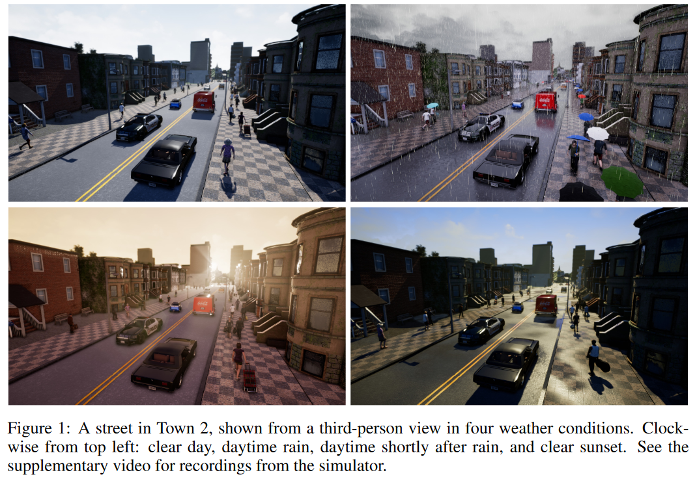
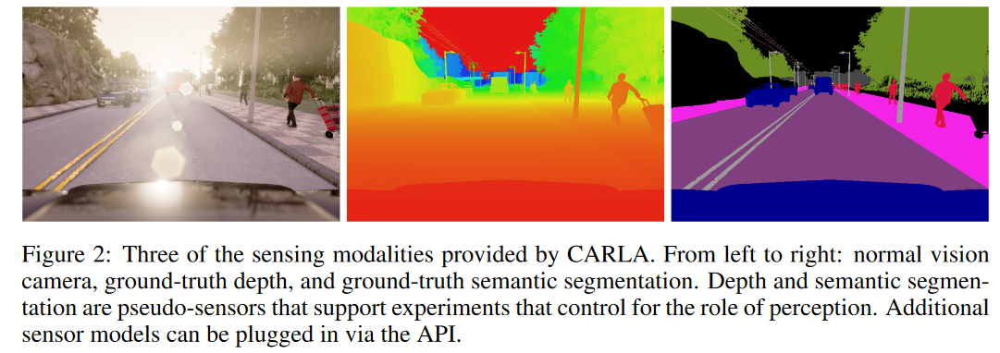
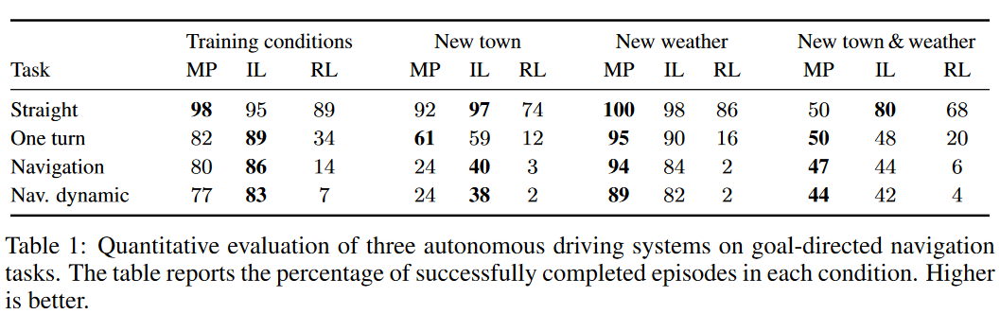

# CARLA: An Open Urban Driving Simulator

- [CARLA: An Open Urban Driving Simulator](#carla-an-open-urban-driving-simulator)
  - [Abstarct](#abstarct)
  - [Introduction](#introduction)
    - [目前研究存在的问题](#目前研究存在的问题)
    - [本文的方法](#本文的方法)
  - [Simulation Engine](#simulation-engine)
  - [Autonomous Driving Experiments](#autonomous-driving-experiments)

## Abstarct

本文的从两个点介绍了 CARLA，分别是（1）CARLA 进行仿真；（2）CARLA 进行自动驾驶的简单实验。具体如下：
- 本文介绍了 CARLA，一款专为自动驾驶研究设计的开源模拟器。CARLA 从基础打造，旨在支持城市自动驾驶系统的开发、训练与验证。CARLA 不仅提供开源代码和协议，还免费提供了专为此目的制作的数字模型（如城市布局、建筑、车辆）。该模拟平台可灵活配置传感器套件和环境条件。
- 我们利用 CARLA 评估了三种自动驾驶策略的性能：传统的模块化系统、通过模仿学习训练的端到端模型和通过强化学习训练的端到端模型。在不同难度的控制场景下，通过 CARLA 提供的评测指标，我们详细分析了这些策略的表现，展示了该平台在自动驾驶研究中的实用价值。

## Introduction

自动驾驶的研究由于高昂的基础设施成本和物理世界中的实验难度受到限制。**单一车辆的数据采集远远不能满足训练和验证的需求**，这对于传统模块化系统（modular pipelines）和数据密集的深度学习方法而言尤为明显。相比之下，模拟训练和验证提供了一种可行的替代方案。通过模拟，我们不仅可以降低研究成本，还能安全地重现危险场景，如模拟孩子突然冲出马路的情况。早期自动驾驶研究就采用模拟技术来训练驾驶模型，而现代则有赛车模拟器和商业游戏的辅助，这些工具提供了高保真的训练数据和视觉感知系统的基准测试 。

### 目前研究存在的问题

现有的模拟平台尽管广泛应用于自动驾驶研究，但它们会有以下的局限性：
- 开源赛车模拟器 TORCS：限于赛道驾驶，缺乏城市环境的复杂性。They lack pedestrians, intersections, cross traffic, traffic rules, and other complications that distinguish urban driving from track racing
- 商业游戏 Grand Theft Auto V：虽然精确模拟了城市环境，但在驾驶策略评估、环境控制和反馈机制等方面存在诸多限制。Do not support detailed benchmarking of driving policies: they have little customization and control over the environment, limited scripting and scenario specification, severely limited sensor suite specification, no detailed feedback upon violation of traffic rules

### 本文的方法

本文提出了 CARLA，一种全新的开放式城市驾驶模拟器。CARLA 专为自动驾驶模型的训练、原型制作和验证而设计，涵盖「感知」和「控制」两大方面。

CARLA 平台不仅开放源代码，还提供免费的城市环境内容，包括各种城市布局、车辆模型、建筑和行人等，这些都是由专业团队精心制作的。平台支持灵活配置传感器套件，并提供GPS坐标、速度、加速度等多种信号，帮助训练更有效的驾驶策略。此外，用户还可以根据需要设定多种环境条件，如天气和时间等，下图展示了这些环境条件的一些示例。

    

## Simulation Engine

CARLA simulates a dynamic world and provides a simple interface between the world and an agent that interacts with the world. 在仿真器中，包含两个部分，分别是 **Environment** 和 **Sensors**。

**Environment**: 环境包含「静态」和「动态」的物体：
- Static objects such as buildings, vegetation, traffic signs, and infrastructure;
- Dynamic objects such as vehicles and pedestrians;

**Sensors**: 传感器可以放置在任意位置，并返回不同格式的结果。如下所示，可以返回深度数据，分割后的结果等：

    

## Autonomous Driving Experiments

CARLA 是一个自动驾驶的仿真器，作者设计了三种自动驾是策略，并进行了性能测试。
1. 首先是基于视觉感知的传统模块化系统（modular pipeline）；
2. 其次是通过模仿学习训练的端到端深度网络（imitation learning）；
3. 最后是通过强化学习训练的端到端深度网络（reinforcement learning）；

同时，文章设计了不同难度级别的场景，然后深入分析了这些策略在实际操作中的表现。下面是设计的四种难度的任务：
- 直行（Straight）：目标直接位于起点前方，途中不会遇到任何移动的障碍物。在城镇1，通往目的地的平均驾驶距离为200米；在城镇2，这一距离为100米。
- 单一转弯（One turn）：从起点出发，需要转一个弯到达目的地；路径上同样不会遇到移动障碍物。在城镇1，平均驾驶距离为400米；在城镇2，为170米。
- 自由导航（Navigation）：起点到目的地的位置不设限制，沿途没有移动障碍物。在城镇1，这一距离平均为770米；在城镇2，为360米。
- 带移动障碍物的自由导航（Nav. dynamic）：任务设置与自由导航相同，但路上会出现移动的汽车和行人，增加了驾驶的复杂性和挑战。

实验结果如下所示，也测试了策略对于新地图，新天气的适应性：

    

