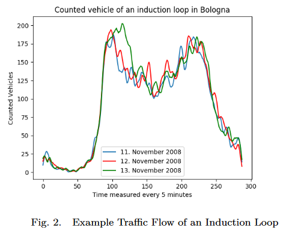

# Microscopic Traffic Simulation using SUMO

- [Microscopic Traffic Simulation using SUMO](#microscopic-traffic-simulation-using-sumo)
  - [Introduction](#introduction)
  - [Wrok Flow](#wrok-flow)

## Introduction

交通模拟工具主要可以分为四个不同的类别：
1) **宏观（Macroscopic）**: 模拟如交通密度等车辆平均动态，average vehicle dynamics like traffic density are simulated 
2) **微观（Microscopic）**: 单独模拟每辆车及其动力学，each vehicle and its dynamics are modeled individually 
3) **中观（Mesoscopic）**: 宏观和微观模型的结合，a mixture of macroscopic and microscopic model 
4) **细观（Submicroscopic）**: 不仅模拟每辆车，还包括车内的各种功能，如变速，each vehicle and also functions inside the vehicle are explicitly simulated e.g. gear shift

宏观模型的优点通常是执行速度快。然而，微观或细观模型在模拟排放或特定路线时更为精确。**因此，这篇文章聚焦于微观交通模拟（也就是说，SUMO 就是一个微观的仿真）。**

下面是本文的结构：
1. 首先，介绍交通模拟的一般工作流。
2. 其次，展示一些可供研究人员使用的示例场景，免去他们初步设置复杂场景的需求。
3. 接下来，解释不同的模型、概念和工具以支持交通研究者的工作。
4. 最后，展望未来与 SUMO 的合作。

## Wrok Flow

为了模拟交通，需要以下几个关键元素：
1. 路网数据，道路路口等，Network data (e.g. roads and footpaths) 
2. 附加交通基础设施，Additional traffic infrastructure (e.g. traffic lights) 
3. 交通需求，可以理解为交通流量，Traffic demand

在定义场景后，通过视觉表示观察模拟对象（车辆、行人、交通灯）对于定性验证非常有用。为此，SUMO 提供了 SUMOGUI 应用程序，允许以不同速度观察模拟，并使用各种颜色选项突出显示各种方面，如速度、交通密度、道路高度或优先权规则。**为了定量评估模拟场景，模拟提供了一系列可选择启用的输出文件（这些文件都为实验结果分析提供了便利）**：

- 车辆轨迹，包括位置和速度（Vehicle trajectories, including positions and speeds）
- 从模拟探测器收集的交通数据（Traffic data collected from modeled detectors）
- 在网络元素（边或车道）上聚合的交通数据（Traffic data aggregated over network elements）
- 在整个车辆或人的行程上聚合的交通数据（Traffic data aggregated over the whole trip of a vehicle or person）
- 交通灯切换的协议（Protocols of traffic light switching）
- 为整个模拟聚合的交通数据（Traffic data aggregated for the whole simulation）
- 排放、能源消耗等（Emissions, energy consumption）

这些输出文件可以使用 SUMO 工具进行可视化，或导入到其他应用程序中。

除此之外，本文还详细介绍了：
- 第四节描述了准备道路网络数据和交通灯的过程（也就是获得 network 的步骤）。
- 第五节解释了如何准备交通需求（交通流量的生成，包含「流量生成，ACTIVITYGEN，Flowrouter，DFROUTER」和「流量校准」）。这里作者给了一个全天真实流量的趋势，如下图所示：
- 第六节讨论了多模式和跨模式交通（也就是联程）。
- 第七节关注模拟验证（仿真参数的调整）。
- 第八节描述了行人模拟。
- 第九节分别描述了模型增强（例如车辆换到，sublane model）。
- 第十节描述了 SUMO 和其他工作的结合，通过 Traci，这里举了 V2X 的例子。

    

