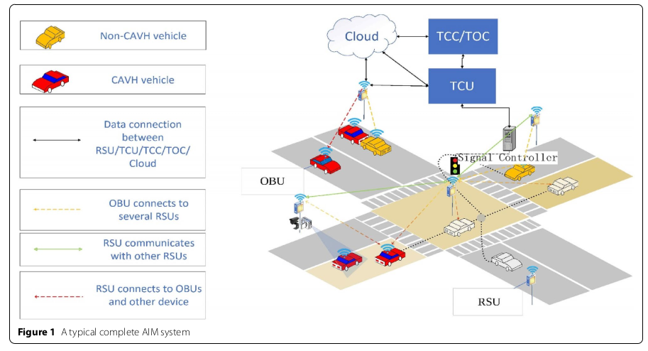
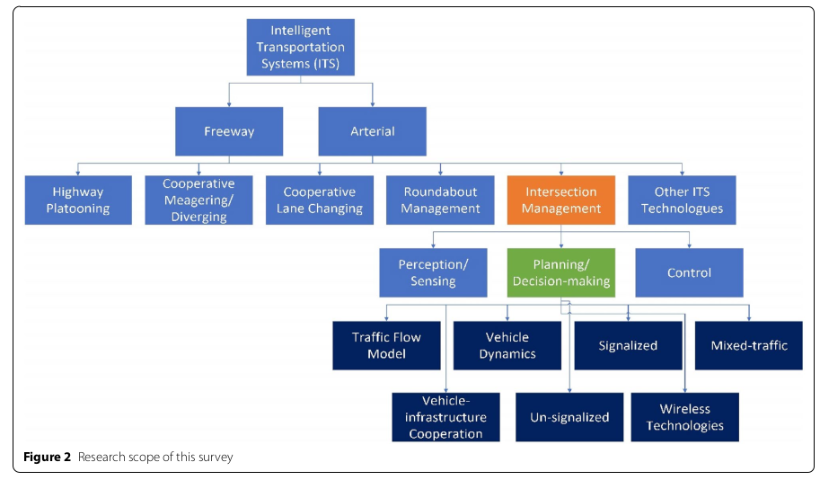
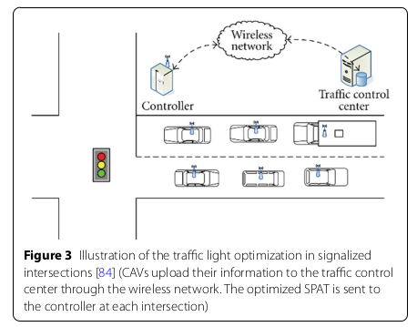
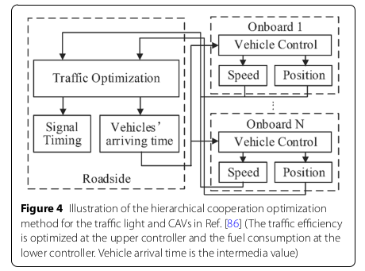

<!--
 * @Author: WANG Maonan
 * @Date: 2023-08-11 15:58:38
 * @Description: Planning and Decision-making for Connected Autonomous Vehicles at Road Intersections: A Review
 * @LastEditTime: 2023-08-11 18:28:46
-->
# Planning and Decision-making for Connected Autonomous Vehicles at Road Intersections: A Review

- [Planning and Decision-making for Connected Autonomous Vehicles at Road Intersections: A Review](#planning-and-decision-making-for-connected-autonomous-vehicles-at-road-intersections-a-review)
  - [Introduction](#introduction)
  - [General Planning and Decision-making methods](#general-planning-and-decision-making-methods)
    - [What is Planning and Decision-making](#what-is-planning-and-decision-making)
    - [General methods](#general-methods)
  - [Vehicle Infrastructure Cooperation Method for Intersections](#vehicle-infrastructure-cooperation-method-for-intersections)
    - [Cooperation methods in signalized intersection](#cooperation-methods-in-signalized-intersection)
    - [CAV control methods in cooperation](#cav-control-methods-in-cooperation)
  - [Planning and decision making method under mixed traffic](#planning-and-decision-making-method-under-mixed-traffic)
    - [Traffic state estimation under mixed traffic](#traffic-state-estimation-under-mixed-traffic)
    - [CAV control under mixed traffic](#cav-control-under-mixed-traffic)
  - [Discussion and potential research direction](#discussion-and-potential-research-direction)
    - [Reliability of Communication](#reliability-of-communication)
    - [Multi intersections coordination and optimization](#multi-intersections-coordination-and-optimization)
    - [Multi‑objective Multi‑agent Planning and Decision‑making](#multiobjective-multiagent-planning-and-decisionmaking)

## Introduction

Intersections are important parts of traffic networks：
- The efficiency of the traditional traffic lights is relatively low when traffic volumes are high
- Researchers found that most incidents occurred in intersections and caused significant traf- fic delays in urban area
  - Therefore, it is important to develop technologies at intersections to allow vehicles to pass the intersection safely and efficiently. 

A typical complete AIM system is shown in the following Figure. There are several important components of the system: 
- **Vehicle on board unit (OBU)**: Contain vehicle dynamic control and intersection approach/departure applications in intersection segment (车载单元)
- **Roadside unit (RSU)**: Provide vehicle lane group control, vehicle driving reservation and planning to help vehicles cross the intersection.
- **Signal Controller**: control the traffic signal based on the data received.
- **Traffic control unit (TCU)**
- **Traffic control center (TCC)**
- **Traffic operation center (TOC)**: TCU/TCC/TOC will coordinate to determine and execute the optimal intersection passing movement.
- **Cloud**: Interact with other Ur ban Services/Applications.

    

In this paper, we mainly focused on planning and decision-making technologies at road intersections, as shown in the following Figure (下图中橙色高亮部分是本文的主要研究点).

    

## General Planning and Decision-making methods

### What is Planning and Decision-making

What is about planning and decision-making technologies at road intersections:
- **Planning algorithms**: Optimal trajectory generation within the topology occupation-free space.
- **Decision-making methods**: focus on speed profile generation along the generated trajectory.

### General methods

- **Graph based approach**
  - RRT and many variants developed from this algorithm. 
  - However, RRT algorithms are mostly implemented in maze and other static environments, with the complexity and fast-changing nature of intersections leads to conservative decisions and the refresh rate of the planner may be challenging in some critical corner case scenarios.
- **Prediction based approach**
  - Planning considering the predicted future path of the environment vehicles is one of the very popular ways to solve intersection planning problems
  - For the prediction and planning framework, if the prediction result is sound and accurate, this type of methods could provide sufficient safety performance and could be implemented under different scenarios. Therefore, developing and applying these path prediction and risk assessment algorithms, the result of the intersection planning performance could be improved greatly.
- **Machine learning based approach**
  - End-to-end neural network approach: Feeding in the images and sensor information of expert drivers driving at intersections and the actual actions of the drivers at such scenarios, a NN network is trained so that when at a similar scenario, giving the original input from the sensors, the model will be able to directly provide actions as output.
- **Partially observale Markov decision-making process approach**
  - In the real-world application and modeling, the states of the participants and environment are not always fully observable. Thus, to represent this uncertainty of the real world, a partially observable Markov decision-making process (POMDP) based approach has been widely applied and is becoming an emerging technique for highly interactive intersection.

## Vehicle Infrastructure Cooperation Method for Intersections

### Cooperation methods in signalized intersection

- 利用 CAV 的信息控制 traffic signal；
- 利用 traffic signal 的信息控制 CAV；
- 考虑同时利用两者的信息，并控制两者；

V2X technology as shown in the following Figure, the central coordinator collects the position and velocity of the CAVs. Estimation on the waiting time of the vehicles at the intersection is further accomplished to be used in traffic signal phase and timing (SPAT) optimization. (CAV 不控制，只收集信息)

    

With the merging development of automated vehicle technology, researchers have gradually taken CAVs into consideration for traffic optimization at intersections rather than merely collecting the CAVs’ information.

First, through V2I technology, the CAV obtains the SPAT information of several consecutive traffic lights ahead. Then, combined with the vehicle model, model predictive control (MPC) is applied to control the CAV to drive through several consecutive traffic lights with no idling at the intersections. Through continuous velocity trajectory planning, the overall travel time of the CAVs is significantly reduced. In this algorithm, CAVs are guaranteed to pass multiple intersections without stopping, which is also named as green wave traveling in later research. (通过 traffic signal 的信息来控制 CAV 的速度)

A hierarchical cooperation optimization method is proposed for the traffic light and CAVs. In this study, considering the complex coupling relationship between signal light time allocation and CAV driving strategy optimization, the authors decoupled the problem into the upper-level traffic efficiency optimization problem and the lower-level CAV control problem as shown in the following Figure.
- The upper-level controller optimizes the overall traffic flow and provides each CAV a target arrival time at the intersection.
- The lower-level controller optimizes the fuel consumption of CAV based according to the received arrival time, i.e., a terminal time constraint in the optimization.

    

### CAV control methods in cooperation

CAV control involves two aspects: *longitudinal control* (加减速) and *lateral control* (换道). In most of the previous research, lateral control is neglected by assuming the CAVs are running on their target lanes. Longitudinal control is the fundamental control problem in intersection management.

## Planning and decision making method under mixed traffic

Considering the long-term deployment of CAV technologies, research on mixed traffic environment of CAVs and human-driven vehicles (HDVs) is of great importance to improve traffic mobility at intersections in the near future.

### Traffic state estimation under mixed traffic

Existing research on mixed traffic intersections mostly focused on the estimation of traffic states and optimization of traffic signals.

### CAV control under mixed traffic

Several works regarded HDVs as disturbances in the control of CAVs, or focused on the task of collision avoidance based on the prediction of HDVs' behaviors. It is worth noting that most of these methods were limited to improving the performance of CAVs themselves in their optimization frameworks, instead of optimizing the global traffic flow consisting of both HDVs and CAVs at the intersection.

## Discussion and potential research direction

- 通信的可靠性
- 多路口协调优化
- 多目标多智能体的优化

### Reliability of Communication

However, communication issues, such as latency, package loss, band-width, is highly affect the model performance at intersections. It is hard for a traffic engineer to understand what makes these issues occur. However, more efforts to develop a method with robustness to these issues need to be conducted. Liu et al. considered vehicle coordination at signal-free intersections with latency. 

### Multi intersections coordination and optimization

The current planning and decision-making technologies using CAV mainly emphasized on isolated intersection. Few of them discussed coordination and optimization between two or more intersections.

### Multi‑objective Multi‑agent Planning and Decision‑making

Current algorithms for optimizing traffic operations at an isolated intersection consider mostly one objective function. For example, vehicle delay is main factor to impact traffic mobility. The approach to optimize vehicle delay can lead to long pedestrian waiting times as well as reducing safety conditions at the intersection.