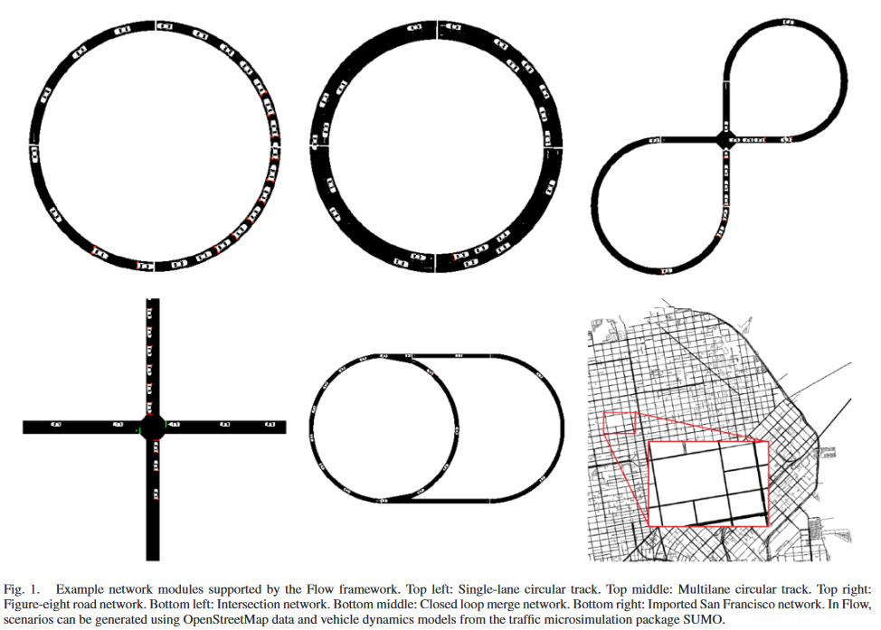
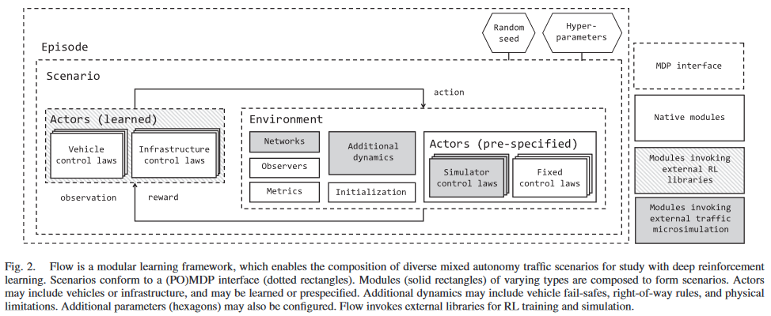
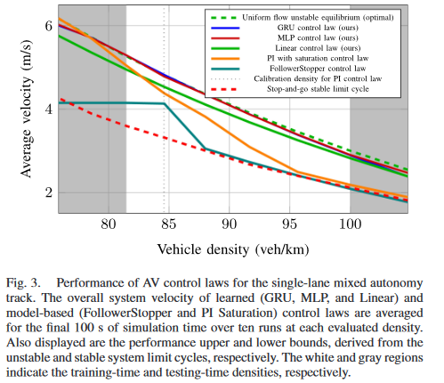

# Flow: A Modular Learning Framework for Mixed Autonomy Traffic

- [Flow: A Modular Learning Framework for Mixed Autonomy Traffic](#flow-a-modular-learning-framework-for-mixed-autonomy-traffic)
  - [Abtsract](#abtsract)
  - [Introduction](#introduction)
    - [现有的研究](#现有的研究)
    - [本文的研究](#本文的研究)
  - [Flow: Modular Learning Framework](#flow-modular-learning-framework)
    - [Scenario Module](#scenario-module)
    - [Architecture and Implementation](#architecture-and-implementation)
  - [Configurable Modules for Mixed Autonomy](#configurable-modules-for-mixed-autonomy)

## Abtsract

自动驾驶汽车（AVs）的快速发展极大地推动了交通系统的安全性、效率和可达性，展现出巨大的潜力。然而，随着 AVs 逐渐被采用，其影响的具体进展尚不明朗。在分析 AVs 部分采用时，我们面临众多技术挑战，包括部分控制与监测、多车辆交互以及现实世界网络中场景的多样性。为了探索 AVs 在近期可能带来的影响，**本文研究了在低 AV 渗透率下（in a low AV-adoption regime）**，深度强化学习（RL）克服这些挑战的适用性。我们提出了一个模块化学习框架，利用深度 RL 应对复杂的交通动态。该框架通过组合模块来模拟常见的交通现象，如走走停停的交通拥堵、变道和交叉口。研究发现，通过仅 4-7% 的 AV 采用，所学习的控制策略可以使系统级速度提高至多 57%，显著优于人类驾驶表现。此外，在单车道交通中，一个小型神经网络控制策略通过局部观测就能消除走走停停的交通，其性能超越所有已知的基于模型的控制器，达到近乎最优，并能适应不同的交通密度。

## Introduction

### 现有的研究

现有的研究主要分为两种：
- Isolated autonomy: AVs 较少，几乎不影响周围交通动态（AVs are few enough as to not affect the surrounding traffic dynamics）
- Full autonomy cases: AVs 极为普遍，形成协调问题（AVs are so ubiquitous as to become a coordination problem）

本文主要研究这两种状态的中间，也就是 `Mixed Autonomy`.

### 本文的研究

本文主要做了两个主要的事情，（1）提出框架，（2）在框架测试新的任务的表现（也就是混合车流下对 AV 的控制）：
- 【提出框架】提出了一个模块化学习框架 Flow，该框架通过可重用的组件来构建代表复杂控制场景的环境，类似于搭建「乐高」积木。为了推动混合自主交通的未来研究，开发并开源了名为 Flow 的模块化学习框架，该框架提供了设计交通控制场景的基本元素。
- 【简单场景分析】接着作者在一个典型的交通控制场景中验证了这一方法，该场景涉及向后传播的交通冲击波，并在部分观测的环境中得到了一种性能卓越的控制策略，该策略不仅远超以往所有方法，还能适应未见过的交通密度，并且接近理论性能上限。
- 【更多复杂场景】最后，通过研究更复杂的交通场景来验证框架的有效性（下图展示了研究的交通场景），这些场景的控制理论结果尚不明确。通过恰当组合这些可重用组件，我们进一步证明了该方法论的有效性，并在多车道、多 AV 和交叉口控制的新场景中取得了初步成果。

    

下面详细描述了上图所示的交通场景：

1. **单车道圆形赛道（ingle-lane circular tracks）**：这种网络由一个具有特定长度的圆形车道组成，其设计灵感来自于 Sugiyama 等人研究的 230 米赛道。这一经典的赛道已经被广泛研究。
2. **多车道圆形赛道（Multilane circular tracks）**：多车道圆形赛道是对单车道赛道的扩展。在这种配置中，车辆的换道行为使得从理论上分析这类问题变得非常复杂，因此大多数传统控制技术都仅限于单车道。为了简化问题的分析，许多多车道模型不考虑纵向动力学。
3. **八字形网络（Figure-eight network）**：八字形网络是一个带有单一交叉口的简单闭环网络。两个圆形赛道位于网络的两端，通过两条相交的直道相连。车辗试图从相对方向穿过交叉口时，需要遵守 SUMO 的右侧通行规则，以避免发生碰撞。
4. **环形合并网络（Loops with merge network）**：这种网络设计用来研究封闭环境中的车辆合并行为。网络由两个圆形赛道组成，这些赛道相互连接。小赛道的车辆会留在小赛道中，而大赛道的车辆则尝试进入小赛道，并最终回到大赛道，这种行为通常会在合并处造成交通拥堵。
5. **交叉口（Intersections）**：该网络设计用于开放环境中交叉口的管理研究。车辆根据泊松分布到达交叉口的控制区。在这里，系统通过调整车速来尽可能提高平均速度或减少车辆经历的延迟。

Flow 的贡献对研究社区具有多方面的意义。
- 对于机器人学社区，Flow 旨在促进复杂、大规模且真实的多机器人控制场景的特征化和实证研究。
- 对于机器学习社区，Flow 试图向现代 RL 算法展示来自重要实际领域的挑战性控制场景。
- 对于控制社区，Flow 通过成功的控制策略提供了新的可证明控制技术的直觉。
- 最后，对于交通社区，Flow 通过可重用的交通模块和现代 RL 方法开辟了一条新的方法路径，解决了关于 AVs 的新挑战和长期存在的交通控制问题。

## Flow: Modular Learning Framework

### Scenario Module

Flow 包含多个模块，可以组合成我们关注的交通场景（我理解这里就是把 RL 实验设置需要的内容都描述了一遍，相当于这个框架可以进行这些操作），如下图所示：

    

- **网络（Network）**：这一模块定义了物理道路的布局，如道路、车道、长度、形状及道路连接等属性。
- **行动者（Actor）**：这些是环境中发出控制信号的物理实体。与仅有单一自动体的设置不同，交通环境通常涉及多个互动实体。**本文特别研究的是车辆作为物理实体**，但其他行动者也可能包括行人、自行车手、交通灯、道路标志、收费站等交通模式和基础设施（定义了哪些是可以被控制的）。
- **观察者（Observer）**：该模块负责将系统状态 $S$ 映射到观察结果 $O$，并为行动者提供观察到的状态信息。例如，虽然状态信息可能包括系统中所有车辆的位置、车道、速度和加速度，但观察者可能只允许访问本地车辆信息和一些聚合统计数据，如交叉口的平均速度或队列长度（需要对场景信息进行处理，类似与 wrapper 的作用）。
- **控制法则（Control laws）**：这些法则定义了行动者的行为，是将观察结果 $O$ 映射到控制输入 $A$ 的功能。所有行动者都需要控制法则，这些法则可能是预设的或通过学习得到的。例如，一个控制法则可以是用于人类驾驶员、自动驾驶车辆或一组车辆的。在集中控制的环境中，一个控制法则可能控制多辆车；在共享参数的设置中，多个行动者可能使用同一个控制法则（相当于是策略，策略可以是学到的，也可以是人为定义的）。
- **动态（Dynamics）**：这一模块包括多个子模块，描述系统发展的各个方面，如车辆路线、需求、随机性、交通规则（如优先权）和安全限制（环境的动态变化）。
- **度量（Metrics）**：这些是关于环境的重要统计数据，学习智能体的奖励信号就是基于这些度量的。例如，所有车辆的平均速度和硬制动事件的数量。
- **初始化（Initialization）**：这描述了场景开始时环境的初始配置，如根据不同概率分布设置车辆的位置和速度。

### Architecture and Implementation

Flow 的实现是开源的，并基于开源软件来促进其访问和扩展。该项目支持自定义模块的开发，使研究人员能够探索更丰富和复杂的环境、智能体、度量和算法。Flow 的实现利用了 SUMO、Ray RLlib 和 OpenAI gym 的 MDP 接口。其中：
- SUMO 是一个详细模拟个体车辆、行人、交通灯和公共交通的微观交通模拟器，支持城市规模的道路网络。Flow 通过 SUMO 的 Python API，即交通控制接口（TraCI），来实现。
- Ray RLlib 是一个分布式框架，用于训练和评估 RL 算法。
- OpenAI gym 提供了一个用于 RL 任务的 MDP 接口。

Flow 设计为一个轻量级架构，连接了前文描述的各个模块，允许进行实验。在典型的 RL 设置中，环境编码了 MDP（场景）。环境通过组合动态（dunamics）及其他模块，进行模拟步进，检索观测数据，应用动作，计算度量和奖励，并在剧情结束时重置模拟。

一个生成器根据网络描述产生与 SUMO 兼容的网络配置文件，实验在初始化时和可选的环境重置时调用此生成器，允许从车辆密度分布进行采样等多样化的初始化条件。Flow 根据动作分配器将控制输入从不同的控制法则分配给相应的行动者，并使用 TraCI 库为每个行动者执行动作。通过数值积分，根据时间步和当前状态，将指定为加速度的动作转换为速度。

最后，Flow 设计为与传统的基于模型的方法兼容，用于评估目的。换句话说，Flow 的学习组件是可选的，这使得可以公平地比较不同的交通控制方法。

## Configurable Modules for Mixed Autonomy

这里作者通过一个场景的例子给出了 Flow 的使用，同时和上面的 Scenarios Module 对应起来。这里的例子为「单车道圆形赛道（ingle-lane circular tracks）」，此时共有 22 辆车，其中 1 辆车为 AV，其他都是 HDVs。

于是对应到前面介绍的「Scenario Module」，分别是：
- Network: 研究的路网为单车道圆形赛道，长度的范围是 220m 到 270m。
- Actors: 共有 22 辆车，每辆车长度为 5m。
- Observer：观测包括所有车辆的信息（可以添加 Wrapper 进行修改）。
- Control Laws: 21 辆车使用 IDM 进行控制，1 辆车使用指定的策略（不同方法进行比较）。
- Dynamics: 环境的动态性包括 21 辆人驾车有随机性。
- Metrics: 最后评价的指标是所有车辆的平均速度。

这样相当于就把这个问题描述出来了，最后作者比较了不同 Control Laws 的效果，发现使用 RL 的效果是最好的，如下图所示：

    

