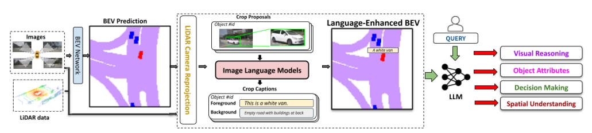
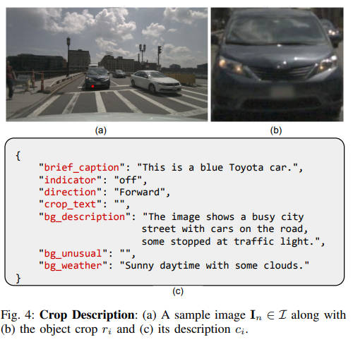
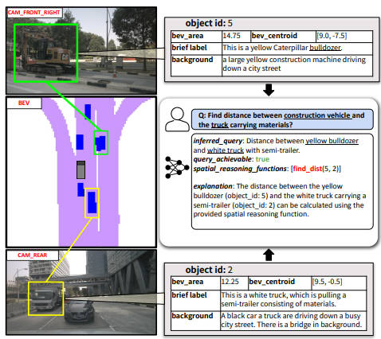
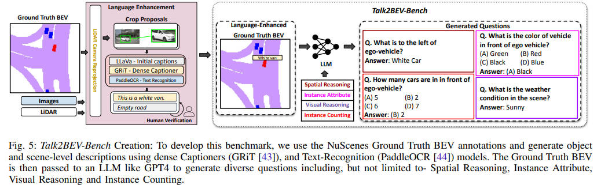
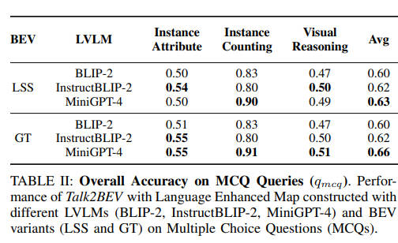
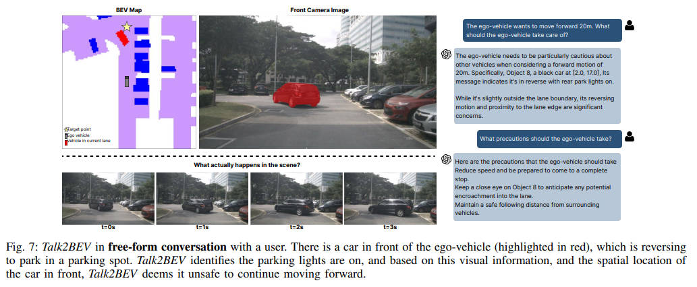
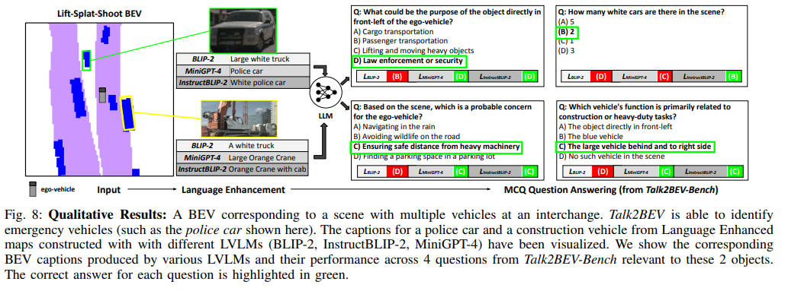
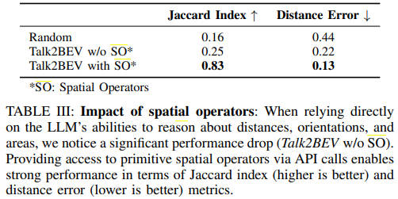
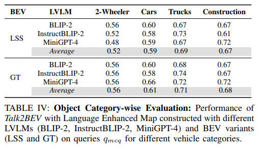

<!--
 * @Author: WANG Maonan
 * @Date: 2023-12-26 22:21:47
 * @Description: Talk2BEV
 * @LastEditTime: 2024-01-05 00:09:30
-->
# Talk2BEV: Language-enhanced Bird's-eye View Maps for Autonomous Driving

- [Talk2BEV: Language-enhanced Bird's-eye View Maps for Autonomous Driving](#talk2bev-language-enhanced-birds-eye-view-maps-for-autonomous-driving)
  - [Introduction](#introduction)
    - [研究背景](#研究背景)
    - [现有方法存在的问题](#现有方法存在的问题)
    - [本文的方法](#本文的方法)
  - [Method：Talk2BEV](#methodtalk2bev)
    - [Overview of Talk2BEV](#overview-of-talk2bev)
    - [Language Enhanced Maps](#language-enhanced-maps)
    - [Response Generation](#response-generation)
  - [Talk2BEV-Bench Benchmark](#talk2bev-bench-benchmark)
  - [Results](#results)
    - [Quantitative Results](#quantitative-results)
    - [Qualitative Results](#qualitative-results)
    - [Impact of Spatial Operators](#impact-of-spatial-operators)
    - [Performance across Object Categories](#performance-across-object-categories)

## Introduction

### 研究背景

Talk2BEV 研究的领域是自动驾驶（AD）系统，**这些系统需要理解周围的视觉世界以做出明智的决策**。这个问题的重要性在于，自动驾驶系统不仅要识别特定的物体类别，还要理解这些物体与环境的当前和潜在的未来互动。

### 现有方法存在的问题

现有的自动驾驶感知系统依赖于针对每个场景理解任务的领域特定模型。**例如检测交通参与者和标志，或预测可能的未来事件。** 这些系统存在局限性，因为它们通常集中在预定义（封闭）的物体类别集和驾驶场景上，未能适应不可预见的情况。

### 本文的方法

本文提出了一个新方法，即 Talk2BEV，它是一个与 bird’s-eye view (BEV) maps 相结合的大型视觉语言模型（LVLM）接口。Talk2BEV 通过将最新的大型语言模型（LLMs）和 LVLMs 的进步与用于自动驾驶的 BEV 结构化地图表示相结合，从而消除了对特定任务模型的需求。这种方法允许单一系统处理多种自动驾驶任务，包括视觉和空间推理、预测交通参与者的意图以及基于视觉线索的决策制定。

本文还开发了 Talk2BEV-Bench，这是一个用于评估 LVLMs 在自动驾驶场景中的感知能力的基准，包括 1000 个人工注释的 BEV 场景以及来自 NuScenes 数据集的超过 20,000 个问题和真实反馈。这些实验结果或研究发现的重要性和影响预示着该方法有望为自动驾驶中的视觉语言任务提供一种创新的解决方案。

本研究的创新之处在于它不需要任何针对 BEV 的特定或视觉语言的训练/微调，并使用现有的预训练 LLMs 和 LVLMs，使得该方法可以灵活快速地部署在广泛的领域和任务上，并且能够轻松适应新的和更好的模型。


## Method：Talk2BEV

### Overview of Talk2BEV

Talk2BEV 的核心想法是利用预训练的 LVLM 派生的通用视觉语言特征来增强 BEV 地图。BEV 地图是一个自顶向下的多通道网格，编码了语义信息，例如车辆和道路。Talk2BEV 的处理流程分为三个阶段：

1. 使用车载传感器（多视角图像）和现成的 BEV 预测模型，首先估计出 BEV 地图。
2. 对于 BEV 地图中的每个物体，生成与 LVLM 对齐的图像语言特征。这些特征然后传递到 LVLM 的语言模型中，以提取物体元数据（给 BEV 中的物体打上标签，例如是什么车辆）。物体数据与 BEV 中封装的几何信息一起形成了语言增强的地图L(O)。
3. 最后，给定一个用户查询，提示一个 LLM（例如 GPT-4），它解释这个查询，根据需要解析语言增强的 BEV，并产生对这个查询的响应。

Talk2BEV 完整的流程图如下所示，可以看到在第二步中，使用 LVLM 来提取特征：

<div align=center>
    
</div>

### Language Enhanced Maps

在语言增强的地图部分（Language Enhanced Maps），首先在多视角图像中定位 BEV 估计的每个物体。对于 BEV 地图中的每个物体，计算与 LiDAR 扫描中的 $k$ 个最近点相对应的图像区域，并推导出空间和文本描述。然后使用点查询分割模型（例如FastSAM）与点提示（图像裁剪的中心）来生成实例分割掩码。为每个分割掩码裁剪一个紧密贴合的边界框，并传递它到 LVLM 以生成裁剪的描述。下面是每一个 object 的表示：

```json
{ 
    "object_id": 3,
    "position": [2.5, 1.5],
    "area": 4,
    "crop_descriptions": {...}
},
```

其中 `crop_descriptions` 包含的信息如下图所示：

<div align=center>
    
</div>

### Response Generation

在回应生成方面，Talk2BEV 系统可以处理多种用户查询。在这项工作中，我们将它们分类为
- 自由格式文本查询
- 指定的空间推理查询（对某个区域进行提问）
- 带有一个正确答案的多项选择题（MCQ）

对于输出格式，我们指导用于 Talk2BEV 的 LLM 生成一个 JSON 格式的输出，该输出包括四个字段：推断查询、查询是否可行、空间推理函数，以及解释 LLM 如何解决所提供任务的简要解释。

为了使 LLM 能够准确地进行空间推理，我们提供了 List of Spatial Operators。当用户查询涉及空间推理时，模型被指示生成 API 调用，而不是直接尝试产生输出（可以调用工具）。下图举了一个例子，计算两辆车之间的距离，我们在匹配到 id 之后，直接调用工具计算距离：

<div align=center>
    
</div>


## Talk2BEV-Bench Benchmark

这一部分主要介绍了 Talk2BEV-Bench 的基准数据集生成，这是评估自动驾驶应用中大型视觉语言模型（LVLM）的首个基准。它通过 从NuScenes 数据集中生成1000个场景的语言增强的鸟瞰图（BEV图）和超过 20,000 个经过人类验证的问答对（采用SEEDBench格式），来评估模型的空间理解和视觉推理能力。

为了生成这些问题和答案，研究人员首先从 NuScenes 数据集中提取 BEV 图的真值，并为图中的每个对象获取标题。这些标题经过人类注释者的细化，然后使用 GPT-4 生成问题及其初始响应。这些问题和响应再次经过人类注释者的验证，形成用于基准测试的最终多项选择题（MCQs）。基准测试的创建过程如下图所示，给出了一个基于语言增强的BEV图生成问题的例子。

<div align=center>
    
</div>

多项选择题（MCQs）涵盖四种视觉和空间理解任务类型：
- 实例属性（涉及对象及其属性的问题）
- 实例计数（计算与文本查询相对应的对象数量）
- 视觉推理（评估通常不直接捕获在其他类别中的一般视觉理解问题）
- 空间推理（涉及位置、距离或方向信息的问题）。
  
对于每个场景和评估维度，研究人员提示 GPT-4 五次，每个维度生成五个这样的问题，每个场景产生20 个问题。对于所有类别（除了空间运算符），他们报告准确度指标（因为问题是多项选择）。对于空间推理查询，他们报告回归指标，形式为 Jaccard 指数（对于期望输出一组对象的查询）和距离错误（对于需要距离值的查询）。


## Results

### Quantitative Results

在量化结果方面，Talk2BEV 在 Talk2BEV-Bench 上的表现被详细报告。结果表明，使用不同的语言增强视觉模型（例如 BLIP-2、InstructBLIP-2 和 MiniGPT-4）进行 BEV 构建时，Talk2BEV 在各种任务中表现不同。特别是，MiniGPT-4 在多个任务类型上取得了平均性能最佳的结果。而在属性识别和视觉推理任务中，模型性能对 LVLM 标注的质量较为敏感。此外，BEV 预测的错误对性能的影响较小，这意味着随着更高性能的 LVLM 的发布，Talk2BEV 的性能有望进一步提高。

<div align=center>
    
</div>

### Qualitative Results

在定性结果方面，文章展示了 Talk2BEV 在具有挑战性的 NuScenes 场景中的应用案例。例如，模型能够识别并建议在前方有车辆倒车停放时应减速并注意观察（**这个例子还是非常有意思的**）。

<div align=center>
    
</div>

下面是使用 Talk2BEV 回答单选题的例子：

<div align=center>
    
</div>

### Impact of Spatial Operators

文章还研究了空间操作符（Spatial Operators）对模型性能的影响。结果显示，通过API调用空间操作符可以显著提高模型在空间推理任务上的表现。这与直接使用LLM进行空间推理相比，有着显著的性能提升（这个很显然，更加专业的功能交给工具来完成）。

<div align=center>
    
</div>


### Performance across Object Categories

最后，文章对不同对象类别的性能变化进行了评估。结果显示，二轮车辆（如自行车和摩托车）的性能普遍较低，这可能是由于它们在 BEV 分割预测中的尺寸较小。与此相反，如卡车和建筑车辆等较大的车辆在大多数情况下表现更佳。

<div align=center>
    
</div>

综上所述，Talk2BEV 通过整合语言和视觉模型在自动驾驶的多个场景中展示了良好的性能，尤其是在处理自然语言查询和执行空间推理任务时。通过引入空间操作符，进一步提高了模型的表现。尽管存在一些类别性能上的差异，但整体上 Talk2BEV 证明了其在自动驾驶应用中的潜力和灵活性。