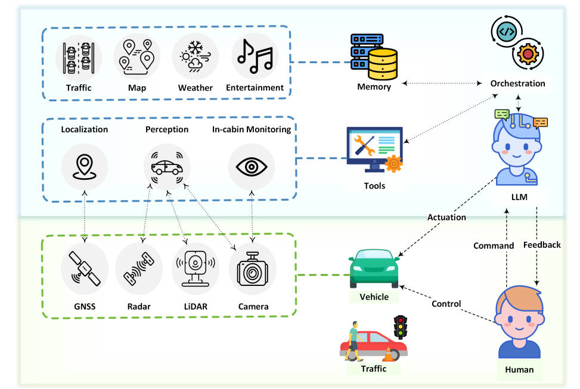
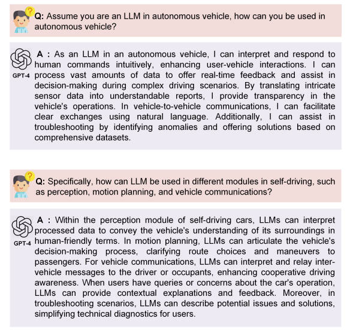
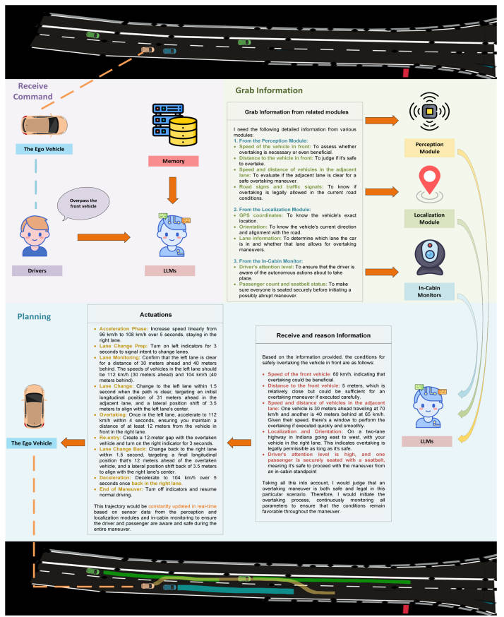

<!--
 * @Author: WANG Maonan
 * @Date: 2024-01-03 23:12:22
 * @Description: Drive as You Speak
 * @LastEditTime: 2024-01-04 16:19:44
-->
# Drive as You Speak: Enabling Human-Like Interaction with Large Language Models in Autonomous Vehicles

- [Drive as You Speak: Enabling Human-Like Interaction with Large Language Models in Autonomous Vehicles](#drive-as-you-speak-enabling-human-like-interaction-with-large-language-models-in-autonomous-vehicles)
  - [Introduction](#introduction)
  - [Methods](#methods)
  - [Experiment](#experiment)
    - [GPT-4 提问关于自动驾驶概念问题](#gpt-4-提问关于自动驾驶概念问题)
    - [真实场景策略分析](#真实场景策略分析)
- [Conclusion](#conclusion)

## Introduction

本文探讨了 Large Language Models（LLMs）在未来自动驾驶汽车中的应用潜力。LLMs因其处理多样化语言输入的强大能力而受到关注，这使得它们可以生成连贯、相关的文本输出。这些模型被视为信息和知识的丰富储存库，类似于人类大脑的功能。因此，研究者提出了一个问题：能否利用 LLMs 的能力来革新自动驾驶的未来？

**目前方法存在问题**：与人类不同，LLMs 缺乏对物理环境的感知能力，这限制了它们在实时环境中做出准确决策的能力，可能导致次优结果甚至危险后果。

为了解决这个问题，本文提出了一个创新方法：
- 将 LLMs 作为自动驾驶汽车内部的决策「大脑」；
- 同时通过车辆的感知模块、定位模块和车内监控等工具作为车辆的「眼睛」，帮助 LLMs 克服不直接获取实时环境信息的固有限制。通过接收来自感知模块处理后的数据，可以促进决策制定，显著提升自动驾驶车辆的性能。
- 此外，车辆的动作和控制器作为其「手」，执行由 LLMs 决策过程得出的指令。

该方法的创新点或优势包括：
- Language Interaction：LLMs 实现了驾驶员与车辆之间直观的沟通，使得互动从僵硬的命令转变为自然的对话。
- Contextual Understanding and Reasoning：车载 LLMs 通过多样化的信息源如交通法规和事故报告，提供增强的情境理解，确保决策优先考虑安全性和遵守规则。
- Zero-Shot Planning：车载 LLMs 能够理解和推理之前未遇到的情况（unfamiliar situation），使车辆能够自信地导航未知场景。
- Continuous Learning and Personalization：LLMs 持续学习和适应，根据个别驾驶员偏好量身定制他们的帮助，随着时间的推移提升驾驶体验。
- Transparency and Trust：LLMs能够以简单的语言阐述它们的决策，促进技术与用户之间至关重要的信任和理解的关系。

## Methods

本文的整体框架十分简单，核心是：LLMs 被视为自动驾驶系统的「大脑」，负责与驾驶员交互和进行决策，而传感器工具和执行器分别被比作汽车的「眼睛」和「手」。
- 当驾驶员提出特定操作请求时，LLMs 会提示相关模块提供已处理的、从环境中提取的相关信息。
- 通过将 LLMs 的语言分析与选定模块的传感器输入结合，LLMs 可以做出明智的决策。
- 如果命令（驾驶员提出的特定操作请求）被认为是可行和安全的，LLMs 将向汽车控制器传达相应的指令，包括方向盘、油门踏板、刹车和其他控制元件，以执行必要的操作。
- 如果操作被认为不适当，LLMs 将向驾驶员提供详细解释，说明为什么请求的动作不适合执行。

该论文还提出了一个以人为本的 LLMs 集成框架的概念，用于自动驾驶汽车。在这个框架中：
- **物理世界**包括人类驾驶员、车辆和交通物体。在物理世界中，人类驾驶员是中心代理，他们向 LLMs 发出指令。交通环境包含多种元素，如车辆、行人、红绿灯、道路状况和交通锥，这些都增加了道路上运动和交互的复杂性。由 LLMs 指导的车辆在这个生态系统中运行，执行它从驾驶员或LLMs那里接收到的指令。
- **虚拟世界**包括 LLMs、存储器和必要工具，如感知模块、定位模块和车内监控。感知模块从传感器（包括外部摄像头、激光雷达和雷达）获取原始输入，并将这些数据处理成适合 LLMs 的格式。定位模块使用 GNSS 数据来确定车辆的精确位置。车内监控利用内部摄像头、温度计和其他传感器密切观察车内环境，预防干扰、极端温度或不舒适的条件。LLMs 位于整个框架的核心，作为中央智能。它们接收来自驾驶员的命令，随后启动查询到相关模块以获取相关信息。
- **存储器部分**作为一个存储库，储存历史操作和驾驶员的偏好，使 LLMs 能够持续学习和增强。这个经验库使 LLMs 在面对类似情况时能够做出类比决策，提高了系统的适应性和性能。存储器还包含地图和当地法律信息，赋予 LLMs 做出更智慧的、适应各种情景的决策的能力。整体的结构如下所示：

    

## Experiment

本文的实验分为两个阶段：
- 首先是向 GPT-4 提问与自动驾驶概念相关的问题，以了解 LLMs 如何融入自动驾驶；
- 其次是通过设计真实世界情景来评估LLMs的决策能力。

### GPT-4 提问关于自动驾驶概念问题

作者首先对 LLM 提问关于自动驾驶的问题，旨在考察 LLM 在推进自动驾驶未来方面的真正潜力，问题和结果如下图所示。

- 从回答中可以明显看出，LLM 可以解释复杂的驾驶场景、车辆做出的决策，甚至各种自动驾驶模块的技术。
- 一个特别重要的观察是LLM在处理大量数据，然后将这些数据转化为实时、可理解的反馈方面的优势。这种反馈不仅仅是关于驾驶状态，还与核心自主功能有关，包括感知模块的利用率和运动规划的选择。
- 此外，该模型展示了增强的车对车通信能力，以及关键的故障排除能力。这种能力不仅可以培养信任，还可以通过解释自主操作的复杂决策来开发用户体验。

    

### 真实场景策略分析

在下图中展示的实验情景中，自动车辆使用 LLMs 协助决策和运动规划。车辆在印第安纳州的双车道公路上以 96 公里/小时的速度行驶，前方有一辆以相同速度但仅相距 8 米的车辆，这个距离对于安全性而言不够理想。相邻左车道有两辆车，一辆在前方 30 米处以 112 公里/小时行驶，另一辆在后方 40 米处以 104 公里/小时行驶。LLMs 需要综合处理来自感知模块（车速和距离）、定位模块（道路和环境条件）以及车内监测系统（驾驶员的注意水平和安全措施如安全带）的多层数据。LLMs制定了一项优先考虑安全同时有效执行驾驶员命令超车的 9 步运动计划。

    

与其他方法相比，LLMs 展示了在实时、动态考虑多个因素的情况下，进行复杂的上下文敏感推理的能力。它们不仅遵循预定义的规则，而且能够适应独特的情境，显示出增强自动驾驶未来的潜力。LLMs 的语言交互能力对于建立信任至关重要。当驾驶员下达「超越前方车辆」的命令时，LLMs 评估了多种因素并向驾驶员通报其推理过程。**这种透明互动不仅提升了安全性，也增强了驾驶员对车辆自动能力的信心。**（the language interaction capabilities of the LLMs proved crucial for trust-building）

LLMs 还可以访问内存模块中的历史数据和用户偏好，这允许提供更个性化的驾驶体验。例如，在实验情景中，系统能够回忆起驾驶员对超车速度、跟车距离和车道偏好的典型舒适度，这些信息可以影响 LLMs 解释和执行命令的方式，确保行动符合驾驶员过去的行为和舒适区域。此外，「零次学习」（zero-shot learning）的优势在高速公路上的复杂超车操作中表现得尤为明显。尽管 LLMs 之前没有遇到过这种特定情况——变化的速度、距离以及驾驶员警觉性——它能够利用其泛化训练安全、有效地生成超车动作的轨迹。这确保即使在动态或罕见的情况下，系统也能做出明智的判断，同时保持用户了解情况，因此在自动技术上建立信任。

# Conclusion

在本文中，研究者们提出了一个全面的框架，将大型语言模型（Large Language Models，LLMs）整合到自动驾驶汽车的生态系统中。这些大型语言模型具有先进的推理能力，能够使自动系统对复杂的现实世界场景更加灵活和响应。通过利用 LLMs 的能力，可以丰富人与车辆之间的互动，提供更加可靠、直观和响应迅速的界面。

与传统的自动系统不同，LLMs能够处理复杂的请求，提供实时反馈和全面的解释，并在复杂或罕见的驾驶场景中协助决策。这预示着未来LLMs可以显著提高自动驾驶技术的效率、安全性和以用户为中心的设计。
