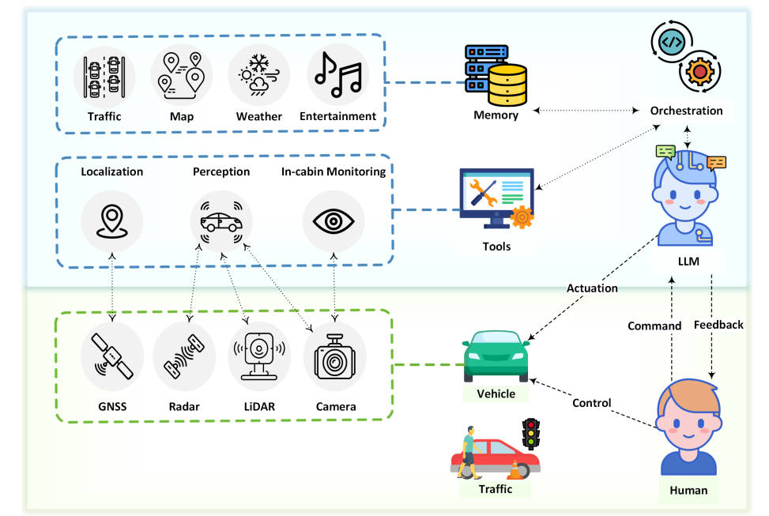
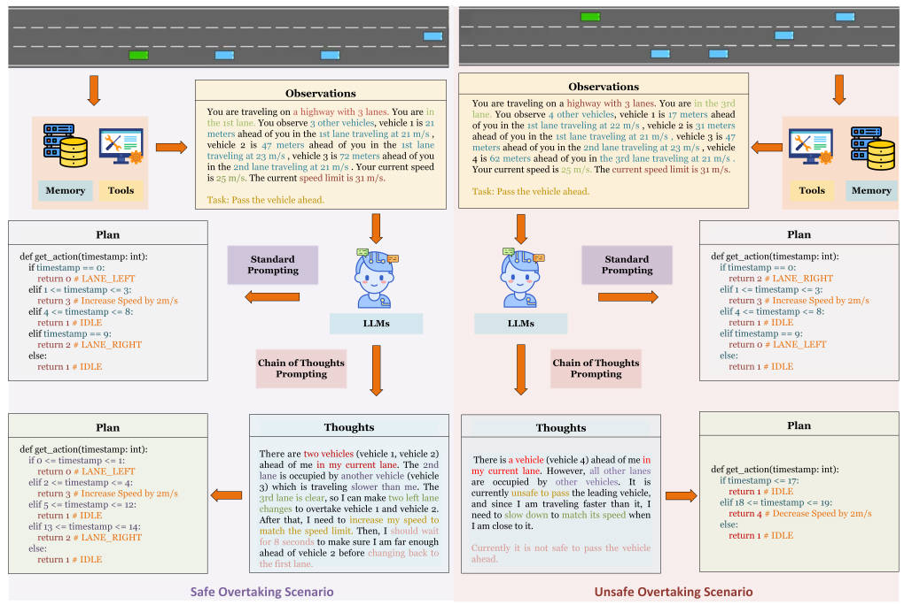
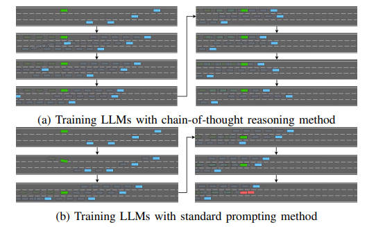
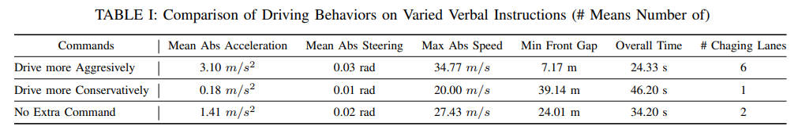

<!--
 * @Author: WANG Maonan
 * @Date: 2024-01-04 16:22:09
 * @Description: Receive, Reason, and React: Drive as You Say
 * @LastEditTime: 2024-01-05 00:15:52
-->
# Receive, Reason, and React: Drive as You Say with Large Language Models in Autonomous Vehicles

- [Receive, Reason, and React: Drive as You Say with Large Language Models in Autonomous Vehicles](#receive-reason-and-react-drive-as-you-say-with-large-language-models-in-autonomous-vehicles)
  - [Introduction](#introduction)
    - [问题背景](#问题背景)
    - [传统方法存在的问题](#传统方法存在的问题)
    - [本文的研究方法](#本文的研究方法)
    - [性能说明](#性能说明)
  - [Methodology](#methodology)
  - [Experiments: Cases Study with GPT-4](#experiments-cases-study-with-gpt-4)
    - [Highway Overtaking](#highway-overtaking)
    - [The Merging Senario](#the-merging-senario)
  - [Analysis and Discussion](#analysis-and-discussion)

## Introduction

### 问题背景

近年来，大型语言模型（Large Language Models，LLMs）引起了广泛关注。LLMs 在处理各种文本输入方面的能力令人瞩目，它们能产生连贯的文本输出，涵盖了不同领域的问题、对话和词汇。

然而，LLMs 的应用潜力远不止于语言任务，还可以扩展到真实世界的应用中。自动驾驶技术是一个非常有前途的领域，它目前正在吸引越来越多的关注。鉴于 LLMs 模仿人脑功能的能力，我们提出了一个问题：我们是否可以利用 LLMs 的强大功能来革新自动驾驶的未来？

### 传统方法存在的问题

尽管 LLMs 在语言相关任务中的能力很强，但它们缺乏对物理世界信息的基础。与人类不同，LLMs缺乏感知物理环境的能力，这可能导致在当前情况下做出不够理想或甚至危险的决策。

### 本文的研究方法

本文提出了一种将 LLMs 作为自动驾驶车辆中决策「**大脑**」的新方法。为了弥补 LLMs 直接获取实时环境信息的局限性，自动驾驶生态系统中的各种工具，包括感知模块、定位模块和车内监控，充当车辆的感官「**眼睛**」（这里其实就是 ReAct 的想法）。车辆的控制器则充当其「手」，执行由LLMs决策过程得出的指令。通过接收环境信息和驾驶员的指令，基于这些信息和人机互动进行推理，最后做出决策，我们使自动驾驶体验不仅在技术上更为优越，而且深度以人为本。

### 性能说明

本文还通过在各种驾驶场景下进行的实验，初步展示了 LLMs 在自动驾驶领域的革命性潜力。这些实验结果强调了利用连锁思考提示（chain-of-thought prompting）的重大优势，这种方法改进了驾驶决策，并展示了LLMs通过持续的口头反馈来增强个性化驾驶体验的潜力。

## Methodology

这个部分阐述了一个结合了大型语言模型的自动驾驶车辆决策制定流程的框架。这个框架的理论基础是将LLMs作为车辆的「大脑」，用于处理司机交互和决策制定，而传感器工具和执行机构则分别作为车辆的「眼睛」和「手」。整体结构如下所示：

    

LLMs 位于整个框架的中心，它们接收来自驾驶员的指令，并随后向相关模块发起查询以获取相关信息。内存部分作为存储历史操作和驾驶员偏好的仓库，使 LLMs 能够持续学习和提升。这个经验库使 LLMs 在面对类似情况时能够做出类比决策，随着时间的推移增强系统的适应性和性能。内存还包含地图和本地法律信息，使得LLMs能够做出适应各种情景的更明智决策。

- 当司机向自动驾驶车辆发出操作指令时，LLMs 会提示相关模块提供经处理的数据，从而从环境中提取相关信息。
- 虚拟世界包括LLMs、内存和包括感知模块、定位模块和车内监控器在内的关键工具。感知模块使用传感器（包括外部摄像头、激光雷达和雷达）获取原始输入，并将数据处理成适合LLMs的格式。定位模块使用GNSS数据来确定车辆的精确位置。车内监控器使用内部摄像头和其它传感器来监控车内环境，预防分心、极端温度或不舒适的情况。
- LLMs 融合了语言分析和来自选定模块的处理感知输入，从而做出明智的决策。如果指令被认为是可行且安全的，LLMs 会将相应的指令发送给车辆的控制器，如方向盘、油门、刹车等控制元素，让它们执行必要的操作。如果操作被认为不适当，LLMs会向司机提供详细的解释。

## Experiments: Cases Study with GPT-4

在实验的部分，作者设计了两组环境，分别是「超车」和「并道」。
- 在「超车」的环境中，作者比较了不同 prompt 的结果；
- 在「并道」的环境中，作者比较了不同指令对 LLM 决策的区别；

### Highway Overtaking

实验展示了 LLMs 在使用 chain-of-thought prompting 方法时相比于标准 prompting 方法，在理解和执行复杂驾驶任务方面具有显著的改进。这表明了 LLMs 在提供个性化驾驶体验方面的巨大潜力。下图展示了两种方法生成策略的区别。

    

这里作者对结果进行了可视化的展示。例如 (a) 是 chain-of-thought 的结果，(b) 是 standard 的结果，可以看到 (b) 最后会发生碰撞，但是 (a) 是不会的。

    

### The Merging Senario

作者展示了如何通过大型语言模型（LLMs）来调整自动驾驶汽车的行驶风格，以符合乘客的即时指令和偏好。实验在 HighwayEnv 环境中进行，主要探讨 LLMs 对「保守驾驶」、「激进驾驶」以及「无指令条件下」的自动驾驶表现。实验结果显示：

- 当LLMs接受到「保守驾驶」的指令时，车辆的驾驶行为更为谨慎，表现为加速较慢、转向操作不激烈、最高车速较低、与前车的距离维持在较大水平，整体完成路线的时间较长。
- 在接到「激进驾驶」的指令时，LLMs 则展现出更加积极的驾驶风格，具体为加速度增加、转向更积极、最高速度提升、与前车的距离缩小，以及整体完成路线的时间显著减少。
- 在「无指令条件下」的情况下，LLMs展现出的驾驶行为介于保守与激进之间。

下面的表格展示了接收到不同指令的结果，可以看到「激进驾驶」换道次数多，驾驶时间短。LLM 可以根据不同的驾驶指令做出改变：

    

## Analysis and Discussion

在最后一部分，作者对上面的实验结果进行了分析：

- **情境学习（In-Context Learning）**：实验发现，当给 LLMs 提供特定情境的例子和操作思路时，它们能够成功应对高速公路超车和并道等挑战，凸显了情境的重要性。LLMs 在具备特定情境对齐时，其预测能力得到增强。传统的决策模型面对新情境时可能需要从头开始训练，而 LLMs 只需要相关的情境指导即可调整决策方法。

- **推理（Reasoning）**：LLMs 能够处理来自感知模块、定位模块和车内监控系统的多层数据，并制定出以安全为优先的综合运动计划。实验表明，LLMs 可以实时地考虑多个动态因素，以确定最安全、最有效的超车轨迹。LLMs 的这种推理能力对于提高道路安全性和操作效率具有重要意义。

- **思维链（Chain-of-Thoughts）**：实验强调了提供思维链提示对 LLMs 在自动驾驶中的性能优化至关重要。通过呈现一系列逻辑上相互关联的步骤或指令，模型能够更好地应对实际驾驶情境的复杂性。思维链的引入提升了LLMs的决策能力，同时确保车辆在遵守安全协议和法律标准的同时，能够应对复杂环境。

- **个性化体验（Personalization）**：根据口头指令（如“更保守地驾驶”或“更激进地驾驶”）进行的并道场景实验显示了 LLMs 在根据指令个性化驾驶体验方面的潜力。LLMs 可以根据实时反馈不断调整驾驶行为，展现了高度个性化的驾驶体验。随着时间的推移，LLMs 可以通过持续接收驾驶者的输入，微调车辆的驾驶参数以贴合个人偏好。

- **解释（Interpretation）**：LLMs 的语言交互能力对于构建信任至关重要。当驾驶者下达“超越前车”等指令时，LLMs会评估各种因素并清晰地向驾驶者解释其推理过程。这种透明的交互不仅提高了安全性，也增强了乘客对车辆自动驾驶能力的信心。
