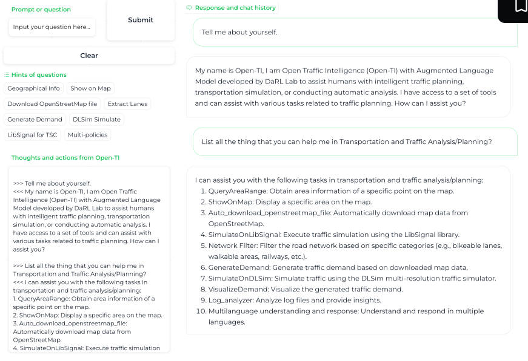
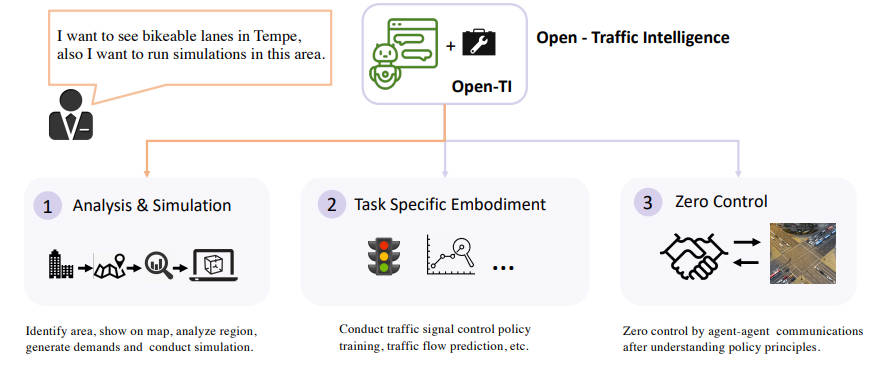
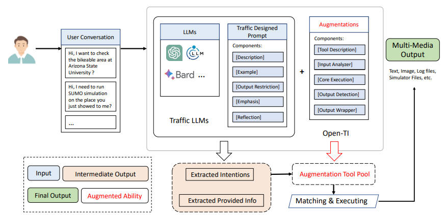
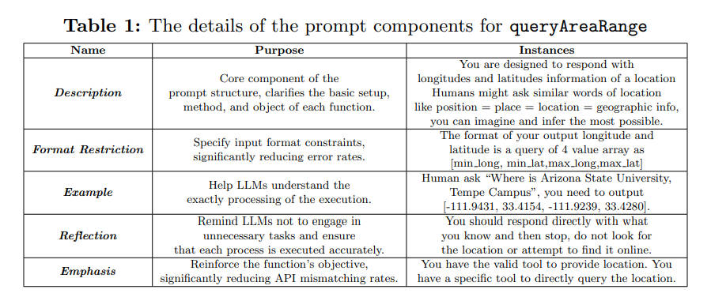
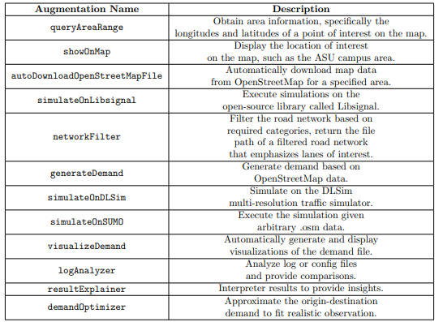
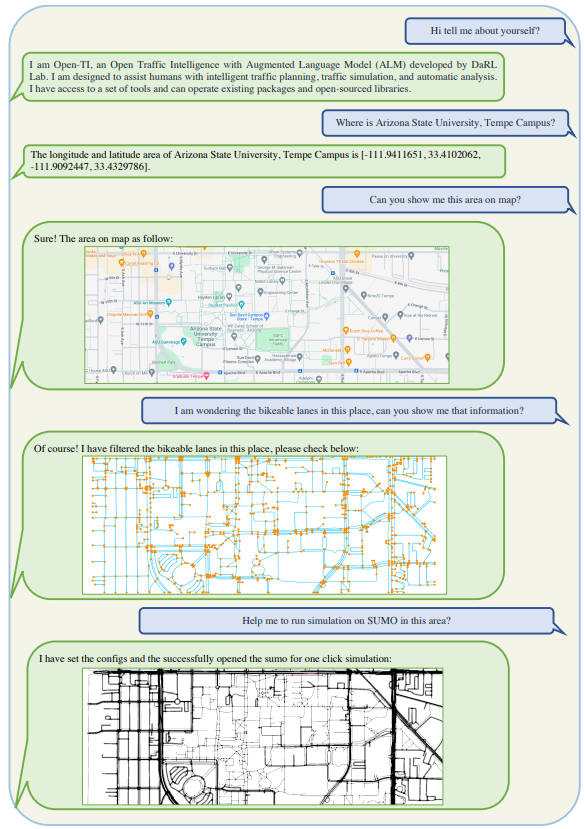
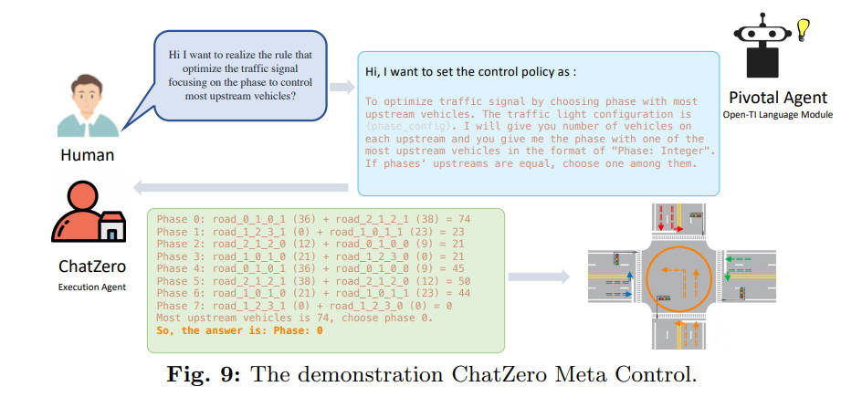
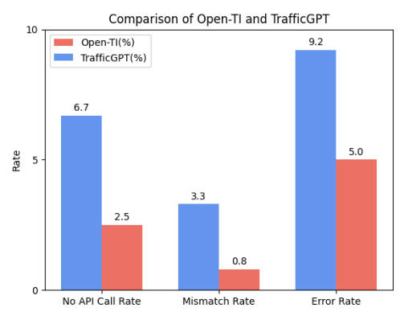
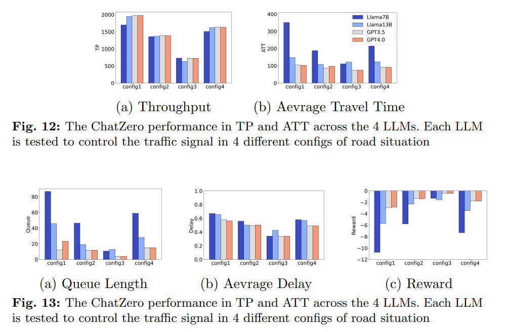

<!--
 * @Author: WANG Maonan
 * @Date: 2024-01-04 17:42:50
 * @Description: 
 * @LastEditTime: 2024-01-04 22:38:11
-->
# Open-TI: Open Traffic Intelligence with Augmented Language Model

- [Open-TI: Open Traffic Intelligence with Augmented Language Model](#open-ti-open-traffic-intelligence-with-augmented-language-model)
  - [Introduction](#introduction)
    - [研究背景与存在的问题](#研究背景与存在的问题)
    - [本文的方法](#本文的方法)
  - [The Architecture of Open-TI](#the-architecture-of-open-ti)
    - [Overview of Open-TI](#overview-of-open-ti)
    - [Prompt Design](#prompt-design)
    - [Execution and Augmentation List](#execution-and-augmentation-list)
  - [Sub-module Embodiment](#sub-module-embodiment)
    - [Pivotal Agent for Transportation Analysis](#pivotal-agent-for-transportation-analysis)
    - [Task-Specific Embodiment](#task-specific-embodiment)
  - [Experiment](#experiment)
    - [Language Agent Analysis on the API Calls](#language-agent-analysis-on-the-api-calls)
    - [Ablation Study of Open-DI Prompt Structure](#ablation-study-of-open-di-prompt-structure)
    - [Meta Agent Control Analysis](#meta-agent-control-analysis)
  - [Conclusion](#conclusion)

## Introduction

### 研究背景与存在的问题

本研究领域为智能交通系统，探讨了如何利用先进的计算机算法来提高城市交通的效率。智能交通是一个跨学科领域，对从业者而言，理解复杂算法和神经网络是一大挑战，这导致了研究和实际应用之间存在着巨大的鸿沟。

传统方法存在的问题包括复杂的交通模拟、信号控制策略优化、动态需求调度等挑战。现有的模拟器和算法虽然强大高效，但实际操作和实施难度较大，这导致了行业对这些技术的信任问题。

### 本文的方法

本文提出的方法称为 Open-TI（**可以理解为类似 TrafficGPT，可以使用自然语言来解决一些交通的问题**），一种新型增强型语言模型，旨在构建起学术界与实际工业界之间的桥梁。Open-TI 目标是实现图灵不可区分的交通智能（Turing Indistinguishable Traffic Intelligence），它通过与交通分析软件包结合，基于现有对话来执行复杂的命令。
- Open-TI 不仅能进行全面的交通分析，从获取地图数据到在复杂的模拟环境中执行，而且能够专门进行任务，如训练和适应交通信号控制策略、探索需求优化等。
- Open-TI 还能通过与另一控制代理 ChatZero 的代理到代理通信模式，直接作为控制代理来服务。它能够根据从 Open-TI 了解到的意图选择动作空间以继续执行。

总的来说，Open-TI 的贡献在于：
- 首次实现了从头到尾的稳定交通分析，包括地图下载和感兴趣区域的模拟；
- 作为负责多个特定任务执行器的中心代理，提供了标准 API 以便研究社区访问并增强其能力；
- 实现了元控制，通过与另一控制代理的通信来传达政策描述；
- 在交通分析过程中提供了充分的解释，从日志文件解释到结果比较，为交通管理和运输策略规划带来便利；

## The Architecture of Open-TI

### Overview of Open-TI

Open-TI 旨在弥合工业界与学术界之间的差距，提出了一种新颖的智能交通系统。Open-TI 采用了具有人类语义理解能力和目标导向执行能力的架构，以实现更加类似图灵测试的交通智能（Turing Indistinguishable Traffic Intelligence）。

Open-TI 的用户界面如下所示，包括四个面板：
- **提示或问题**（左上），用户可以编辑输入、清除文本和提交请求；
- **问题提示**（左中），用户可以点击建议选项轻松开始对话；
- **思考和行动**（左下），展示 Open-TI 代理的思考链内容；
- **响应和聊天历史**（右侧），此主面板提供多媒体反馈和执行结果；

    

Open-TI 的核心结构由三个模块组成，整体的结构图如下所示：
- **分析与模拟（Analysis and Simulation）**：用户可以从头开始进行交通分析和模拟，通过 DTALite 或 SUMO 等工具进行特定区域的交通模拟；
- **特定任务的体现（Task Specific Embodiment）**：支持通过模糊和高级语言解释来执行多任务，大大降低了实验探索的专业背景要求；
- **零控制（Zero Control）**：利用当前大型语言模型（LLMs）的出色理解能力，直接作为控制代理进行元控制；

    

Open-TI 的设计框架包括两个组件，如下图所示：

- **交通 LLMs**：用户需求从对话中检测到后，将传递给交通 LLMs 组件，该组件使用语言代理从对话中提取准确的意图和有用信息
- **增强（Augmentations）**：将提取的意图与增强池（augmentation pool）中的工具进行匹配。如果找到可能的解决方案，代理将执行提取的信息并生成多媒体数据形式的输出。

    

### Prompt Design

为了提高操作的组织性，Open-TI 利用了 LLM 的理解能力，并通过提示工程调整了其行为。提示设计包括五个方面：**描述（Description）**、**例子（Example）**、**输出限制（Output Restriction）**、**强调（Emphasis）**和**反思（Reflection）**。

下图是工具 `queryAreaRange` 的例子，包含了**描述（Description）**、**例子（Example）**、**输出限制（Output Restriction）**、**强调（Emphasis）**和**反思（Reflection）**。

    

### Execution and Augmentation List

在执行过程中，Open-TI通过增强工具列表来帮助用户满足各种需求。这些工具包括地图信息获取、地图显示、模拟执行等。下面是包含的工具的列表：

    

最后，Open-TI 提供了标准执行的 API 内容和增强类的结构。为了扩展增强的范围并增加附加能力，关键是确保主要代理了解特定附加工具的功能，以便在用户提出要求时，主要代理可以选择最合适的方法。此外，体现程序应该准确有效地运行，以便在主要代理启动过程时能够得到预期结果。

## Sub-module Embodiment

这一节主要介绍了 Open-TI 模型的三个不同模块，这些模块共同实现了模型的优越性能。该节通过示例和图解来详细解释了每个模块。

### Pivotal Agent for Transportation Analysis

这部分描述了一个关键的操作代理（Pivotal Agent），该代理通过增强的工具和无缝连接实现了从头开始的分析。这些工具和包括 osm2gmns、grid2demand、DLSim-MRM 和 Libsignal 在内的包在表格中列出，并配有对应的版本信息。

用户可以通过与 Open-TI 的交互来查询地理信息、地图可视化、筛选感兴趣的车道类型，并使用地图进行自动交通模拟（SUMO）。下图展示了一个交互示例，通过用户消息和 Open-TI 响应的系列互动展示了查询和可视化的过程。

    

### Task-Specific Embodiment

这部分讨论了 Open-TI 在交通领域更通用研究任务的具体实现，包括交通信号控制（TSC）、交通流预测、交通起点-终点（O-D）需求优化等。Open-TI 的架构结构化良好，支持社区的扩展性。文中介绍了通过三个任务示例来展示 Open-TI 的实现。相当于使用 Open-TI 来解决三个交通的问题。

- **Traffic O-D Demand Optimization Task**：目标是设计一个算法并学习一个模型，以便在给定部分观测数据的情况下输出准确的 O-D 矩阵。例如在美国亚利桑那州塞多纳的一个案例中，用户可以指定观测数据源、交通模拟设置，并选择要实验的优化技术。给定的数据是一个环岛特定观测点的 16 小时计数数据，研究者要求代理使用遗传算法进行优化并提供结果。
- **Traffic Signal Control Task**：展示了如何将 Libsignal 集成到系统中，用于实现跨模拟器的交通信号控制。该系统覆盖了多数基线方法，包括基于规则的方法（固定时间和自组织交通灯 - SOTL）和基于强化学习的方法。在附录中提供了进一步的交互案例。
- **Agent Meta Control**：介绍了一个元控制任务，其中一个关键代理（Pivotal Agent）负责理解人类对交通政策的描述性意图，执行代理（Excution Agent）将指令作为指令处理和消化，然后连接到交通实际控制，以提供自我解释的动作执行控制。完整的流程如下所示：

    

## Experiment

在这一节介绍了广泛的实验来回答三个研究问题：
- RQ1: 提出的方法与其他最先进方法在性能方面的比较如何？
- RQ2: 组件如何影响提出方法的性能？
- RQ3: ChatZero 如何执行元控制？它在不同的 LLM 上的表现如何（Llama7B、Llama13B、GPT3.5 和 GPT4.0）？

### Language Agent Analysis on the API Calls

作者介绍了 Open-TI 与 TrafficGPT 在不同智能交通任务中表现的对比实验结果。实验通过比较错误率来衡量性能，包括「没有 API 调用」、「不匹配」和「错误调用」三种错误类型。实验结果如下所示：

    

实验结果显示 Open-TI 在大多数任务中错误率更低，表现出更稳定的性能。具体来说，在没有 API 调用和不匹配错误率方面，Open-TI 几乎都是 0%，而 TrafficGPT 则有一定的错误率。在「错误调用」方面，Open-TI 也通常比 TrafficGPT 表现得更好。总体而言，Open-TI 的综合错误率为 8.3%，而 TrafficGPT 为 19.2%，显示出 Open-TI 在智能交通任务中具有更高的准确性和可靠性。

### Ablation Study of Open-DI Prompt Structure

文中还包括了对 Open-TI 提示结构的消融研究，该研究通过逐步移除提示组件来分析每个组件对任务功能的影响。实验结果表明，所有组件的移除都会影响系统性能，其中「格式限制」和「示例」对性能影响最大。这表明在执行相关的提示时，应重点关注这两个组件。

### Meta Agent Control Analysis

最后，文中还对 Meta Agent Control 进行了分析，通过设计实验验证了元代理控制的有效性。实验在不同的 LLMs 版本上进行，包括 Llama2-7b、Llama2-13b、ChatGPT (GPT-3.5) 和 GPT-4.0，并使用杭州市的实际道路数据测试了各个版本在不同的交通信号控制任务中的性能。实验结果显示，GPT 4.0 版本的 ChatZero 在吞吐量（TP）和平均旅行时间（ATT）上表现最佳，反映出其在理解政策描述和执行适当控制方面的优越能力。

    

## Conclusion

在本文中，作者提出了一个名为 Open-TI 的智能交通分析代理，它利用大型语言模型的上下文能力，并将其与交通领域特定工具相结合，不仅能提供问题咨询，还能实际处理原始地图数据，执行模拟，训练交通信号控制策略，以及进行需求优化等。作者还探索了通过一个名为 ChatZero 的代理-代理通信方案进行交通灯的元控制，这可以为自解释控制实践提供洞察。

作者还发现，在连续动作实践中，API不匹配的情况更容易发生，未来的工作需要专注于提高多步动作体现的准确性。作者已经为研究社区提供了代码库和明确的实现结构，以增强和扩展Open-TI的智能。