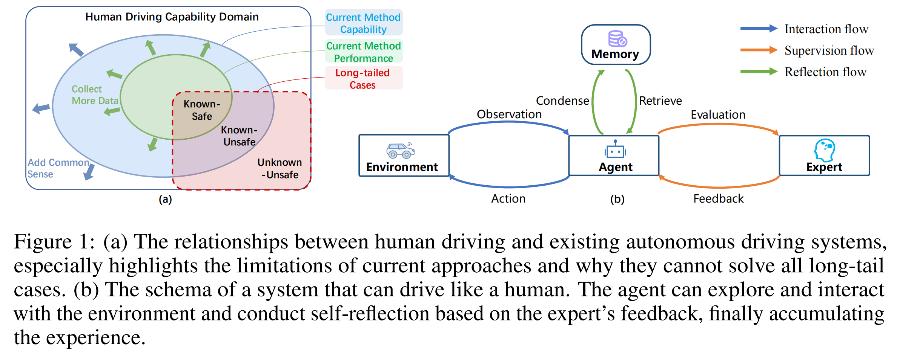
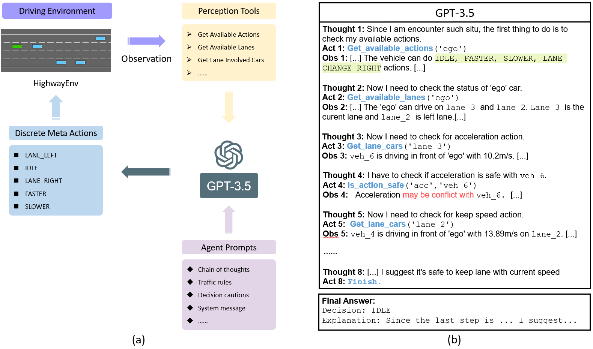
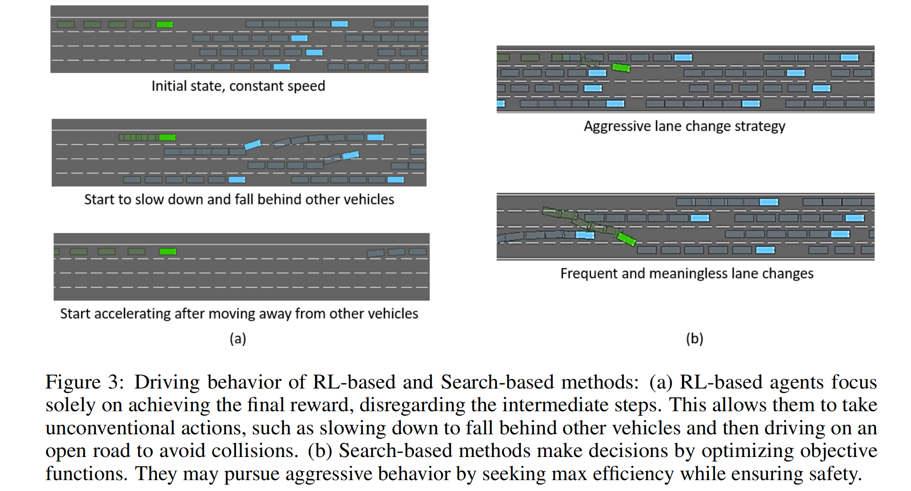
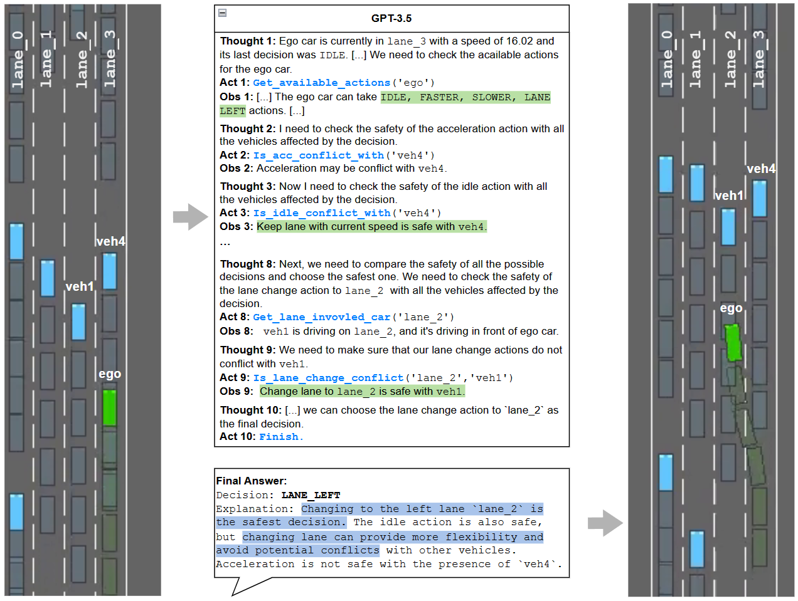
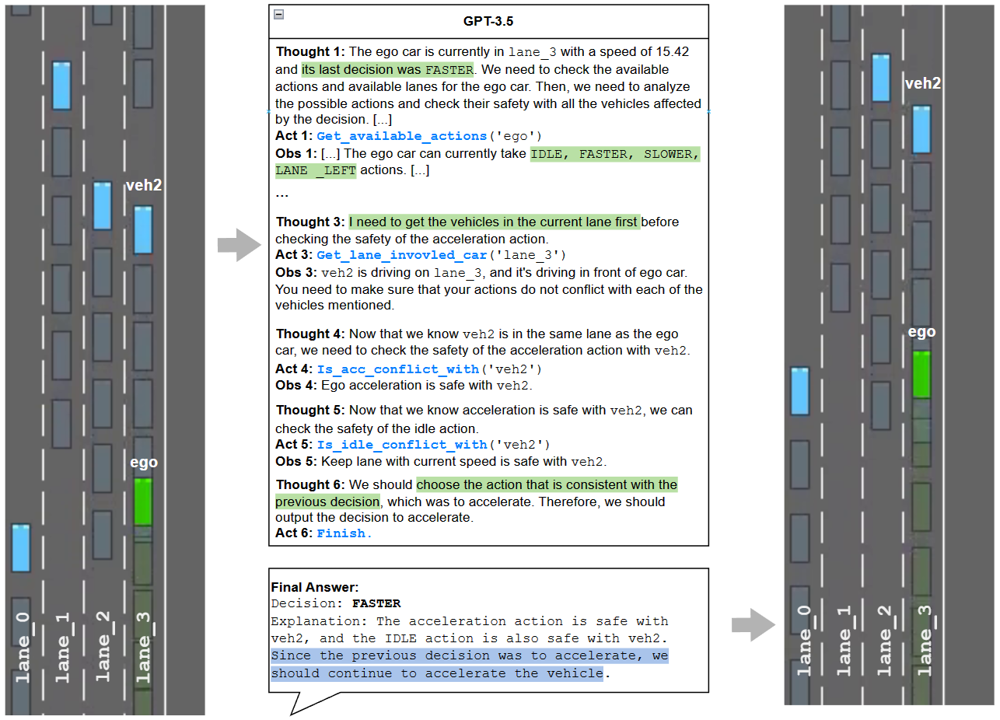
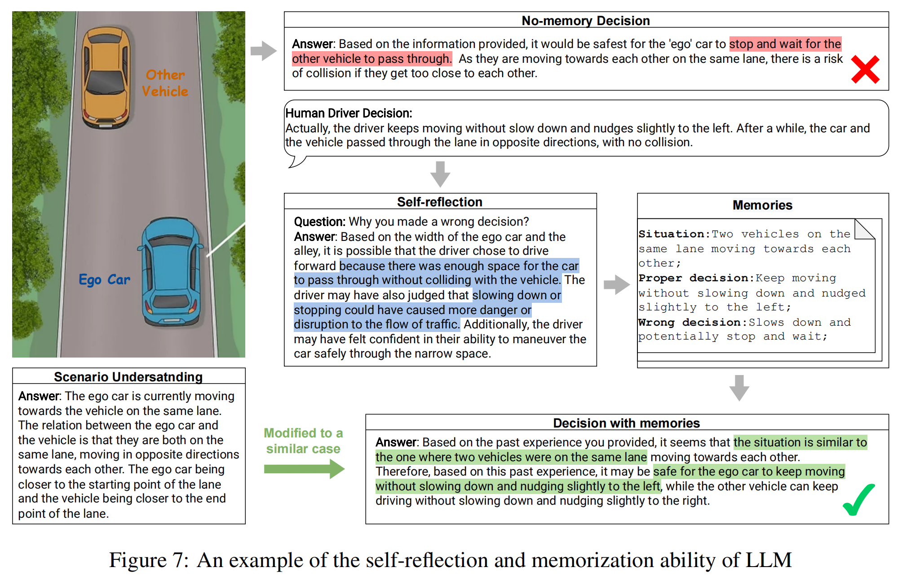

<!--
 * @Author: Pang Aoyu
 * @Date: 2023-08-15 
 * @Description: Drive Like a Human: Rethinking Autonomous Driving with Large Language Models
 * @LastEditTime: 2023-08-15 
-->
# Drive Like a Human: Rethinking Autonomous Driving with Large Language Models

- [Drive Like a Human: Rethinking Autonomous Driving with Large Language Models](#drive-like-a-human-rethinking-autonomous-driving-with-large-language-models)
  - [Introduction](#introduction)
  - [Closed-loop interaction ability in driving scenarios](#closed-loop-interaction-ability-in-driving-scenarios)
  - [Reasoning ability with common sense](#reasoning-ability-with-common-sense)
  - [Performance enhancement through memorization ability](#performance-enhancement-through-memorization-ability)
  - [Conclusion](#conclusion)

## Introduction

Some scenarios, which are easy for human drivers to handle, are long-tail corner cases for many existing autonomous driving (AD) systems.

    

Although the system that built upon the optimization theory can easily divide the complex autonomous driving task into a set of sub-tasks. The goal of optimizing the loss function tends to be trapped by local optimizations when facing a complex scenario, which limits its generalization ability. Incorporating more data (green arrows in graph) can only reduce the performance gap between to current model (green ellipse) and the maximum capacity of optimization-based methods (blue ellipse). This is mainly because the optimization process focuses on learning the dominant patterns within the data, often overlooking infrequent long-tail corner cases. Without the incorporation of common sense (blue arrows), the capacity of the model (blue ellipse) cannot be prompted. We claim that it is necessary to borrow
ideas from Embodied AI  research if we want to get an agent that can drive a car like an experienced human driver.

Towards the goal of driving like a human, they identify three abilities that are necessary:: 
- **Reasoning**: Given a specific driving scenario, the model should be able to make decisions by reasoning via common sense and experience.
- **Interpretation**: The decisions made by the agent should able to be interpreted. This demonstrates the ability of introspection and the existence of declarative memory.
- **Memorization**: After reasoning and interpreting scenarios, a memory mechanism is required to remember previous experiences and enable the agent to make similar decisions once facing similar situations.

Based on the above three properties, we refer to the paradigm of human learning to drive and condense a canonical form of a driving system and categorize it into four parts：
- Environment creates a stage that the agent can interact with by the interaction flow; 
- Agent stands for a driver that can perceive the environment and make decisions utilizing its memory and learning from expert advice; 
-  Memory allows the agent to accumulate experience and perform actions with it via the reflection flow;
-  Expert provides advice on agent training and gives feedback when it acts inconsistently, which forms the supervision flow.

In this paper, we try to initially explore the ability of LLM to understand driving traffic scenes like humans and analyze the LLM’s ability of reasoning, interpretation and memorization in handling scenarios like long-tail corner cases through a series of qualitative experiments. The main contributions of this paper are as follows:
 -   We dive deep into how to make autonomous driving systems drive like a human to prevent catastrophic forgetting of the existing AD systems when facing long-tail corner cases and summarize into three key abilities to drive like a human: Reasoning, Interpretation and Memorization.
 -   We are the first to demonstrate the feasibility of employing LLM in driving scenarios and exploit its decision-making ability in the simulated driving environment.
 -  Extensive experiments in our study express impressive comprehension and the ability to
solve long-tailed cases. We hope that these insights will inspire academia and industry to
contribute to the development of human-like autonomous driving.

## Closed-loop interaction ability in driving scenarios
 We conducted a closed-loop driving experiment on HighwayEnv* using GPT-3.5 to verify LLM’s interpretation and environmental interaction abilities.  As shown in Fig. 2, the Agent Prompts provide GPT-3.5 with information about its current actions, driving rules, and cautions. GPT-3.5 employs the ReAct strategy to perceive and analyze its surrounding environment through a cycle of thought, action, and observation. Based on this information, GPT-3.5 makes decisions and controls vehicles in HighwayEnv, forming a closed-loop driving system. The results are shown in Fig 3, 4 and 5
 

    

 

    

 

    

 

    

In summary, neither RL-based nor Search-based approaches can truly think and drive like humans because they lack common sense, the ability to interpret scenarios, and the ability to weigh the pros and cons. In contrast, GPT-3.5 can explain the consequences of each action, and by providing prompts, we can make GPT-3.5 value-oriented and enable it to make more human-like decisions.

## Reasoning ability with common sense
LLMs like GPT-3.5, have been trained on vast amounts of natural language data and are knowledgeable about common sense [2]. This marks a significant departure from traditional AD methods and empowers LLMs to reason through complex driving scenarios using common sense, much like human drivers. In this section, we evaluate two typical long-tail cases in autonomous driving systems, which involves a pickup truck carrying traffic cones as described at the beginning of Section1, as in Fig 6.
 

    

## Performance enhancement through memorization ability
Continuous learning is another key aspect for human to drive. Novice drivers typically drive cautiously due to their limited experience when encountering complex traffic situations. Over time, as they gain more experience behind the wheel, drivers encounter new traffic scenarios, develop new driving skills, and consolidate their previous experience, eventually becoming experienced drivers. As depicted in Fig.1(b), our proposed LLM-based approach closely follows the human through the use of a separate memory module. The memory module records only the decision scenarios that "deviate from the experts." The experts can be either the developer’s evaluation of the LLM decision or the ground truth of human driver’s decision in the real world. Once expert feedback is obtained, the LLM undergoes a self-reflection process to determine why its decision deviates from the expert’s. It then summarizes the traffic situation into a decision scenario and adds it to the memory pool as a new memory entry, along with the proper decision. When the next time a similar case is encountered, the LLM can quickly retrieve this memory entry for reference and make an informed decision. Example as in Fig 7.
 

    

## Conclusion
In this paper, we present our idea of building a system that can drive like a human. We reckon that previous optimization-based autonomous driving systems have their limits when dealing with long-tail corner cases due to the catastrophic forgetting of global optimization. Therefore, we summarize three necessary abilities that an AD system should have to defeat imperfections including (1) Reasoning, (2)interpretation, and (3) Memorization. Then we design a new paradigm following these three creeds that mimics the process of human learning to drive. Finally, with the hope of a primary artificial general intelligence, we try to use GPT-3.5 as our LLM test-bed and show an impressive ability of understanding traffic scenarios. 
