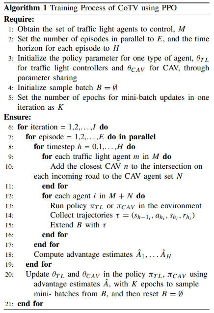

<!--
 * @Author: WANG Maonan
 * @Date: 2024-02-29 13:05:34
 * @Description: CoTV 
 * @LastEditTime: 2024-03-01 00:56:40
-->
# CoTV: Cooperative Control for Traffic Light Signals and Connected Autonomous Vehicles Using Deep Reinforcement Learning

- [CoTV: Cooperative Control for Traffic Light Signals and Connected Autonomous Vehicles Using Deep Reinforcement Learning](#cotv-cooperative-control-for-traffic-light-signals-and-connected-autonomous-vehicles-using-deep-reinforcement-learning)
  - [Introduction](#introduction)
    - [研究背景](#研究背景)
    - [传统方法存在的问题](#传统方法存在的问题)
    - [本文的方法](#本文的方法)
  - [Method](#method)
    - [System Design Goal](#system-design-goal)
    - [System Components](#system-components)
      - [Traffic Light Controller Agents](#traffic-light-controller-agents)
      - [CAV Agents](#cav-agents)
    - [DRL Training Process](#drl-training-process)
    - [Considerations for Easy-to-Deploy](#considerations-for-easy-to-deploy)
  - [Evaluation Method](#evaluation-method)
    - [模拟场景](#模拟场景)
    - [评估指标](#评估指标)
  - [比较方法](#比较方法)
  - [Experiment](#experiment)
    - [Traffic Efficiency \& Safety](#traffic-efficiency--safety)
    - [Improved Scalability by Reducing the CAVs Agents](#improved-scalability-by-reducing-the-cavs-agents)
    - [When CoTV Meets More Complicated Urban Scenarios](#when-cotv-meets-more-complicated-urban-scenarios)
  - [Conclusion](#conclusion)

## Introduction

### 研究背景

本文探讨了为了实现联合国可持续发展目标（UN-SDG），如何发展下一代智能交通系统（ITS）。特别是：
1. 可持续交通不仅要求提高效率，减少因交通拥堵造成的巨额经济损失（traffic efficiency）
2. 还要鼓励更环保的驾驶，以减少燃料消耗和气体排放（eco-friendly driving）
3. 同时还要通过避免潜在的碰撞来提高交通安全，从而拯救生命（traffic safety）。
4. 最后，要实现这些可持续交通目标，易于部署的 ITS 基础设施至关重要。

### 传统方法存在的问题

现有的可持续城市交通控制研究大多**只调整交通信号灯或车辆速度**。如下图所示：
- 控制信号的可以减少 travel time，从而减少 fuel consumption；
- 控制 CAV 可以减少 fuel consumption 和「事故率」；

    

更进一步，这些方法可能无法在真实交通场景中表现良好，因为它们的确定性交通控制决策不足以应对复杂和不断变化的实际交通场景。

### 本文的方法

本文提出了一种称为 CoTV 的多智能体深度强化学习（DRL）系统，它能够合作控制交通信号灯和连接自动驾驶车辆（CAV）。本文的方法 CoTV 可以在实现旅行时间、燃料和排放量减少方面取得了良好的平衡。

下面是本文的主要贡献：
- Effective cooperation schemes between CAVs and traffic light controllers. 设计了整个包含 Traffic Light 和 CAV 交互的强化学习框架。CoTV 的合作方案不依赖于动作依赖性设计，而是依赖于在交叉口范围内的智能体（包括交通信号灯控制器和接近的 CAV）之间的状态信息交换。这种「动作独立型MARL」简化了 DRL 训练，并保持了 CoTV 在各种场景下改善交通的有效性。
- Scalable to complex urban scenarios by avoiding cooperation with excessive CAV agents. CoTV 通过与每条进入道路上最接近交通信号控制器的 CAV 合作来简化部署，从而实现交通信号控制器和 CAV 之间更有效的协调，使得 CoTV 在大规模多智能体场景下达到传统上难以收敛的训练收敛。
- Efficient communication exchange schemes between CAV and traffic light controllers. 需要传输的信息比较少，其实就是 state 是比较简单的。

实验结果表明，CoTV 在不同的 CAV 渗透率下，能够将旅行时间、燃油消耗和 $CO_{2}$ 排放量减少高达 $30\%$。本文还展示了 CoTV 在复杂城市场景下的可扩展性，通过避免与过多的 CAV 代理合作，显著降低了训练时间和资源消耗。此外，CoTV 在交通安全方面的效果也通过碰撞时间评估得到验证，并展示了其在不同 CAV 渗透率下的鲁棒性。

## Method

CoTV 的系统组件包括交通信号灯控制器（Traffic Light Controller Agents）和 CAV Agents，它们通过 V2X 通信相互交换状态信息。系统的目标不仅仅是减少旅行时间，还包括减少燃料消耗和二氧化碳排放，提高交通安全，以及简化基础设施部署和维护。CoTV 的信息交换如下图所示：

    

**注意**：可以直观的看到，Traffic Light 的 State 中包含 CAV 的信息，CAV 的 state 中包含 Current Signal Phase。作者通过 state 的设计来完成 Traffic Light 和 CAV 之间的协作。

### System Design Goal

下面是系统设计的目标：

- 减少旅行时间：通过提高交叉口通行能力来实现。
- 降低燃料消耗和 $CO_{2}$ 排放：通过控制 CAV 的速度来实现稳定的交通流，并通过智能交通灯控制减少停车和起步。
- 提高碰撞时间间隔：通过维持足够的时间间隔以适度减速来减少碰撞风险。
- 易于部署：需要 V2X 通信基础设施，同时解决随着智能体数量增加可能出现的可扩展性问题。

### System Components

#### Traffic Light Controller Agents

- **Action**：使用了 Next or Not 的动作设计，也就是每次选择 Change to the next phase 或是 Keep the current phase.
- **State**：这里的状态由三个部分组成，分别是：
  - The Current Signal Phase；
  - Traffic on the roads，这个包含每个车道上车辆的数量；
  - Status of the cloest vehicle to the intersection on each incoming road, including speed, acceleration, distance to the intersection
- **Reward**：使用归一化之后的 Pressure，这里通过路口的 capacity 对其进行归一化。这里不区分车道，计算整个路口的 Pressure。下图是一个计算 Pressure 的例子，其中进入 5 辆车，离开 2 辆车，道路的通行能力是 40：

    

#### CAV Agents

- **Action**：在 $[-3m/s^{2}, 3m/s^{2}]$ 范围内的 CAV 加速度，一个连续的动作空间；
- **State**：这里的状态同样由三个部分组成，分别是：
  - Current Signal Phase（接近的交通信号控制器的当前信号状态）
  - Traffic Flow，前后车辆的状态（速度，加速度）
  - 车辆的当前的状态（包含速度，加速度，与前方车辆的距离，即将到达的交叉口的距离）
- **Reward**：车辆的奖励分为两个部分，分别是：
  - 希望车辆的速度尽可能的接近最大速度，从而提高效率；
  - 希望车辆的加速度接近 0，减少油耗，和增加安全系数；
  - 下面是奖励详细的计算公式，其中 v* 是最大速度，a* 是最大加速度，$K$ 是这条路上的车辆。

    

下图展示了 CAV 每一辆车奖励计算的例子。此时路口有三辆车，奖励左侧部分为速度，我们希望速度接近最大速度 $15$；右边式子是加速度，我们希望加速度接近 $0$（这里如果加速度小于 $0$，则直接是 $0$）：

    

### DRL Training Process

使用 PPO 算法进行训练。同时，CoTV 使用参数共享，以便所有同类型智能体在多智能体DRL系统中能够快速收敛，从共享经验中获益。下面是训练的伪代码：

    

### Considerations for Easy-to-Deploy

本文提出的方法是易于部署的，这是因为：
- 【解决 CAV 数量多的情况下难以训练】只选择每个进入道路上距离交叉口最近的 CAV 进行合作控制，减少了培训时间和资源。
- 【解决多智能体的合作】智能体之间的合作方案仅依赖于状态信息的交换，而非动作依赖性设计。
- 【解决通信】交换的信息量相对较小，传输需求由 IEEE 802.11p 的 V2I 和 V2V 通信基础设施满足，通信范围限定在单个交叉口内（约300米）。关于 CAV 和 Traffic Signal 的通信模块，如下图所示。展示了「车和车」，「车和灯」，以及「灯获得周围信息」：

    

## Evaluation Method

在本节中，我们介绍了评估方法，包括模拟设置，评估指标，以及我们提出的CoTV系统与其他方法的比较概述。

### 模拟场景

仿真平台是 SUMO，模型设计和实现基于FLOW，它提供了使用 SUMO 进行 DRL 的一些接口。作者使用了下面的三个场景来验证方法的有效性：
- 简单的 $1 \times 1$ 网格图（单个路口的场景）
- 扩展到在 $1 \times 6$ 网格图表上更多连续的交叉口（6 个路口的场景）
- 使用都柏林市的真实城市场景的一个子集（真实城市路口，这里其实也只有 6 个路口）。下图为真实的路网。

    

### 评估指标

我们使用以下指标评估每个场景的可持续交通改进：

- **Travel time (seconds)**：每辆车的行驶时间是在道路网络中完成指定行程所需的时间成本。平均行驶时间是在一个场景中完成行程的车辆计算的，这是评估交通效率的常用指标。
- **Delay (seconds)**：延迟是实际行驶时间与理想行驶时间（即以最高允许速度行驶时的时间）之间的差异。这个值表示交通效率可以进一步优化到其上限的空间。这个指标比行驶时间更能反映交通效率的改进。
- **Fuel consumption (l/100km)**：燃油消耗是每100公里行驶的平均燃油消耗量。车辆速度越接近我们设置的最大速度限制，加速度变化越平缓，就越有可能实现较低的燃油消耗。
- **CO₂ emissions (g/km)**：CO₂排放是所有车辆行驶每公里平均排放的二氧化碳量。作为温室气体排放的主要组成部分，CO₂排放需要减少以实现可持续交通。
- **Time-To-Collision (TTC)**：TTC是一个广泛使用的安全指标，估算一辆车撞上前面一辆车所需的时间。我们使用SUMO中的默认TTC阈值，3秒，这意味着当两辆相邻车辆之间的时间间隔小于3秒时，就会识别出可能的碰撞。

## 比较方法

为了评估我们系统 CoTV 的有效性，我们描述了以下比较方法：

- **Baseline**：这是评估其他方法改进的基线。交通信号灯有一个不随交通变化的静态时间计划，因此不需要V2X通信来收集车辆信息。
- **FlowCAV**：FlowCAV 是一个基于 DRL 的模型，用于控制 CAV 的速度以提高燃油效率并减少排放（只控制 CAV 但是不控制 Traffic Light）。
- **PressLight**：PressLight 是一个基于 DRL 的模型，用于控制交通信号灯以提高交叉口吞吐量（只控制信号灯，但是不控制 CAV）。
- **GLOSA**：这是一种优化基方法，用于联合控制交通信号灯和 CAV。这个部分的实现可以直接使用 SUMO 自带的 [SUMO-GLOSA](https://sumo.dlr.de/docs/Simulation/GLOSA.html)，
- **I-CoTV**：I-CoTV 结合了两种类型的代理的**独立策略训练**。在这里独立其实就是 state 的改变，CAV 中没有包含 Traffic Light 的信息，Traffic Light 没有包含 CAV 的信息。
- **M-CoTV**：M-CoTV是 CoTV 的 action-dependent 的 MARL 版本，这里训练的时候会考虑不同 agent 的动作。
- **CoTV***：CoTV*保留了 CoTV 的所有特性，不同之处在于在 CoTV* 中，交通信号控制器与所有 CAV 互动，而不仅仅是与每条进入道路上最接近交叉口的CAV互动。

## Experiment

### Traffic Efficiency & Safety

在**交通效率与安全性**方面，CoTV 在 $100\%$ CAV 渗透率下取得了最短的旅行时间，与基准情况相比减少了 $30\%$，PressLight 和 GLOSA 分别减少了 $24\%$ 以上和 $23\%$ 以上。然而，FlowCAV 由于静态交通灯计划和当前交通灯信号的缺失，并没有减少旅行时间。CoTV 的进一步改进表明了与仅控制交通灯信号相比，协同交通控制的优势。此外，CoTV 还在燃料消耗和二氧化碳排放方面取得了最好的结果，减少了 $27\%$ 以上。在**交通安全**方面，CoTV 降低了 TTC（碰撞时间）超过 $96\%$。FlowCAV 在网格地图情景下降低了交通安全，但在都柏林情景下并非如此。

    

关于**不同CAV渗透率下的鲁棒性**，CoTV 在不同情景下随着 CAV 渗透率的增加，旅行时间倾向于减少。即使在 $0\%$ CAV渗透率下（即没有速度控制的CAV），CoTV 实现的旅行时间仍然少于基准和 PressLight。这证明了 CoTV 在现实混合自主性情景下部署的可行性。（个人感觉下面这张图 Y 轴这么画不是很好，因为不同路网的 Travel Time 放在一起是没有意义的）

    

在**与其他MARL方法的比较**方面，与其他两种常见的 MARL 方法 I-CoTV（独立，没有任何合作方案）和 M-CoTV（动作依赖，动作和状态中有合作方案）相比，CoTV 取得了最好的结果。I-CoTV 由于收敛问题，导致最差的交通性能。M-CoTV 未能克服考虑其他代理的动作带来的高复杂性，影响了交通改善。CoTV 实现了前三个系统目标，包括减少旅行时间、降低燃料消耗和二氧化碳排放、延长碰撞时间。

    

### Improved Scalability by Reducing the CAVs Agents

在**可扩展性改进**方面，CoTV 的第二个贡献是通过减少受控 CAV 代理的数量来提高多智能体系统的可扩展性。与 $CoTV^{*}$ 相比，CoTV 在交通效率和安全性方面有相当（有时略好）的改进，同时还能减少高达 $44\%$ 的训练时间。CoTV 通过仅与每条进入道路上最近的 CAV 合作来实现这一点。

    

### When CoTV Meets More Complicated Urban Scenarios

为了进一步探索 CoTV 的部署选项，我们在都柏林市中心进行了仿真实验，该地区传统上需要相邻交通灯控制器之间的复杂协调。选择的区域覆盖了近1 平方公里，有 $31$ 个信号化交叉路口。尽管 CoTV 在所有评估指标上均取得了最好的结果，但我们仍需要进一步研究如何选择关键交叉口以控制，以避免在所有城市交叉口上的昂贵部署。下表是 CoTV 与其他方法结果的比较，是在 $100\%$ CAV 渗透率下的结果：

    

## Conclusion

本文提出了一种多智能体深度强化学习（DRL）系统 CoTV，用以协同控制交通信号灯和连接自动驾驶车辆（CAV），以实现可持续交通目标。CoTV 能显著提高交通效率（例如旅行时间、燃油消耗和二氧化碳排放）和交通安全（例如碰撞时间），其性能超越了其他只控制交通信号灯或车速的基于 DRL的系统，以及传统的联合控制方法。

CoTV 中的交通信号灯控制器利用车辆对基础设施通信（V2I）来仅与每条来路上最近的 CAV（即车队的领头车）合作，以缓解多智能体系统的可扩展性问题。这也简化了部署工作，并能使训练过程在适度的迭代次数内收敛。在各种网格图和现实城市场景的实验中，CoTV的有效性得到了证明。与基准情况相比，CoTV 能够节省高达 $28\%$ 的燃油消耗和 $CO_{2}$ 排放，同时将旅行时间减少多达 $30\%$。CoTV 的稳健性也在不同CAV渗透率下得到验证。

未来的工作（这里包含一些我自己觉得可以做的）：
- 我们计划提高 CoTV 系统对更实际情况的稳健性。首先，我们将放宽所有车辆使用车辆对任何通信（V2X）的假设。其次，我们将改进CoTV 以适应变化的车辆网络条件（例如，延迟、数据包丢失、带宽等）。
- 解决在复杂城市交通场景中应用协同多智能体强化学习算法（例如COMA）的可扩展性问题。
- 当路口过于多的时候，可能需要选择关键路口进行控制。