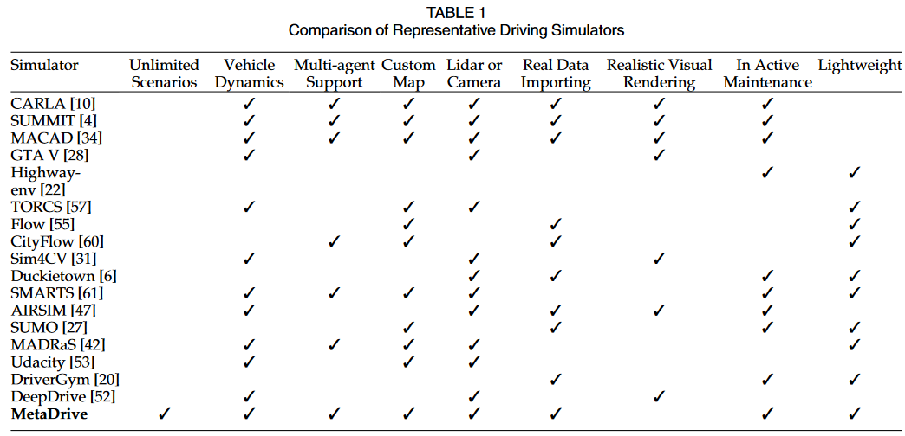
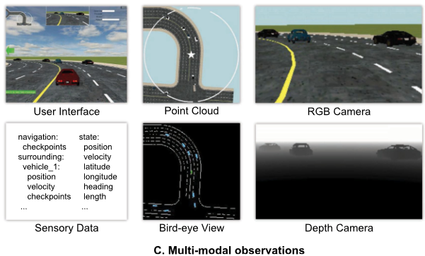
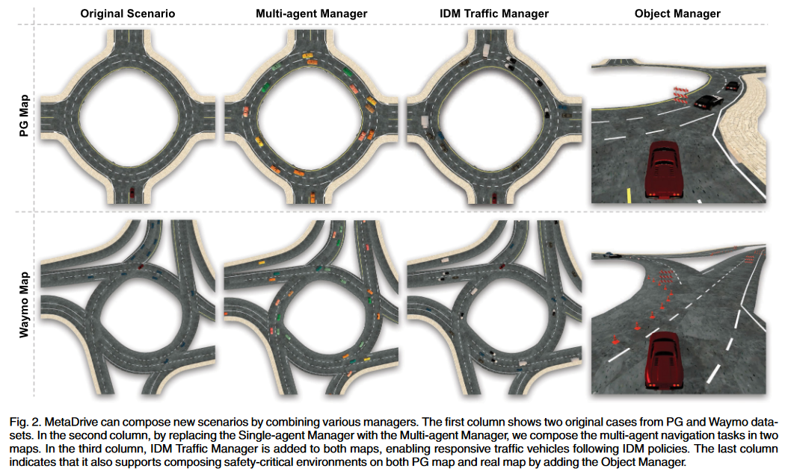
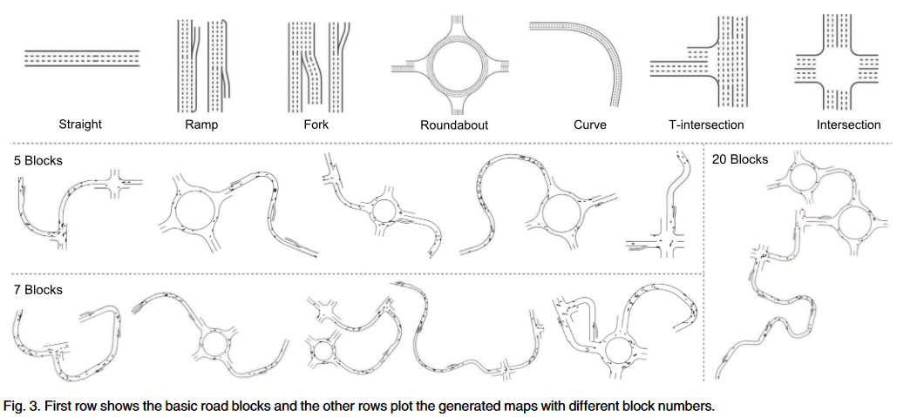
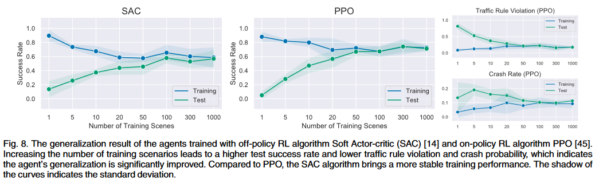

# MetaDrive: Composing Diverse Driving Scenarios for Generalizable Reinforcement Learning

- [MetaDrive: Composing Diverse Driving Scenarios for Generalizable Reinforcement Learning](#metadrive-composing-diverse-driving-scenarios-for-generalizable-reinforcement-learning)
  - [Abstract](#abstract)
  - [Introduction](#introduction)
    - [目前存在的问题](#目前存在的问题)
    - [本文的方法](#本文的方法)
  - [Related Work](#related-work)
  - [System Design of MetaDrive](#system-design-of-metadrive)
    - [Core Concepts](#core-concepts)
    - [Workflow for Scenario Composition](#workflow-for-scenario-composition)
    - [Composing Diverse Driving Scenarios](#composing-diverse-driving-scenarios)
  - [Benchmarking RL Task](#benchmarking-rl-task)

## Abstract

安全驾驶需要人类和智能体具备多种能力，例如对未知环境的适应能力、对周边交通的安全意识，以及在复杂多智能体环境中的决策能力。尽管强化学习（Reinforcement Learning, RL）取得了显著成就，但大部分 RL 研究仍是分别研究这些能力，原因在于缺乏一个集成的环境。

本文（1）首先介绍了 MetaDrive 框架，（2）接着使用这个框架完成了 4 个 tasks 并给出 benchmark:
1. 在这项研究中，我们开发了一个名为 MetaDrive 的新驾驶模拟平台，旨在支持机器自主性的**泛化强化学习算法**的研究。MetaDrive 具有高度的可组合性，能够通过程序生成（Procedural Generation, PG）和真实数据导入，创造无限数量的多样化驾驶场景。
2. 基于 MetaDrive，我们在单智能体和多智能体设置中设计了多种 RL 任务和基准测试，包括评估在未知场景中的泛化能力、安全探索和多智能体交通学习。我们在程序生成的场景和现实世界场景中进行的泛化实验表明，增加训练集的多样性和规模可以提高 RL 智能体的泛化能力。我们进一步评估了 MetaDrive 环境中不同的安全强化学习和多智能体强化学习算法，并提供了性能基准。

## Introduction

### 目前存在的问题

1. 最近的进展表明，将 RL 应用于实际应用，例如自动驾驶、均显示出巨大潜力。然而，泛化依然是 RL 面临的一个主要挑战。即便是常见的驾驶任务，一个在某个城镇学会了驾驶的智能体，往往难以在另一个城镇中驾驶。**这主要是因为现有 RL 环境缺乏多样性，导致模型过度拟合**。
2. 另一个挑战是泛化 RL 研究的可扩展性问题。进行 RL 智能体泛化性的基准测试需要大量的计算资源和较长的训练时间。例如 Carla 等仿真需要较长的时间。

### 本文的方法

1. **【解决场景多样性】** 为了更好地评估自动驾驶领域 RL 算法的泛化能力，本文开发了 MetaDrive，这是一个能够构建广泛多样交通场景的驾驶模拟平台。MetaDrive 的关键特性是其组合性，可以从程序生成、真实数据导入和域随机化中生成多样的驾驶场景。它还支持安全 RL 和多智能体RL等多种研究主题。MetaDrive中的每一个元素，如车辆、障碍物或道路结构，都是可配置的交互对象，可以在参数空间中自由组合和管理，用以构建新的交互式驾驶场景。**Every asset in MetaDrive, such as the vehicle, the obstacle, or the road structure, is defined as an interactive object with many configurable settings restricted in the parameter spaces, which can be combined, managed, and actuated to compose new interactive driving scenarios.**
2. **【解决训练速度和 RL 适配性】** MetaDrive 在视觉渲染和物理模拟之间做了权衡。通过减少对于高度真实渲染的资源需求，一个 100 MB 大小的 MetaDrive 实例能在标准 PC 上以高达 300 FPS 的速度运行真实的物理模拟。此外，这个平台还兼容常见的 RL 训练框架，如 RLLib 和 Stable-Baseline3，能够启动超过 100 个实例以并行方式生成数据。MetaDrive 还可以通过单行命令安装，并在 Python 环境中与OpenAI Gym API进行交互，这些特性使其成为推动泛化RL算法开发的有力工具。
3. **【自动驾驶任务】** 由于其高度的组合性和扩展性，MetaDrive 支持多种强化学习任务（**MetaDrive supports a variety of reinforcement learning tasks because of its compositionality and extensibility**）。在当前开发阶段，我们在驾驶研究的背景下构建了四个标准的 RL 任务，并实现了它们的基准。前三个任务是单智能体任务，最后一个是多智能体任务：
   1. 对程序生成场景的泛化（Generalization to unseen PG scenarios）
   2. 对真实场景的泛化（Generalization to unseen real scenarios）
   3. 安全探索（Safe exploration）
   4. 多智能体交通模拟（Multi-agent traffic simulation）

## Related Work

下表是一些驾驶模拟器整理的表格，详细描述见原文：

    

## System Design of MetaDrive

**MetaDrive 的核心特征是其组合性（The core feature of MetaDrive is its compositionality）**，这一特点主要体现在两个方面（这里其实在介绍 MetaDrive 的实现）：
- 低级系统实现的抽象化：在底层实现上，我们封装了基本组件的后端实现及其与高效的 3D 游戏引擎 Panda3D 之间的交互。
- 将基本组件高级聚合成交通场景。而在高层 API 上，我们开发了多种方法来生成交通流和多样化的道路网络。后端模拟的封装使得 RL 研究人员能够方便地开发新的场景和任务，从而在自动驾驶领域进行原型化测试。MetaDrive中的多样化驾驶场景也成为了评估各种 RL 算法的标准环境。

### Core Concepts

**对象（object）**：在MetaDrive中，对象作为模拟引擎和 Python 环境之间的中介。对象是驾驶场景中的基本单位，如车辆、障碍物、交通灯和道路结构。在后端模拟中，对象连接了物理模型和渲染模型两个内部模型。物理模型由 Bullet 引擎驱动（Panda3D），能够参与碰撞检测和运动计算；渲染模型则负责实现光反射、纹理和阴影等细致的渲染效果。

在 Python 环境中，用户可以简单地通过一行代码来操作对象和获取信息。每种对象都有一个参数空间，定义了对象可能的配置，如车辆的轮胎摩擦力、悬挂硬度、颜色和大小等，这些参数可以根据用户的配置直接设定或在参数空间中随机抽样。

**策略**：策略是一个函数，根据对象和环境状态输入，决定可控对象的行动或静态对象的新状态。每个时间步骤中，对象的策略会自动被调用，控制信号通过 object.step() 或 object.set_state() 函数传递给对象，模拟引擎随后执行这些控制信号，推动世界向前发展一步（如何控制车辆移动）。

**管理器**：不同的管理器负责管理不同角色的对象。例如，在单智能体强化学习环境中，虽然自主车辆和交通车辆都是车辆对象，但它们扮演的角色不同，因此需要不同的策略。自主车辆需要环境提供详细的周围信息，并由强化学习代理控制；而交通车辆则依赖于基于规则的策略，其生成和回收规则也有所不同。自主车辆仅在场景重置时创建，而交通车辆如果远离自主车辆则会被回收。因此，这两种车辆应由代理管理器和交通管理器分别管理（可以理解为将策略分配给对象）。

### Workflow for Scenario Composition

MetaDrive 的工作流如下：
1. 【初始化】根据用户的设定，MetaDrive 环境创建一组管理器，这些管理器负责生成对象并在适当的时候为对象分配策略。
2. 【每一步 object 的更新】初始化阶段后，所有对象将自动按照其策略在环境中运行，同时管理器监控对象的状态，并在必要时启动新对象或回收已终止的对象。
3. 【object 返回观测】每个步骤中，管理的对象信息和状态会被抛出环境外，供策略决定新的控制信号。这里的观测可以有多种格式，如下图所示：

    

通过灵活组合现有的管理器，可以轻松构建新的环境和官方发布的基准，为更有趣的研究主题提供支持。下图展示了场景和管理器之间的组合（其实就是不同 agent 可以使用不同的策略进行控制）：

    

### Composing Diverse Driving Scenarios

为了可以生成多种类型的路网，在 MetaDrive 中定义了基础的 road block，接着可以将这些 road block 进行组合，得到不同的自动驾驶场景：

    

1. Straight: A straight road is configured by the number of lanes, length, width, and lane line types. 
2. Ramp: A ramp is a road with an entry or exit existing in the rightest lane. The acceleration lane and deceleration lane are attached to the main road to guide the traffic vehicles to the enrty or exit of the main road.
3. Fork: A structure used to merge or split additional lanes from the main road and change the number of lanes.
4. Roundabout: A circular junction with four exits (sockets) with a configurable shape. Both roundabout, ramp, and fork aim to provide diverse merge scenarios.
5. Curve: A curve block consists of a circular shape or clothoid shape lanes with configurable curvature.
6. T-Intersection: An intersection that can enter and exit in three ways and thus has three sockets. The turning radius is configurable.
7. Intersection: A four-way intersection allows bi-directional traffic. It is designed to support the research of unprotected intersection.

## Benchmarking RL Task

正如前面所说，这里作者在 MetaDrive 上测试了四个不同的 RL 任务：
1. 对程序生成场景的泛化（Generalization to unseen PG scenarios）。模拟器基于程序生成技术，从基本的道路结构和交通车辆中创造出大量多样的驾驶场景。这些地图和场景被进一步分为训练集和测试集。我们随后进行了基准测试，以评估不同 RL 方法在道路网络结构和交通流动性方面的泛化能力。
2. 对真实场景的泛化（Generalization to unseen real scenarios）。MetaDrive 支持导入 Waymo 和 Argoverse 等真实世界数据集的 API，使我们能够评估 RL 智能体在真实交通场景中的泛化能力。这些真实世界案例经过人工精选以确保数据的高度真实性，之后被分为标准的训练和测试集。此外，我们还测试了在程序生成场景中训练的智能体在真实交通场景中的表现，以此验证程序生成技术的有效性。
3. 安全探索（Safe exploration）。我们研究了 RL 中的安全探索问题，探讨智能体在安全约束下的驾驶行为。除了周边车辆，道路上还可能随机分布一些障碍物，如故障车辆和交通锥，碰撞发生时将产生成本。我们测试了几种安全 RL 算法，以评估它们在关键安全场景下的适用性。
4. 多智能体交通模拟（Multi-agent traffic simulation）。我们在如环形交通和交叉路口等五个典型交通场景中，研究了密集交通模拟的多智能体RL问题。每个场景中有 20 到 40 个智能体，每个智能体都由一个连续的神经控制策略驱动。通过智能体之间的协调，可以实现集体行为的产生。

这里我们就说一下第一组实验，在虚拟环境下泛化性的测试。作者这里测试了在不同个数的场景上进行训练，然后在训练集和测试集上进行测试，得到如下的结果：

    

可以看到当场景较少的时候，模型泛化性较差，也就是在 Test Scenario 上的结果比较差。但是当场景数量变多的时候，模型在 Test Scenario 的效果变好。