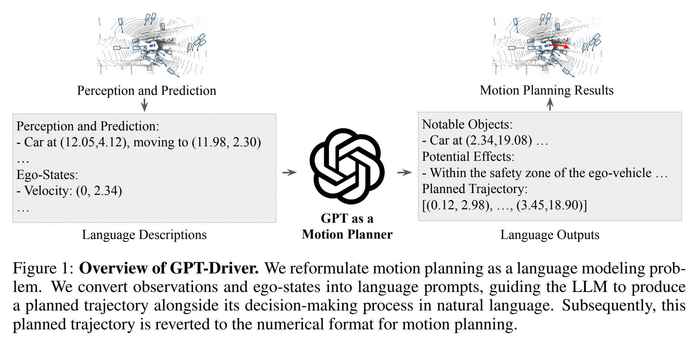
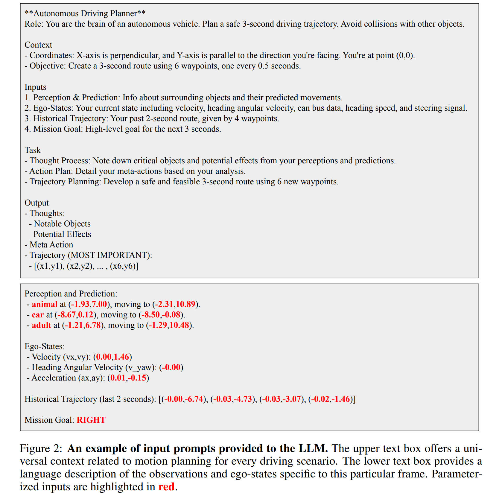
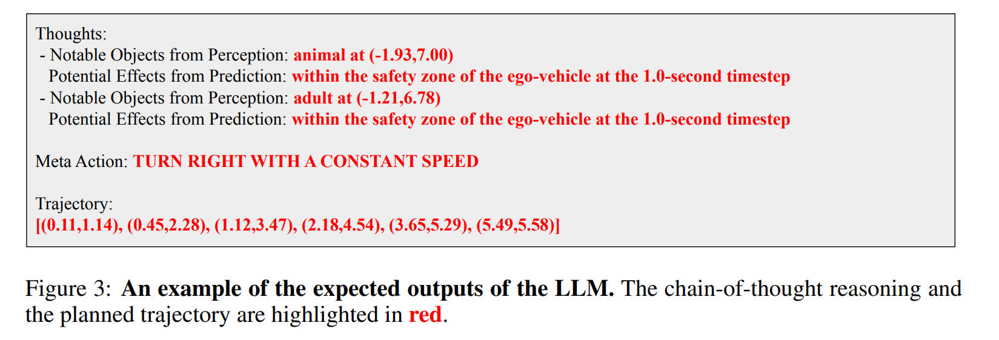
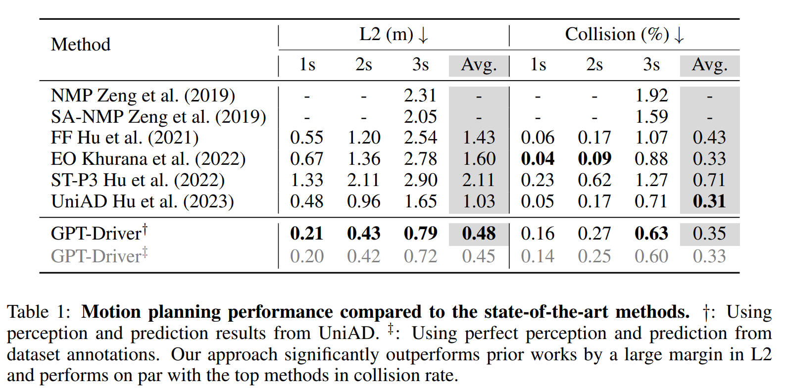
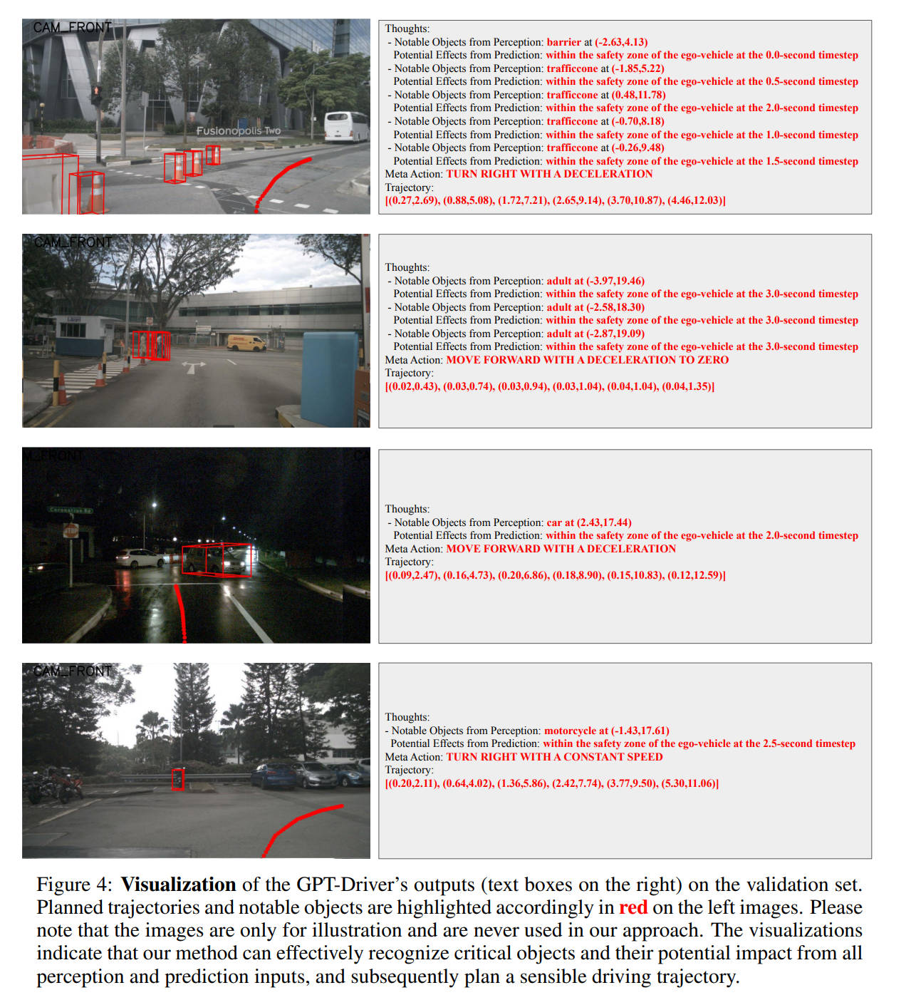

# GPT-Driver: Learning to Drive with GPT

- [GPT-Driver: Learning to Drive with GPT](#gpt-driver-learning-to-drive-with-gpt)
  - [Introduction](#introduction)
  - [Method](#method)
    - [问题定义](#问题定义)
    - [运动规划作为语言建模](#运动规划作为语言建模)
    - [提示-推理-微调](#提示-推理-微调)
      - [提示](#提示)
      - [推理](#推理)
      - [微调](#微调)
  - [Experiment Results](#experiment-results)
    - [与最先进的方法的比较](#与最先进的方法的比较)
    - [少样本运动规划](#少样本运动规划)
    - [可解释性](#可解释性)

## Introduction

Autonomous driving is a challenging frontier in modern technology, with motion planning being a critical component. Existing motion planning approaches can be divided into **rule-based** and **learning-based** methods. 
- Rule-based methods have clear interpretability but fail to handle extreme driving scenarios. 
- Learning-based approaches, while performing well, sacrifice interpretability and lack the common sense reasoning ability of human drivers. 

Recent advances in Large Language Models (LLMs) indicate their potential in addressing problems in autonomous driving, given their great generalization power and common sense reasoning ability. In this paper, the authors propose a novel approach that reformulates motion planning as a language modeling problem, using a GPT-3.5 model to understand language tokens representing planner inputs and articulate waypoint coordinates of a future driving trajectory. A **prompting-reasoning-finetuning** strategy is also proposed to stimulate the numerical reasoning potential of GPT-3.5.

The key contributions are as followed:
- The authors propose GPT-Driver, a GPT-based motion planner that turns the motion planning task into a language modeling problem, providing an intuitive interpretation of language modeling in motion planning.
- They introduce a novel prompting-reasoning-finetuning strategy in the context of autonomous driving, enabling precise numerical reasoning and transparent decision-making.
- The GPT-Driver demonstrates superior motion planning performance, few-shot generalization ability, and interpretability compared to state-of-the-art motion planners on the nuScenes dataset.

## Method

在这一部分，作者们介绍了 GPT-Driver，一种基于大型语言模型（LLM）的自动驾驶运动规划器。
1. 首先介绍了自动驾驶中运动规划的基本概念和问题定义。
2. 然后展示了如何将运动规划问题重新定义为语言建模问题。
3. 最后介绍了如何使用一种新颖的提示-推理-微调策略来解决这个语言建模问题。

    

### 问题定义

自动驾驶中的运动规划目标是以观察值和自我状态作为输入，规划出一条安全舒适的驾驶轨迹。这个过程可以被公式化为：

$$
    \mathcal{T} = F(\mathcal{O}, \mathcal{S}).
$$

其中 $\mathcal{T}$ 代表规划的轨迹，$\mathcal{O}$ 代表观察值（地图信息，周围的感知信息），$\mathcal{T}$ 代表自我状态（包括车辆历史轨迹，速度和加速度）。规划的轨迹可以被表示为一系列的路径点。

### 运动规划作为语言建模

这篇论文的关键是将运动规划转化为语言建模问题。给定一个驾驶轨迹，我们可以将其表示为描述这个轨迹的一系列单词。每个坐标值可以被语言标记器自由地转化为一组单词。

$$
 \mathcal{T} = K(\{(x_1, y_1), \cdots, (x_{t}, y_{t})\}) = \{w_1, \cdots, w_n\},
$$

其中 $w_{i}$ 表示第 $i$ 个单词。例如，坐标值 $23.17$ 可以被 GPT-3.5 的标记器转化为三个单词："23"、"." 和 "17"。通过这种语言表示，我们可以将运动规划问题重新定义为语言建模问题。

### 提示-推理-微调

尽管语言建模在运动规划中有潜力，但是简单地采用 GPT-3.5 来生成轨迹在实践中并不可行。为了解决这个问题，本文引入了一种新颖的「提示-推理-微调策略（Prompting-Reasonfing-Finetuning）」，激发语言建模解决运动规划问题的潜力。
提示-推理-微调策略可以使用下面的式子来表示：

$$
    \{ \mathcal{T}, \mathcal{R} \} = F_{GPT}(K(\mathcal{O}, \mathcal{S}))
$$

其中 $\mathcal{T}$ 表示输出的轨迹，$\mathcal{R}$ 表示模型给出的推理的原因。

#### 提示

他们通过将观察和自我状态的参数化表示转化为语言描述来制定提示。这些描述然后被输入到 GPT-3.5 模型中。下面是一个转换之后的例子：

    

#### 推理

他们提出了一种新颖的思维链推理策略，特别设计用于自动驾驶，解决了传统方法是黑盒，没有可解释的问题。这个三步推理框架为运动规划提供了更结构化的方法，并确保了整个规划过程的透明度。具体来说，这个推理过程可以被总结为以下三个步骤：

- 第一步：从感知结果中，运动规划器需要识别出那些可能影响其驾驶动态的关键对象（场景中关键元素获取）。
- 第二步：通过分析这些关键对象的未来运动，规划器应该推断出这个关键对象可能在何时、何地、以及如何影响自车。
- 第三步：在前两步分析的基础上，规划器需要做出高级驾驶决策，并将其转化为规划的轨迹。

    

#### 微调

为了使 LLM 的输出与人类驾驶行为对齐，他们采用了一个简单的微调策略。这里直接使用了 OpenAI fine-tuning API 来进微调。

## Experiment Results

本文在大规模实际世界的 nuScenes 数据集上进行广泛的实验，展示了 GPT-Driver 的有效性、泛化能力和可解释性。

### 与最先进的方法的比较

本文提出的 GPT-Driver 在 L2 指标上显著优于先前的工作。在碰撞指标上，本文的方法与最先进的方法接近，这表明 GPT-Driver 能够规划出安全的驾驶轨迹。此外，当将完美的感知和预测替换为学习的感知和预测时，规划性能只是稍微下降，这表明 GPT-Driver 对感知和预测错误具有鲁棒性。

    

### 少样本运动规划

为了进一步验证我们的 GPT-Driver 的泛化能力，我们设计了一个少样本运动规划实验。我们的方法在仅接触到全套训练场景的 $10%$ 时，就能在验证集上获得不错的运动规划结果，而 UniAD 在训练数据有限时无法获得良好的性能。与其他依赖大量数据的学习型规划器相比，我们的 GPT-Driver 在几个训练场景上进行微调，可以很好地泛化到完整的验证集，这表明了它强大的泛化和少样本学习能力。

    

### 可解释性

为了展示我们的 GPT-Driver 的可解释性，在下图中可视化了模型的推理输出和规划的轨迹。从图中可以看出，本文的的方法能够从所有的感知和预测输入中识别出关键。例如在第一个例子中，可以只关注附件的物体，远处白色的车辆会被忽略：

    

