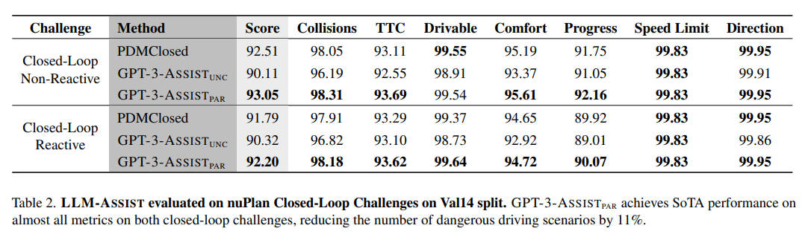

<!--
 * @Author: WANG Maonan
 * @Date: 2024-01-09 23:18:17
 * @Description: Paper Reading for LLM Assist
 * @LastEditTime: 2024-01-10 13:40:02
-->
# LLM-ASSIST: Enhancing Closed-Loop Planning with Language-Based Reasoning

- [LLM-ASSIST: Enhancing Closed-Loop Planning with Language-Based Reasoning](#llm-assist-enhancing-closed-loop-planning-with-language-based-reasoning)
  - [Introduction](#introduction)
    - [研究背景](#研究背景)
    - [目前方法存在的问题](#目前方法存在的问题)
    - [本研究的方法](#本研究的方法)
  - [Method](#method)
    - [Base Planner](#base-planner)
    - [LLM-ASSIST UNC](#llm-assist-unc)
    - [LLM-ASSIST PAR](#llm-assist-par)
  - [Experiment](#experiment)
    - [Hyperparameter Search](#hyperparameter-search)
    - [Prediction](#prediction)
    - [LLM-ASSIST Evaluation](#llm-assist-evaluation)
    - [Ablation Studies](#ablation-studies)
  - [Conclusion](#conclusion)

## Introduction

### 研究背景

近年来，得益于深度学习、新型感测技术的进步，自动驾驶汽车已经取得了重大进展，并且在某些城市的限定区域部署了完全自动驾驶的出租车服务。然而，在完全无约束环境中开展驾驶的所有复杂性，为自动驾驶车辆开发规划算法仍是一个重大挑战。

### 目前方法存在的问题

- **Learning-based Planners**: 尽管深度学习对自动驾驶堆栈的感知和预测组件产生了重大影响，但它在闭环规划上的影响还不大。rule-based planner 在最近的 nuPlan 基准测试竞赛中获胜，**这说明了 learning-based planner 在开环训练时缺乏泛化能力，闭环训练时又难以收敛到合理的解决方案**。
- **Rule-based Planners**: 另一方面，尽管 rule-based planner 在大多数情况下能够成功，但它们并不具备可扩展性，因为不可能枚举所有可能的驾驶场景。

### 本研究的方法

本文探讨了是否可以利用大型语言模型（LLMs）的常识推理能力来克服现有 learning-based planners 和 rule-based planner 的限制（Can we leverage the common-sense reasoning of LLMs to overcome the limitations of existing learning- and rule-based planners?）。**通过使用 LLM 补充现有的基准规划器**，我们的方法在复杂场景中表现出色，这是现有规划器难以应对的（***这里 LLM 不是直接做出轨迹决策，而是辅助现有的 planner，核心就是会对现有的轨迹有一个信心的打分，当打分较低的时候，才会使用 LLM 来进行规划***）。

我们基准规划器 PDM-Closed 通过智能驾驶模型方法控制中心线偏移和目标速度，在 nuPlan 基准测试中取得了先前的最佳性能。我们提出了一种创新的混合规划方法（a novel hybrid planner），结合了 PDM-Closed 规则基准规划器和新颖的 LLM 基准规划器，用于处理挑战性高不确定性的场景。

在 nuPlan 基准测试的广泛实验中，我们的 LLM 辅助规划器在挑战性闭环反应和非反应设置中均取得了最佳性能。我们展示了几个定性示例，其中 LLM 辅助规划器能够执行非平凡的操作以导航复杂场景，而基准规划器未能成功或只取得了次优的安全性、效率或舒适度结果。重要的是，使用 LLM 还允许获取规划器行为的推理输出，我们的方法通过控制具有物理意义的规划变量，实现了良好的推理基础。

- 项目链接：https://Sharan_2023_LLM-Assist.github.io/

## Method

本文提出了一种新颖的混合规划方法（a novel hybrid planning approach），该方法结合了一种现有的最优秀的 rule-based planner PDM-Closed 和一个基于大型语言模型（LLM）的规划器，以解决自动驾驶中的挑战性场景。

这种规划器的主要思想是：
- 首先使用 rule-based planner PDM-Closed 生成 15 个行驶轨迹提案，并通过内部模拟器进行评估；
- 当这些提案的分数低于预定阈值时，会启用基于 LLM 的规划器。具体来说，有两种基于 LLM 的规划器被提出。
  - 第一种是 $LLM-ASSIST_{UNC}$，它直接为自车生成一个安全的未来轨迹。
  - 第二种是 $LLM-ASSIST_{PAR}$，它为基础规划器 PDM-Closed 提供一组参数，用于规划自车的安全轨迹。

下图是 LLM-ASSIST 的总体结构图。首先会让 rule-based planner 产生轨迹并打分，如果打分超过阈值则通过，否则使用 LLM 规划器。在每个时间步骤中多次查询 LLM 规划器，直到提出的轨迹有一个预测分数达到预定义阈值，或者查询次数超过预定义阈值。如果查询次数超过阈值，则选择预测分数最高的轨迹。LLM 还需要提供一句话解释为什么选择了特定的轨迹。

    

### Base Planner

基础规划器 PDM-Closed 是基于 IDM（智能驾驶员模型）和考虑中心线偏移（centerline offset）和目标速度（target speed）的两个超参数的组合（$3 \times 5 = 15$）。
- centerline offset: {-1, 0, 1}
- target speed: {20%, 40%, 60%, 80%, 100%}

它通过实时模拟器对每个提案进行评分，并选择符合 nuPlan 挑战指标的最高分提案。如果最高分提案预计会在 $2$ 秒内发生碰撞，将触发紧急刹车功能。

### LLM-ASSIST UNC

在 $LLM-ASSIST_{UNC} $下，LLM 必须直接返回自车的安全未来轨迹。这里给 LLM 的 Prompt 如下图所示，主要包含了：
- The state of the scene
- Task requirements composed of generating a trajectory and a rationale

    

### LLM-ASSIST PAR

在 $LLM-ASSIST_{PAR}$ 下，LLM 返回一组参数供 PDM-Closed 使用，而不是直接返回轨迹。这些参数包括：
1. lateral offsets: Ego offset relative to lane center.
2. speed limit fraction: Speed-limit fraction in free traffic.
3. fallback target velocity: Fallback speed in free traffic.
4. min gap to lead agent: Min distance to lead car.
5. headway time: Min time to the lead car.
6. accel max: Max acceleration.
7. decel max: Max deceleration

下图是 $LLM-ASSIST_{PAR}$ 部分的 `Prompt`（清晰的图片可以查看原文）：

    

## Experiment

### Hyperparameter Search

首先，他们进行了超参数搜索，发现对基础规划器 PDM-Closed 使用更多超参数并不会提升性能，反而会损害性能和规划速度。

前面提到 PDM-Closed 只会生成 $15$ 条轨迹，这里作者将组合数提升到了 $8505$，结果如下表所示，发现结果并没有变好：

    

### Prediction

其次，他们评估了基础规划器内部模拟器预测轨迹性能的准确性，发现它能够相对可靠地预测在特定场景中的不良得分（**相当于可以找到哪些轨迹是生成的不好的**）。这一发现激发了结合规则基础和 LLM 基础规划器的设计。

### LLM-ASSIST Evaluation

LLM-ASSIST 的评估结果表明，在几乎所有度量上都取得了最先进的性能，尤其是在安全方面，与当前最先进的 PDM-Closed 相比，危险驾驶事件减少了 11%。

    

作者还提供了定性结果，展示了 LLM-ASSIST 在 PDM-Closed 失败的安全关键场景中执行复杂操作的能力。

    

同时作者还提供了 LLM 给出的 reasoning 的内容：

    

### Ablation Studies

此外，作者还进行了一系列消融研究（ablation studies）。他们评估了一个纯粹基于 LLM 的规划器（GPT-3），并发现尽管 GPT-3 可以合理地表现，但与 LLM-ASSIST 相比，其性能较低，这证明了LLM作为基础规划器的补充是一个更好的使用方法。

    

最后，作者比较了使用不同 LLM（GPT-3 和 GPT-4）的 LLM-ASSIST 性能，并分析了它们的运行时间。GPT-4 在无约束设置中略微领先，而 GPT-3 在有约束的设置中表现稍好。

    

## Conclusion

- **提出的方法**：这篇论文介绍了一种名为 LLM-ASSIST 的新型自动驾驶闭环规划方法，该方法将 Large Language Models (LLMs) 的先进能力与传统的基于规则的方法相结合。通过利用最新LLMs，特别是 GPT 3/4 的共识推理能力和认知能力，LLM-ASSIST 在处理传统方法常常不足以应对的复杂驾驶场景中表现出色。这种方法在可能的应用场景中展现了其有效性。

- **研究发现**：通过在 nuPlan 基准测试上进行全面评估，确认了 LLM-ASSIST 在多个驾驶指标上的表现达到了最新水准，无论是在反应性还是非反应性设置中。研究不仅展示了将语言模型整合到自动驾驶解决方案中的有效性，还强调了它们在改进和增强复杂决策过程中的重要性和能力，为该领域未来的发展设定了新的基准。

- **未来工作**：该研究强调了 LLMs 在增强基于规则的规划器性能方面的潜力，尤其是在这些规划器短缺的场景中。未来的研究应专注于改正 LLMs 现有的缺陷，包括提高它们的基础能力、结合多种模态以获得更丰富的上下文理解，以及提升它们的可扩展性和速度。这样的进步不仅会增强 LLM 辅助规划系统的有效性，还会扩大 LLMs 在自动导航等不同方面的适用性。