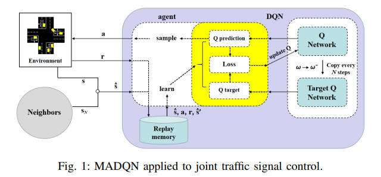
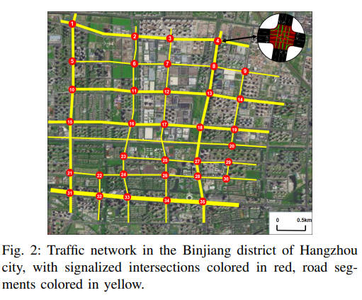
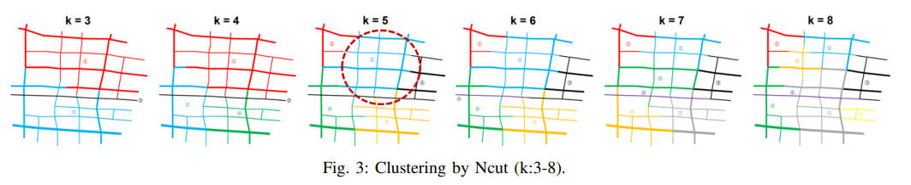
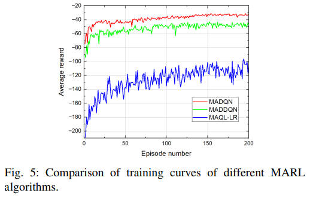
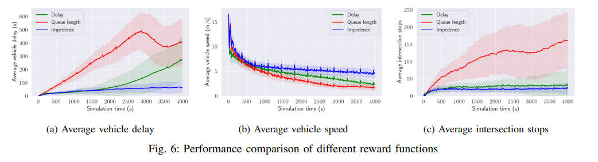

<!--
 * @Author: WANG Maonan
 * @Date: 2024-01-05 12:30:55
 * @Description: Network Clustering-based TSC
 * @LastEditTime: 2024-01-05 14:31:29
-->
# Network Clustering-based Multi-agent Reinforcement Learning for Large-scale Traffc Signal Control

- [Network Clustering-based Multi-agent Reinforcement Learning for Large-scale Traffc Signal Control](#network-clustering-based-multi-agent-reinforcement-learning-for-large-scale-traffc-signal-control)
  - [Introduction](#introduction)
    - [问题背景](#问题背景)
    - [传统方法的问题](#传统方法的问题)
    - [本文的方法](#本文的方法)
  - [Problem Formulation](#problem-formulation)
    - [Traffic Network Clusting](#traffic-network-clusting)
    - [MARL-based Joint TSC](#marl-based-joint-tsc)
  - [Method](#method)
    - [Normalized Cut (Ncut)](#normalized-cut-ncut)
    - [Multi-Agent DQN (MADQN) 算法](#multi-agent-dqn-madqn-算法)
  - [Experiment](#experiment)
    - [路网聚类](#路网聚类)
    - [强化学习训练](#强化学习训练)

## Introduction

### 问题背景

随着人口增长和城市化进程的加快，全球主要城市的交通需求不断增加，导致日常交通压力巨大，持续的交通拥堵问题给现有城市交通基础设施带来了巨大压力。交通信号控制（Traffic Signal Control, TSC）方法是解决主要城市交通拥堵问题的成本效益高、易于实施和调整的手段。

### 传统方法的问题

尽管经典的 TSC 技术已经广泛应用，如 SCOOT 和 SCATS，以及遗传算法和模糊逻辑等优化算法，近年来深度强化学习（Deep Reinforcement Learning, DRL）等方法在 TSC 中表现出色。**然而，当交通网络规模进一步扩大时，多智能体强化学习（Multi-agent Reinforcement Learning, MARL）面临着越来越大的收敛挑战，导致算法性能显著下降。**

### 本文的方法

- 这篇论文提出了一种结合「路网聚类」和「MARL」的方法来解决大规模的交通信号控制问题，尤其是针对高峰时段的拥堵问题：
  - 首先，使用 Normalized Cut (Ncut) 算法将大规模交通网络基于每条道路的拥堵程度进行划分，将大型网络的联合 TSC 问题转换为每个均质子网络的并行 TSC 问题。
  - 接着，应用 MARL 算法来共同训练每个子网络中的交通信号。
- 此外，设计了一种基于阻抗指数的新颖奖励函数来代替传统基于队列长度、延迟或其加权和等的奖励定义。

通过对比实验的结果表明，该方法对于改善控制效果是有益的，能够有效地缓解高峰时段大规模网络的交通拥堵问题。

## Problem Formulation

这一节主要关于交通网络聚类（Traffic Network Clusting）和基于多智能体强化学习（MARL）的交通信号控制（TSC）问题的建模。

### Traffic Network Clusting

在交通网络聚类部分，作者首先将交通网络映射成一个加权无向图：

$$
G=(V, E)
$$

其中 $V$ 是节点（node）集合，$E$ 是边（edge）集合。每个节点 $i$ 代表网络中的双向路段，并且具有某一特定时间（本文选择高峰流量时段）的拥堵指数 $c_{i}$（可以理解为这个节点的特征属性）。

节点之间通过边相连，每条边的权重衡量节点之间的相似度，可以通过一个关于节点拥堵指数差的指数函数来表示，同时考虑到节点间的空间距离。当空间距离超过某个阈值 $\epsilon$ 时，可以忽略两个节点之间的相似度。边的权重通过下面的式子进行计算：

$$
w(i,j) = \left\{
    \begin{aligned}
        & exp(-(c_{i}-c_{j})^{2}) & \text{if } r(i,j) < \epsilon \\
        & 0 & \text{if } r(i,j) > \epsilon
    \end{aligned}
\right.
$$

其中 $r(i,j)$ 表示 $node_{i}$ 和 $node_{j}$ 之间的距离。交通网络聚类的目的是保持一定数量的适当大小的子网络（即簇），使得每个簇内的拥堵水平相似，而不同簇之间的拥堵水平有明显差异。

为了评估和比较不同簇数量 $k$ 的分区结果，引入了一个叫做 NcutSilhouette (NS) 的度量。NS 基于簇内道路段的拥堵指数的方差和均值。

### MARL-based Joint TSC

在基于MARL的联合TSC部分，每个智能体控制相应的交通信号灯，在当前状态下选择最优的相位。控制过程可以被建模为马尔可夫决策过程（MDP）：

- **Action**：可以从所有可以选择的相位中进行选择（Choose Next Phase）
- **State**：在时间 $t$ 节点 $i$ 处观察到的原始状态表示为 $s_{i,t}$，包括每个进入路口的车道的排队车辆数（速度低于0.1米/秒）和平均速度。为了降低环境不稳定性，智能体需要共享状态信息以实现协同控制。假设每个智能体只与其邻居交互，智能体 $i$ 获取的状态可以描述为 $\hat{s}_{i,t} = [s_{i,t}] \cup [s_{j,t}]_{j \in N}$ ，其中 $N$ 表示路口 $i$ 的邻居。
- **Reward**：之前的研究通常基于队列长度、延迟或它们的加权和来确定奖励。但是，仅基于某个交通指标的奖励只能单方面反映交通状况，并不利于智能体学习最优控制策略。考虑到综合多个指标是必要的，作者提出了一个新颖的奖励函数，通过反向加权队列长度与平均速度，更准确地反映了交通流的动态拥堵情况。这种奖励被形象地称为「阻抗」。奖励的设计大致如下：

$$
r_{i,t} = -\sum_{l \in L}(queue_{i,t}[l] * e^{\alpha * speed_{i,t}[l]})
$$

## Method

作者在这里其实是先将路网进行分割，然后对分割之后的路网使用 MARL 进行训练。下面分别介绍如何分割，和如何进行 RL 的训练。

### Normalized Cut (Ncut)

首先是**Normalized Cut (Ncut) 算法**。Ncut 是一个常用于图像分割的谱聚类方法，它能够捕捉到图像的全局结构，同时忽略某些局部细节。Ncut已被证明可以有效地对交通网络进行划分。

在这个算法中，交通网络被建模为一个加权无向图 $G=(V, E)$。通过将节点集 $V$ 划分为两个子集 $A$ 和 $B$，则会有：

$$
A \cup B = V \\
A \cap B = \varnothing
$$

我们使用 $cut(A, B)$ 表达 $A$ 和 $B$ 之间的总相似度为。

$$
cut(A, B) = \sum_{u \in A, v \in B}{w(u,v)}
$$

为了克服 Min-cut 方法常导致的孤立节点问题，NCut 方法被引入。NCut 的数学定义是

$$
N_{cut}(A, B) = \frac{cut(A, B)}{assoc(A, V)}+\frac{cut(A, B)}{assoc(B, V)}
$$

其中 $assoc(A, V)$ 表示集合 $A$ 中所有点与图中所有点之间权重的总和。

$$
assoc(A, V) = \sum_{u \in A, z \in Z}{w(u,z)}
$$

最小化 NCut 值意味着追求不仅在不同子集之间的最小权重，而且还包括在同一子集内的最大权重。因此，使用 NCut 算法可以同时最小化簇内方差，并保持簇的空间紧凑性。

### Multi-Agent DQN (MADQN) 算法

这里作者使用了 MADQN，这是一个基于 DQN 核心算法的MARL算法。在 MADQN 算法中，每个智能体都有自己的 DQN 网络，它接收观测状态作为输入，并预测每个动作的 Q 值。整个 RL 的框架图如下图所示，注意这里 state 是包含自己和邻居的状态：

    

## Experiment

在这篇论文中，研究者们针对杭州市滨江区的一个大约 $10.44$ 平方公里的交通网络进行了实验，该网络包含 $35$ 个交叉口和 $92$ 段双向道路。实验选取了工作日 $18:00-19:00$ 的高峰时段的交通流数据进行分析。

    

### 路网聚类

利用 Normalized Cut (NCut) 算法对交通网络进行划分，下图展示了不同聚类数目（从 $3$ 到 $8$）下 Ncut 的分割结果，发现当聚类数为 $5$ 时，NCut 的 NS 值最小，表明最优的聚类数目是 $5$。

    

### 强化学习训练

在最优聚类结果（k=5）中，选择平均拥堵指数最高的子网络进行了 RL-TSC 实验。实验比较了基于 DQN、Double DQN(DDQN) 和 QL-LR 的 MARL 算法。实验结果表明，MADQN 在平均车辆速度、平均车辆延迟和平均交叉口停车次数等方面均优于其它算法。与固定时间控制器相比，MADQN 的表现也更好。

    

作者将基于阻抗的奖励函数与其他奖励函数进行了比较。在不同奖励函数的比较中，基于阻抗的奖励函数在车辆延迟、车辆速度和交叉口停车次数方面展现出了更高的稳定性和控制性能。

    

