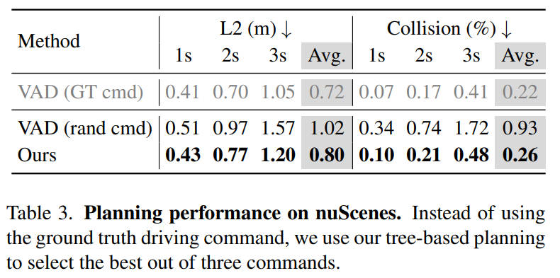

# Driving into the Future: Multiview Visual Forecasting and Planning with World Model for Autonomous Driving

- [Driving into the Future: Multiview Visual Forecasting and Planning with World Model for Autonomous Driving](#driving-into-the-future-multiview-visual-forecasting-and-planning-with-world-model-for-autonomous-driving)
  - [Introduction](#introduction)
    - [问题背景](#问题背景)
    - [传统方法存在的问题](#传统方法存在的问题)
    - [本文的解决方法](#本文的解决方法)
  - [多视图视频生成 (Multi-view Video Generation)](#多视图视频生成-multi-view-video-generation)
    - [联合多视图视频建模 (Joint Modeling of Multiview Video)](#联合多视图视频建模-joint-modeling-of-multiview-video)
    - [多视图建模的因子分解 (Factorization of Joint Multiview Modeling)](#多视图建模的因子分解-factorization-of-joint-multiview-modeling)
    - [统一条件生成 (Unified Conditional Generation)](#统一条件生成-unified-conditional-generation)
  - [用于端到端规划的世界模型 (World Model for End-to-End Planning)](#用于端到端规划的世界模型-world-model-for-end-to-end-planning)
    - [基于树的动作展开 (Tree-based Rollout with Actions)](#基于树的动作展开-tree-based-rollout-with-actions)
    - [基于图像的奖励函数 (Image-based Reward Function)](#基于图像的奖励函数-image-based-reward-function)
  - [Experiment](#experiment)
    - [实验设置：](#实验设置)
    - [多视角视频生成实验结果](#多视角视频生成实验结果)
    - [规划与世界模型的探索](#规划与世界模型的探索)
    - [反事实事件（Counterfactual Events）](#反事实事件counterfactual-events)
  - [Conclusion](#conclusion)

## Introduction

### 问题背景

本文研究的领域是自动驾驶，特别是在**预测未来事件和评估潜在风险方面，以便自动驾驶车辆更好地规划其行动，增强道路安全和效率**。

### 传统方法存在的问题

目前存在的问题是，纯粹基于专家驾驶轨迹训练的端到端规划器面对分布外（out-of-distributio, OOD）情况时，其泛化能力是否足够仍然是一个疑问。例如，当车辆位置从中心线横向偏离时，端到端规划器难以生成合理的轨迹。

那么是否可以提出一种预测的模型，来对未来的场景进行预测，也就是所谓的 world model（ predict future states based on current states and ego actions）。

但是在端到端的自动驾驶上学习 world model 存在一些问题，包括：
1. Driving World Model 需要在高分辨率像素空间进行建模，以往的低分辨率图像或向量化状态空间方法无法有效表示现实世界中众多的细粒度或不可向量化的事件；
2. 生成多视角一致的视频很困难，之前的研究通常限于单视角视频或多视角图像生成，但多视角视频生成在自动驾驶中对于全面环境观察仍是一个开放问题；
3. 在各种异质条件下（如变化的天气、光照、自主行动以及道路/障碍物/车辆布局），灵活适应也是一个挑战。

### 本文的解决方法

为了解决这些挑战，本文提出了一种名为 Drive-WM 的方法。该方法：
- 多视图视频生成：受到潜在视频扩散模型的启发，引入了多视角和时间建模，**以联合生成多个视图和帧**。为了进一步增强多视角一致性，本文提出通过对邻近视图条件下的中间视图进行预测的方法来分解联合建模，大大提高了视图之间的一致性。此外，还介绍了一个简单而有效的统一条件接口，使得在异质条件（heterogeneous conditions）下的条件生成大大简化。
- World Model for End-to-End Planning：对不同动作来生成未来的场景，并对场景进行打分，选择出打分高的来作为最后的动作来执行。

在 nuScenes 数据集上进行的广泛实验表明，Drive-WM 在视频质量和可控性方面处于领先地位，并且通过一种基于关键点匹配的新颖度量标准，证明了其在多视角一致性方面的优势。这是第一次探索将世界模型应用于自动驾驶的端到端规划中。实验表明，该方法能够提高规划的整体合理性和在分布外情况下的鲁棒性。

本文的 Github 仓库地址为：https://github.com/BraveGroup/Drive-WM

## 多视图视频生成 (Multi-view Video Generation)

下图是多视图视频生成的整体框架（相当于是用来对多个视图的场景进行预测的模型），包含三个部分。我们会依次对这三个部分进行说明：

    

### 联合多视图视频建模 (Joint Modeling of Multiview Video)

- **整体公式化**：模型利用一个数据集 $p_\text{data}$，包含多视图视频序列 $x \in R^{T \times K \times 3 \times H \times W}$。其中 $T$ 表示有 $T$ 个图片（帧），$K$ 表示有 $K$ 个视角。有一个整体的 denoising model $f_{\theta, \phi, \psi}$，其中 $\theta$ 为单视角图像参数、$\phi$ 为时间参数、$\psi$ 为多视图参数。
- **时间编码层**：在预训练的图像扩散模型基础上增加了时间层，通过 3D 卷积和多头自注意力机制增强时间依赖性（apply standard multi-head self-attention to the temporal dimension, enhancing the temporal dependency）。
- **多视图编码层**：引入多视图编码层以实现不同视图之间的信息交换，并通过视图维度上的自注意力层，实现所有视图的风格一致性和结构一致性。这里多视角编码层通过在不同视角数据间进行 self-attention 来实现（a self-attention layer parameterized by $\phi$ is employed across the view dimension）。
- **多视图时间调整**：首先训练一个标准的单视图图像扩散模型，然后冻结参数 $\theta$ 并微调额外的时间层 ($\phi$) 和多视图层 ($\psi$)。

### 多视图建模的因子分解 (Factorization of Joint Multiview Modeling)

上面的方法可以生成多视角的图像，但是很难保证他们重合区域是正确对应的（it is hard to ensure strict consistency in their overlapped regions）。于是作者提出了多视图的因子分解。他的具体步骤如下：

- 将所有视角分为两类：参考视角（reference views）和拼接视角（stitched views）。参考视角之间没有重叠，而拼接视角则可能与参考视角重叠。
- 首先模型会建立参考视角的联合分布，这些视角由于不重叠，所以不需要严格的一致性。
- 接着模型会建立拼接视角的条件分布，条件是参考视角。
- 考虑到时间连贯性，模型还会将之前帧（如前两帧视频）作为额外的条件来生成当前的参考视角和拼接视角。

下面看一个例子：假设我们有一个自动驾驶的场景，并且我们想要生成一个包含前方（F）、左后方（BL）、右后方（BR）、前左方（FL）、后方（B）、前右方（FR）六个视角的视频。在这个例子中，我们可以选择 {F, BL, BR} 作为参考视角，而 {FL, B, FR} 作为拼接视角。

- 我们首先生成参考视角 ${F, BL, BR}$ 的联合分布，因为它们之间不重叠，所以可以独立生成。
- 然后，对于拼接视角 ${FL, B, FR}$，我们分别生成它们的条件分布。例如，FL 视角是基于 F 和 BL 视角生成的，因为 FL 在空间上与 F 和 BL 相邻。
- 如果要生成一个新的视频帧，我们还会考虑前两帧视频的信息，确保新生成的视频在时间上是连贯的。

下图是一个 factorized multi-view generation 的例子（不相邻的视角是可以独立生成的）：

    

### 统一条件生成 (Unified Conditional Generation)

由于现实世界的复杂性，信息源的来源是多样性的，因此本文的模型需要可以处理不同的信息源的数据，于是作者提出了「Unified Conditional Generation」。

Unified Conditional Generation（统一条件生成）是指在构建模型时，将多种不同类型的条件信息通过一个统一的接口来进行整合和处理，以便更高效地控制生成内容的过程。**他的主要作用是：简化了模型对多源异构条件的处理**。在复杂的应用场景中，如自动驾驶，需要考虑多种条件因素，例如初始上下文帧、文本描述、自身动作、3D boxes、鸟瞰图（BEV maps）和参考视图等。通过使用统一条件生成的方法，可以使模型更加灵活地整合和利用这些多源信息，并提升模型对现实世界复杂性的应对能力，增强生成内容的控制性和适应性。

他的整体流程是：
- 编码各个条件：首先，对每一个条件进行编码处理，转换为模型可以理解和处理的形式。
- 构建统一条件接口：之后，设计并实现一个统一的条件接口，该接口可以将不同的条件编码整合起来，形成一个联合的条件表示。
- 集成到模型中：最后，通过这个统一的条件接口将不同的条件信息融合到生成模型中，以此来控制视频生成的过程。

例如在本文的一个自动驾驶车辆的视频生成模型，模型的目标是根据当前的驾驶情况预测未来几秒钟内的路况变化，并生成对应的视频。在这个场景中，可能需要考虑的条件包括：

- **初始上下文帧（Image condition）**：车辆当前的视角图像，这里使用 ConvNeXt 作为 encoder，得到了 $i$。
- **文本描述（Text condition）**：可能描述未来的某些事件，比如“前方有行人过街”，使用 CLIP 作为 encoder，得到了 $e$。
- **自身动作（Action condition）**：车辆预计执行的动作，如转向或加速，使用 MLP 作为 encoder，得到了 $a$。
- **布局信息（Layout condition）**：这里包含 3D boxex（路上其他车辆的3D位置信息）、鸟瞰图、参考视图（从其他角度捕获的车辆周围环境的图像），同样使用 ConvNeXt 作为 encoder，得到了 $l$

然后通过统一条件接口将这些编码后的信息融合起来，形成一个综合的条件表示；

$$
c = [i,e,a,l],
$$

最后，将这个综合条件输入到视频生成模型中（这里的 $c$ 会和 $z$ 进行 cross-attention），模型根据这些条件生成预测未来路况的视频，从而辅助自动驾驶车辆进行规划和决策。

## 用于端到端规划的世界模型 (World Model for End-to-End Planning)

### 基于树的动作展开 (Tree-based Rollout with Actions)

使用世界模型生成预测未来场景，评估轨迹候选者，选择最优轨迹。下面看一个具体的例子。假设我们的自动驾驶车辆正在一个交叉口，并面临三个选择：「直行」、「左转」和「右转」。我们要使用基于树的展开与行动来进行规划。

- 定义规划树：我们构建一个规划树，其中包含了基于当前位置和方向的多个预测轨迹。
- 获取真实图像：车辆摄像头捕获了当前交叉口的多视角图像。
- 定义动作：以车辆当前位置为基础，为每个轨迹定义一个行动向量，例如直行可能是 $(10,0)$，表示从当前位置在 X 轴方向前进 10 米，Y 轴不变。
- 视频生成：对于每个可能的行动（直行、左转、右转），我们的世界模型生成预测未来的视频，展示如果采取这个行动，环境将如何变化。
- 应用奖励函数：我们对每个生成的视频使用奖励函数进行评估，如果轨迹使车辆保持在车道中心并远离其他车辆和路边，会得到较高的奖励。
- 选择最优轨迹：假设经过奖励函数评估后，“直行”轨迹得到最高奖励，因为它避免了与其他车辆的碰撞，并保持在车道中心。

    

### 基于图像的奖励函数 (Image-based Reward Function)

Image-based Reward Function 是用来评估多个预测未来场景（即多个可能的驾驶轨迹产生的视频）的有效性和安全性的函数。它使用基于图像的 3D 物体检测器和在线 HDMap 预测器从生成的视频中获取感知结果。具体来说，Image-based Reward Function 包括两部分：地图奖励（map reward）和物体奖励（object reward）。

- **地图奖励**考虑了两个因素：距离路缘的距离，鼓励自动驾驶汽车停留在正确的可行驶区域；以及中心线的一致性，防止汽车频繁变道和在横向上偏离车道。
- **物体奖励**指的是与其他道路使用者在纵向和横向上的距离，这个奖励是为了避免自动驾驶车辆与其他道路使用者之间的碰撞。
- **总奖励**是物体奖励和地图奖励的乘积。

在选择最优轨迹时，会选择具有最大奖励值的预测。然后规划树向前推进到下一个时间戳，并迭代规划后续轨迹。

此外，由于所提出的世界模型（world model）在像素空间中运行，它还可以从非矢量化表示（non-vectorized representation）中获取奖励，以处理更一般的情况。例如，喷水器喷出的水滴和受损的道路表面很难通过受监督的感知模型矢量化，而从大量未标记数据中训练的世界模型能够在像素空间中生成此类情况。利用像GPT-4V这样强大的基础模型，规划过程可以从非矢量化表示中获得更全面的奖励。

关于 Image Reward 的内容，也可以参考 [Vision-Language Models are Zero-Shot Reward Models for Reinforcement Learning 阅读](https://mathpretty.com/16454.html)。

## Experiment

### 实验设置：

- 数据集：使用了 nuScenes 数据集进行实验，包括 700 个训练视频和 150 个验证视频，每个视频约 20 秒，由六个周围视角摄像头捕获。
- 训练方案：将原始图像从 $1600 \times 900$ 裁剪并调整大小为 $384 \times 192$。模型以Stable Diffusion 检查点初始化，在A40（48GB）GPU上进行训练。
- 质量评估：使用 FID 和 FVD 作为主要指标评估生成视频的质量。
- 多视角一致性评估：引入了一个新的度量标准 KPM 分数，使用预训练匹配模型计算匹配关键点的平均数。
- 可控性评估：通过预训练的感知模型评估生成图像的内容可控性，包括 3D 物体检测和在线地图构建。
- 规划评估：采用开环评估指标，包括与真实轨迹的L2距离和物体碰撞率。

### 多视角视频生成实验结果

- 生成质量：在单视角图像生成中，FID 达到 12.99，在视频生成中，FID 为 15.8，FVD 为 122.7。这在单视角视频生成方法中展现了显著的质量提升，并且是第一个能够生成一致多视角视频的工作。
- 可控性：对于前景可控性，评估了在生成的多视角视频上的 3D 物体检测性能，以及基于 BEV 布局的前景分割。对于背景控制，评估了道路分割的 mIoU 和 HDMap 性能。

接着作者进行了消融研究，比较了不同模块对视频生成质量产生的影响：
- 统一条件（Unified condition）：布局条件（layout condition）显著提高了生成视频的质量和一致性。时间嵌入也能提高视频质量。
- 模型设计（Model design）：探讨了多视角时间调整中的时间层和视角层（temporal and view layers）的作用。
- 分解多视角生成（Factorized multiview generation）：相较于联合建模，分解生成显著提高了多视角间的一致性。

    

下图是使用 factorization 和不使用 factorization 生成的结果比较。第一行是不使用 factorization，第二行是使用 factorization，可以看到第二行照片前后是更加连贯的，第一行的照片不是很连贯：

    

### 规划与世界模型的探索

这里作者进行了两组实验，分别验证了：
- 对未来的预测会对 planning 是有帮助的；
- World Model 可以在 out-of-domain (ODD) cases 下有帮助；

下表展示了使用本文的 tree-based planning，可以有效的提升性能，结果与 GT 也是非常接近。

    

对于 ODD 的场景，本文的方法（下表第三行）也是获得了较好的结果。下表第二行是别人的方法，可以看到在 ODD 时有较大的性能下降，但是本文的方法仍然有一个好的结果。

    

### 反事实事件（Counterfactual Events）

Drive-WM 能够生成如绕路和穿越不可行驶区域等与训练数据明显不同的反事实事件，展现了处理 OOD 情况的潜力。如下图所示，这些场景在训练集中是没有出现过的：

    

## Conclusion

在本文中，作者提出了 Drive-WM，这是第一个针对自动驾驶的多视角世界模型。该方法能够在不同条件下，利用文本描述符、Layout 或 action 来控制视频生成，从而生成高质量且一致性强的多视角视频。

作者引入的因子化生成显著提升了不同视角间的空间一致性。此外，通过在nuScenes数据集上进行的广泛实验表明，我们的方法可以增强规划的整体稳健性，并在分布外情况下表现出更强的鲁棒性。