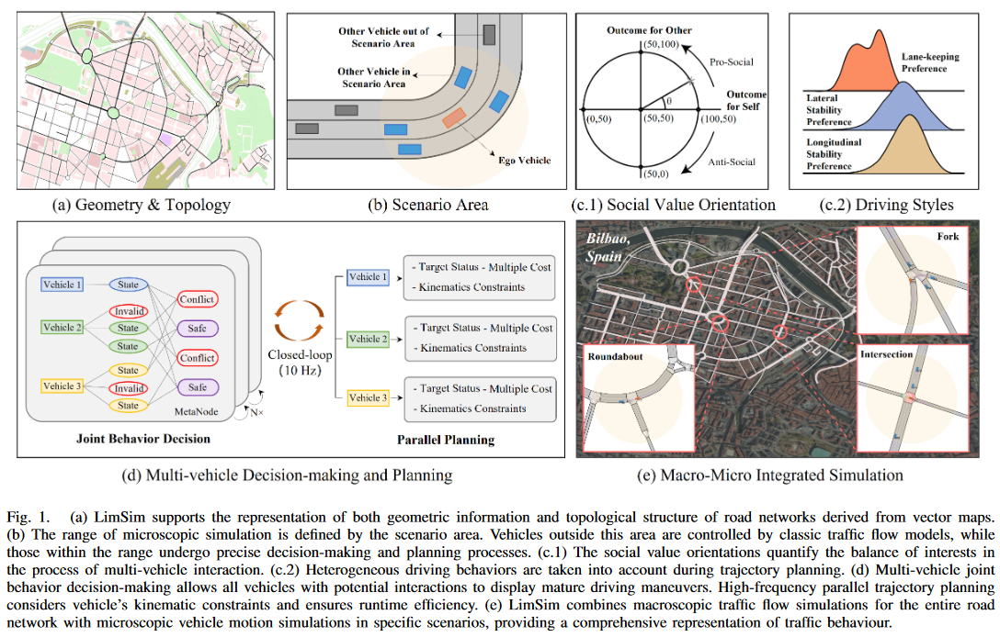
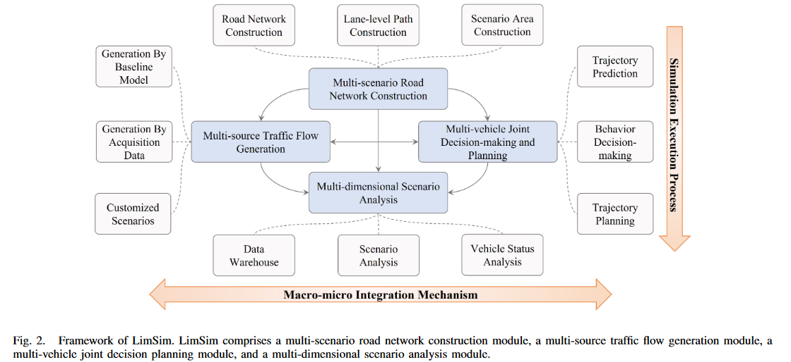
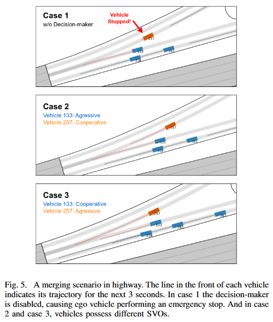
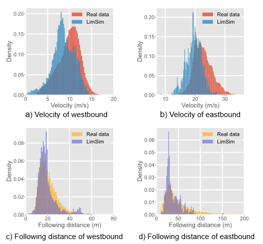

# LimSim: A Long-term Interactive Multi-scenario Traffic Simulator

- [LimSim: A Long-term Interactive Multi-scenario Traffic Simulator](#limsim-a-long-term-interactive-multi-scenario-traffic-simulator)
  - [文章摘要](#文章摘要)
  - [相关研究](#相关研究)
  - [LimSim 框架介绍](#limsim-框架介绍)
    - [主要工作和贡献](#主要工作和贡献)
    - [系统框架](#系统框架)

## 文章摘要

随着数字孪生技术和自动驾驶在交通领域的广泛应用，对能生成高保真和可靠场景的模拟系统的需求日益增长。现有的模拟系统因支持场景类型有限、车辆模型过于简化而难以呈现不同驾驶风格和车辆间的互动，处理数据集中的边缘案例也显得力不从心。本文提出了 LimSim，一款面向城市道路网络的长期互动多场景交通模拟器，能够模拟细粒度动态场景，并专注于交通流中车辆间的多样互动。文章详细介绍了 LimSim 的架构和功能，并通过案例研究和实验展示了其性能。

## 相关研究

目前主流的交通仿真器主要分为以下三类：
- **基于流量的仿真器（Flow-based Simulator）**：
  - 优点：能够展示大范围的交通状况（Facilitating large-scale traffic simulations to demonstrate the overall traffic conditions of the road network）
  - 缺点：简化了车辆运动行为，未能充分考虑多车辆互动和动力学约束（Simplify vehicle motion behaviors and fail to consider multivehicle interactions and kinematics constraints）
  - 示例：PARAMICS (The Journal of Supercomputing)、Vissim (Fundamentals of Traffic Simulation)、Aimsun (Fundamentals of Traffic Simulation)、SUMO (ITSC, 2018)
- **基于车辆的仿真器（Vehicle-based Simulator）**：
  - 优点：对轨迹规划有更精确的运动学约束，为自动驾驶的决策和规划算法测试提供了更真实的驾驶环境（Have more precise kinematic constraints for trajectory planning, providing a more realistic driving environment for testing autonomous driving decision and planning algorithms）
  - 缺点：生成的交通流和场景与实际不符（Generation of background traffic flow relies on manual editing scenarios or using collected road data, which fails to accurately reproduce the characteristics of actual scenarios）
  - 示例：AirSim (Field and Service Robotics)、LGSVL (ITSC, 2020)、CARLA (CoRL, 2017)、MetaDrive (IEEE Transactions on Pattern Analysis and Machine Intelligence)
- **基于数据的仿真器（Data-based Simulator）**：
  - 优点：依据真实世界的交通数据，允许自车与背景交通流互动（Rely on real-world traffic data. By extracting vehicle motion features from the datasets, these simulators allow ego vehicle to interact with the background traffic flow）
  - 缺点：提供的场景碎片化、规模较小，难以进行长期连续模拟（The datasets typically provide fragmented, small-scale scenarios, making these simulators unable to conduct long-term continuous simulations.）
  - 示例：SimNet (ICRA, 2021)、InterSim (IROS, 2022)、TrafficGen (ICRA, 2023)

## LimSim 框架介绍

### 主要工作和贡献

提出的 LimSim 框架，具有以下优点：
- **长期性（Long-term）**：在需求构建和路线规划的指导下，能够长时间生成交通流。同时，仿真过程可以录制和回放（下图的 Fig. 1(a) 所展示）。
- **多样性（Diversity）**：内置的行为模型考虑到了车辆的社会价值导向和驾驶风格的异质性，支持跟车、变道和并线等多种驾驶行为（下图的 Fig. 1(c.1) 和 1(c.2) 所展示）。
- **互动性（Interactivity）**：场景中的车辆通过一个联合决策和规划框架进行控制，实现复杂的车辆互动（Fig. 1(b) and 1(d) 所展示）。
- **多场景性（Multi-scenario）**：提出了通用道路组件，支持现实世界中各种道路结构的模拟，确保了仿真系统的一致性。同时，LimSim 可以从真实数据中导入并进行仿真，得到的结果与实际数据非常接近（Fig. 1(e) 所展示）。

    

### 系统框架

LimSim 仿真器的整体框架如下图所示，包含四个部分：
- 多场景道路网络构建（Multi-scenario road network construction）
- 多源交通流生成（Multi-source traffic flow generation）
- 多车辆联合决策和规划（Multi-vehicle joint decision-making and planning）
- 多维度场景分析（Multi-dimensional scenario analysis）

    

**多场景道路网络构建（Multi-scenario road network construction）**：该框架的场景包括几何和拓扑信息（交叉口、环岛和匝道），支持 fixed scene mode 和 hero mode（跟随自车移动的场景）。

**多源交通流生成（Multi-source traffic flow generation）**：支持使用自然驾驶数据集和相关标准定制场景。同时支持许多微观的交通模型，例如 carfollowing，lane-changing，和 merging motions。

**多车辆联合决策和规划（Multi-vehicle joint decision-making and planning）**：里面集成了多车联合决策的模块，包括预测、决策和规划三个部分。且车辆之间是会有交互的。下图展示了这些模块的作用。例如在第一个图中，由于没有预测，因此 vehicle 257 会有急刹。对于第二和第三个图，由于意图不同，二中为合作，三中是激进，因此策略也不同：

    

**多维度场景分析（Multi-dimensional scenario analysis）**：用于分析仿真的车流与真实交通车流是否相似。可以通过调整车辆决策过程参数来调整结果。下图展示了仿真结果和真实结果在「速度分布」和「跟车距离分布」上的关系，整体非常接近：

    

