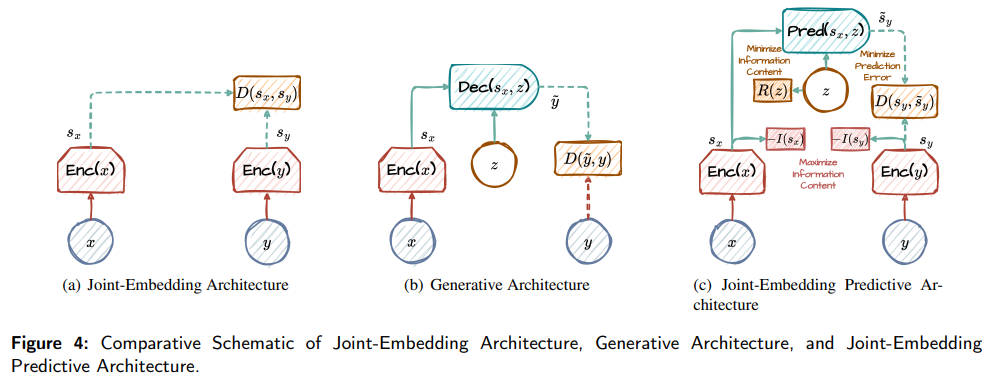

<!--
 * @Author: WANG Maonan
 * @Date: 2024-03-12 17:20:27
 * @Description: World Models for Autonomous Driving: An Initial Survey
 * @LastEditTime: 2024-03-13 15:11:53
-->
# World Models for Autonomous Driving: An Initial Survey

- [World Models for Autonomous Driving: An Initial Survey](#world-models-for-autonomous-driving-an-initial-survey)
  - [Introduction](#introduction)
    - [问题背景](#问题背景)
    - [传统方法存在的问题](#传统方法存在的问题)
    - [World Model 介绍](#world-model-介绍)
    - [World Model in Autonomous Driving](#world-model-in-autonomous-driving)
  - [Development of World Model](#development-of-world-model)
    - [Architectural Foundations of World Models](#architectural-foundations-of-world-models)
    - [RSSM and JEPA](#rssm-and-jepa)
      - [RSSM](#rssm)
      - [JEPA](#jepa)
    - [Broad Spectrum Applications](#broad-spectrum-applications)
  - [World Models in Autonomous Driving](#world-models-in-autonomous-driving)
    - [驾驶场景生成](#驾驶场景生成)
    - [规划和控制](#规划和控制)
  - [Conclusion and Future Work](#conclusion-and-future-work)
    - [存在的问题](#存在的问题)
    - [未来的工作](#未来的工作)

## Introduction

### 问题背景

自动驾驶技术是现代技术发展的一个重大前沿领域，其挑战不仅仅是技术性的，还涉及到认知和感知的问题，这些问题探讨了区分人类智能与人工构造的本质。关键挑战在于让机器具备人类所轻松运用的直观推理和“常识”。尽管当前的机器学习系统在诸多方面表现出色，但在人类易于解决的模式识别任务中往往会遇到困难，这突出了我们实现真正自主系统的显著差距。

### 传统方法存在的问题

传统的人工智能方法在应对现实世界场景的复杂性和不可预测性时，往往难以复制人类认知过程的深度和多变性。这些方法在数据稀疏性方面面临特别的挑战，尤其是在类似 BEV 标注这样的专业任务中。

### World Model 介绍

为了解决这一差距，world models 作为一种关键的解决方案出现了，**它们为系统提供了通过仿真人类感知和决策过程来预测和适应动态环境的能力**。

World models 是在 20 世纪 70 年代控制理论中概念性框架的基础上发展起来的，随着时间的推移，神经网络的出现带来了范式转变，特别是通过 RNN 网络，使得系统能够处理时间序列数据，对预测未来状态和启用抽象推理至关重要。

David Ha 在 2018 年正式提出的 [world models](https://worldmodels.github.io/) ，它利用 RNNs 的力量，来对未来的环境进行预测。

### World Model in Autonomous Driving

在自动驾驶领域，World Models 的引入象征着朝向数据驱动智能的重大转变，**其中预测和模拟未来场景成为安全和效率的基石**。

这些模型通过从历史数据生成预测场景不仅可以规避数据收集和标注的局限性，而且还可以增强自动系统在模拟环境中的训练，这些模拟环境可以反映或甚至超越现实世界条件的复杂性。这种方法预示着一个新时代的来临，自动驾驶车辆将被赋予反映直觉形式的预测能力，使它们能够以前所未有的复杂水平导航和响应其环境（By generating predictive scenarios from historical data, these models not only circumvent the limitations posed by data collection and labeling but also enhance the training of autonomous systems in simulated environments that can mirror, or even surpass, the complexity of realworld conditions.）。

## Development of World Model

本部分介绍世界模型（World Models）的发展，详细介绍了构建这些模型的关键组成部分以及它们在各种研究中的实际应用。这些模型的设计宗旨是模拟人类大脑复杂的认知过程，使自动系统能够像人类一样做出决策并理解其环境。

### Architectural Foundations of World Models

1) **感知模块（Perception Module）**：作为系统的感官输入，运用先进的传感器和编码器模块（如 VAE、Masked Autoencoder、Discrete Autoencoder）来处理和压缩环境输入，对复杂动态环境进行精确感知。

2) **记忆模块（Memory Module）**：类似人类的海马体，记录和管理过去、现在和预测的世界状态及其相关的成本或奖励，支持短期和长期记忆功能。

3) **控制/行动模块（Control/Action Module）**：负责通过行动与环境互动，根据当前的状态，和世界模型提供的预测，来决定实现特定目标的最优行动序列。

4) **世界模型模块（World Model Module）**：作为架构的核心，主要执行两个工作：
   - Estimating any missing information about the current world state;
   - Predicting future states of the environment;

这些组件共同构成一个强大的框架，使世界模型能够模拟人类的认知过程和决策。在高维感官输入场景中，世界模型利用潜在动态模型来抽象地表示观察到的信息，使得在潜在状态空间内进行紧凑的前向预测成为可能。下图是整个 World Model 的框架图：

    

### RSSM and JEPA

目前 World Model Module 主要有两个结构，分别是「Recurrent State Space Model (RSSM)」和「Joint Embedding Predictive Architecture (JEPA)」。

#### RSSM

RSSM（Recurrent State-Space Models）是一种用于强化学习中的模型基础架构，特别是在model-based RL（基于模型的强化学习）中，例如 Dream 系列的方法。它结合了循环神经网络（RNN）的优点和状态空间模型（SSM）的结构特性，以处理部分可观测的环境和复杂的时间序列数据。

    

RSSM 通常包含四个主要组件（上图中 **「圆形」表示随机状态**，**「方形」表示确定性状态**）：
- 确定性状态（Deterministic State）：这是一个循环神经网络（RNN）的部分，它通过隐藏状态的循环传递来保持时间上的一致性。它对序列中的每个时间步骤的观察结果进行编码，通常使用长短时记忆（LSTM）或门控循环单元（GRU）来实现。
- 随机状态（Stochastic State）：这部分采用贝叶斯推断来建模环境的不确定性。它通常涉及变分自编码器（VAE）来生成潜在状态的概率分布，这些潜在状态可以捕获观察结果中的随机性和不确定性。
- 观察模型（Observation Model）：它基于当前的隐状态和确定性状态，生成对环境观测的预测。这个模型通常是一个神经网络，它尝试重构输入观测或预测下一个观测。
- 奖励模型（Reward Model）：基于当前的隐状态和确定性状态，预测即将到来的奖励。这也是一个神经网络，它帮助策略学习如何行动以最大化预期奖励。

在每个时间步骤 $t$，这些组件的更新顺序通常如下：

1. 更新确定性状态 $h_t$。
2. 生成随机状态的概率分布参数 $(\mu_t, \log \sigma_t^2)$。
3. 从该分布中抽样以获得随机状态 $z_t$。
4. 使用确定性状态 $h_t$ 和随机状态 $z_t$ 重构观测 $\hat{o}_t$ 和预测奖励 $r_t$。

下面是每一个步骤详细的计算过程：

**确定性状态**：通常由一个循环神经网络（如 LSTM 或 GRU）维护，它在时间步骤之间传递信息。给定时间步 $t$ 的观测 $o_t$ 和上一时间步的确定性状态 $h_{t-1}$，以及上一时间步的随机状态 $z_{t-1}$，确定性状态 $h_t$ 是这样计算的：

$$
h_t = f(h_{t-1}, z_{t-1}, o_t)
$$

其中 $f$ 是循环神经网络的更新函数。

**随机状态**：在确定性状态更新之后，随机状态 $z_t$ 通过考虑当前的确定性状态 $h_t$ 和当前的观测 $o_t$ 来生成。这里，VAE 的编码器用于产生随机状态的概率分布参数（均值 $\mu_t$ 和方差 $\sigma_t^2$）：

$$
(\mu_t, \log \sigma_t^2) = g(h_t, o_t)
$$

然后，通过重参数化技巧，从这个分布中抽样以获得随机状态 $z_t$：

$$
z_t = \mu_t + \sigma_t \cdot \epsilon_t, \quad \epsilon_t \sim \mathcal{N}(0, I)
$$

**观测模型**：给定确定性状态 $h_t$ 和随机状态 $z_t$，观测模型用于预测或重构观测。这通常用解码器来完成：

$$
\hat{o}_t = p(h_t, z_t)
$$

其中 $\hat{o}_t$ 是预测的观测。

**奖励模型**：最后，奖励模型用于预测在给定状态下采取某个行动可能获得的即时奖励。这通常是基于确定性状态和随机状态来完成的：

$$
r_t = q(h_t, z_t)
$$

其中 $r_t$ 是预测的奖励。

#### JEPA

下图展示了三种结构，分别是 JEA，GA 和 JEPA，他们分别是：
- JEA：这里 $x$ 和 $y$ 同时经过 Encoder，我们对 $x$ 和 $y$ 得到的 embedding 进行比较。如果 $x$ 和 $y$ 接近的，我们希望他们的 embedding 也是接近的。通常我们可以对 $x$ 进行裁剪或是旋转等操作得到 $y$，确保他们是相似的；
- GA：对 $x$ 进行编码并结合附加变量 $z$ 来生成 $\hat{y}=Dec(Enc(x),z)$。最后比较希望 $y$ 和 $\hat{y}$ 是接近的。这里是像素层面的比较，通常 $y$ 是原始图片， $x$ 是对 $y$ 进行 mask，$z$ 中包含 mask 的位置信息；
- JEPA：这个方法与 GA 类似，但是不是直接比较最后生成的像素，而是在 laten space 进行比较。这里会首先对 $x$ 和 $y$ 都经过 encoder，分别得到 $s_x$ 和 $s_y$。接着我们利用 $s_x$ 和附加变量 $z$ 来预测 $\bar{s}_y = pred(s_x, z)$。我们希望在 laten space 上，也就是 $\bar{s}_y$ 和 $s_y$ 是接近的。这里我们不是在像素层面进行比较，而是在 laten space，我们希望在这里可以有更多的语义信息。

    

### Broad Spectrum Applications

这一小节展示了世界模型在多种环境中的广泛应用（完整的 related work 见原文的 Table-1）：

- 在游戏领域，如 Atari 100k 排行榜上，世界模型占据了前五名中的四个位置。
- I-JEPA 在无需手工设计的数据增强的情况下学习高度语义化的图像表示，而 A-JEPA 在音频和语音分类任务中设定了新的性能标准。
- 在机器人操控领域，LEXA 通过想象中同时训练探索者和成就者，在 40 项机器人操作和移动任务中表现突出；
- Pathdreamer 和 SafeDreamer 在机器人导航任务中应用世界模型概念，通过预测其在特定情境下行动的后果来获取周围环境的信息。
- DayDreamer 展示了世界模型在真实世界机器人学习中的快速训练能力，与传统方法形成鲜明对比。
- SORA 和 Genie 在虚拟场景和视频生成方面取得了突破性进展。SORA 能够根据不同的提示产生连贯的高清视频，而 Genie 则引入了用户驱动的世界操控新维度。

## World Models in Autonomous Driving

本节的主题是探讨世界模型在自动驾驶领域中的应用，强调它们在「环境理解」、「动态预测」以及「阐释控制运动的物理原则」方面的重要贡献。自动驾驶是世界模型应用的一个新兴前沿领域，为利用这些先进的计算框架提供了独特的挑战和机遇。目前，世界模型在自动驾驶中主要用于场景生成、规划和控制机制等方面，这些领域仍有很大的探索和创新空间。

    

### 驾驶场景生成

这一小节主要讨论了世界模型在驾驶场景生成方面的应用。自动驾驶的数据获取面临成本高、法律限制和安全考虑等障碍。世界模型通过自监督学习范式，能够从大量未标记数据中提取有价值的见解，以成本效益的方式提高模型性能。

- GAIA-1 是一种新型的自主生成 AI 模型，能够使用视频、文本和动作输入创建逼真的驾驶视频。它在 Wayve 的英国城市真实世界驾驶数据上训练，能够基于几秒钟的视频输入预测和生成接下来的驾驶场景。
- DriveDreamer 和 ADriver-I 等其他模型也在驾驶场景生成方面有所贡献，它们分别利用了不同的数据集和技术。
- WorldDreamer 等模型则受到大型语言模型成功的启发，采用了不同的方法来处理世界建模问题。
- MUVO 和 OccWorld 等项目将物理数据融入到驾驶场景中，扩展了世界模型的应用范围。

### 规划和控制

在规划和控制方面，世界模型对于在驾驶环境中的学习、评估潜在的未来情况和改进规划控制策略具有重要作用。
- MILE 采用基于模型的模仿学习方法，从离线数据集中共同学习动态模型和驾驶行为。
- SEM2 则引入了语义掩膜世界模型来提高采样效率和自动驾驶的鲁棒性。
- Drive-WM 是第一个多视角世界模型，通过多视角和时间建模，提高了自动驾驶规划的安全性。
- UniWorld 利用多帧点云融合作为生成 4D 占用标签的真值，提升了环境动态的理解。
- TrafficBots更侧重于预测场景中各个代理的行为，使用 CVAE 学习每个代理的独特性格，从而促进从 BEV 视角进行行动预测。

总结而言，世界模型在自动驾驶中的应用不仅包括了丰富的驾驶场景生成，还拓展到了车辆的规划和控制，通过预测和生成未来的驾驶情景来提升自动驾驶系统的性能和安全性。这些模型和方法的开发和应用为自动驾驶技术的进步提供了重要支持，并为研究社区提供了灵感，推动了持续的创新和探索。

下图总结了不同方法的数据集，输入（Video、Action、Text 等）和任务（场景生成和控制）：

    

## Conclusion and Future Work

**总结：** 本文强调了 World Model 在增强自动驾驶系统的预测、模拟和决策能力方面的作用。例如，使用长期、可扩展的内存集成和仿真到真实世界的泛化来改进模型。

### 存在的问题

**Long-Term Scalable Memory Integration**：

世界模型需要能够长期地、有效地存储和访问大量信息，以便更好地导航在不断变化的驾驶环境中。目前，这一挑战主要体现在现有的模型架构中，它们在处理长期任务时面临一些困难。比如，模型可能会遇到梯度消失的问题，这会导致模型难以学习和记忆长时间序列中的信息；或者是灾难性遗忘，意味着模型在学习新任务时会忘记旧的知识。尽管  Transformer 架构通过自注意力机制在访问历史数据方面取得了进步，但在处理长序列时仍存在可扩展性和速度方面的问题。

**Simulation-to-Real-World Generalization**：

当前的仿真平台虽然先进，但无法完美复制现实世界的不可预测性和多样性。这种不一致性体现在物理属性、传感器噪声和意外事件的发生等方面，严重影响了仅在模拟环境中训练的世界模型的实用性。

换句话说，就像我们在电脑游戏中驾驶车辆和在现实世界中驾驶车辆有很大不同，自动驾驶系统也必须能够处理这种差异。真实世界的复杂性远远超出了计算机模拟的范围，因此训练出来的模型必须能够泛化到现实世界，才能在各种意料之外的情况下仍然保持稳定和安全的驾驶行为。

**Decision-Making Accountability**：

决策责任是指确保自动驾驶汽车中的自主决策框架能够对其所作决策负责的重要伦理问题。自动驾驶汽车运行的算法通常非常复杂，**因此我们需要一种机制，不仅可以在关键和常规情境下促进决策过程，而且还能够解释这些系统做出特定决策的理由**。简单来说，这就像是让车辆能够“说出”它为什么会这样做，而不是仅仅做出决策。

这种透明度对于建立和维护最终用户、监管机构和公众的信任至关重要。试想，如果我们能够理解自动驾驶汽车的每一个动作背后的原因，我们就更可能信任它们，并且在发生事故时，我们也能够查明责任。

**Privacy and Data Integrity**：

隐私与数据完整性关注的是自动驾驶技术依赖大量数据集来运作和不断改进，这就带来了关于隐私保护和数据安全的重大问题。我们必须保护个人信息不被未授权访问和泄露，这需要一个强有力的框架来道德地处理和保护数据。

对于隐私的保护，不仅要遵守现有的隐私法规，比如欧洲的《通用数据保护条例》（GDPR），还要建立严格的数据治理政策来规范数据的收集、处理、存储和分享。这些政策的目的是最大限度地减少数据暴露，确保只处理必要的特定合法目的的数据。此外，部署先进的网络安全措施来保护数据的完整性和机密性也是至关重要的。这包括使用加密技术、安全的数据存储解决方案，并定期进行安全审计以识别和缓解潜在的风险。

同时，与用户透明地分享他们的数据如何被收集、使用和保护也是根本性的。这可以通过清晰、易于访问的隐私政策和赋予用户对个人信息控制权的机制来实现，包括数据访问、更正和删除的选项。简而言之，就是让用户清楚自己的数据怎样被处理，并给他们足够的权力来管理这些数据。

### 未来的工作

**Bridging Human Intuition and AI Precision**

「Bridging Human Intuition and AI Precision」指的是在自动驾驶领域中，**将人类司机那种基于经验和直觉的决策方式与人工智能的高精确度和可靠性结合起来。** 传统的自动驾驶系统主要依赖预设的算法和传感器输入来作出决策。但是，人类驾驶者在开车时会利用他们的直觉和经验来做出快速判断，这些判断可能包括对周围环境的理解、对未来风险的预测以及在复杂的社会技术环境中导航的能力。

在这个新的模式中，自动驾驶车辆将使用先进的世界模型，这些模型能够模拟人类认知过程中的预期、直觉和复杂环境下的导航能力。**通过这种方式，车辆能够获得前所未有的环境感知和预测能力。例如，如果车辆能够“感觉到”周围车辆的意图和行人的行为，它就可以更准确地预测并适应各种交通情况，就像有经验的人类驾驶员一样。**

**Harmonizing Vehicles with the Urban Ecosystem**

「Harmonizing Vehicles with the Urban Ecosystem」是指自动驾驶车辆通过实时监测环境状况、交通流量和城市基础设施状态，并据此动态调整运行策略，以实现与城市生态系统的和谐相处。这一概念涉及到多个层面，包括减轻交通拥堵、降低城市热岛效应、优化燃料效率以减少排放、甚至与智能城市基础设施协作，支持通过车辆到电网的技术来平衡能源网络。

想象一下，如果一群自动驾驶车辆能够相互通信，根据实时数据重新规划路线，就能够在城市中分散交通负载，避免某些地区过度拥堵。这些车辆还可以选择更加节能的路线和速度，减少温室气体排放。此外，它们还能与智慧城市设施协同工作，比如在用电高峰时将车辆的电池作为临时的电源存储，帮助平衡电网负荷。