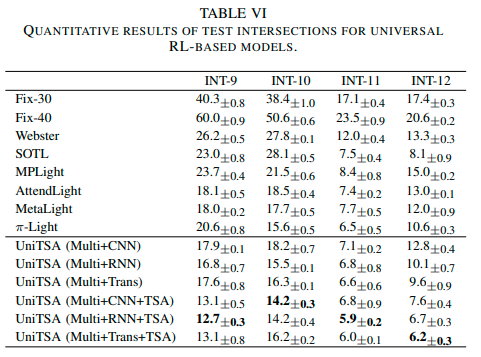

<!--
 * @Author: WANG Maonan
 * @Date: 2024-03-12 17:20:27
 * @Description: World Models for Autonomous Driving: An Initial Survey
 * @LastEditTime: 2024-03-13 15:11:53
-->
# UniTSA: A Universal Reinforcement Learning Framework for V2X Traffic Signal Control

- [UniTSA: A Universal Reinforcement Learning Framework for V2X Traffic Signal Control](#unitsa-a-universal-reinforcement-learning-framework-for-v2x-traffic-signal-control)
  - [Introduction](#introduction)
    - [研究背景](#研究背景)
    - [现有的方法即存在的问题](#现有的方法即存在的问题)
    - [本文的创新点](#本文的创新点)
  - [Method:UniTSA](#methodunitsa)
    - [路口矩阵构建](#路口矩阵构建)
    - [路口数据增强](#路口数据增强)
    - [使用 LoRA 微调](#使用-lora-微调)
  - [Results](#results)

## Introduction

本研究的代码已经开源，链接为：https://github.com/wmn7/Universal-Light.

### 研究背景

在全球城市地区，交通拥堵已成为一个严峻的挑战，它不仅浪费了人们的时间，还导致了过度的燃油消耗和温室气体排放增加。而信号灯控制是一个非常有效的缓解交通拥堵的方法。

### 现有的方法即存在的问题

传统的方法包含 Webster 和感应控制算法，但是这些方法无法很好的利用动态变化的数据，或是基于一些简单的规则。于是有研究尝试使用强化学习（RL）来控制信号灯，从而缓解路口拥堵的问题。但是这些方法在面对不同路口的时候，通常需要进行重新的训练，这就需要花费大量的时间和算力如果希望在上千个路口进行部署。有一些研究提出了通用的 RL-based 信号灯控制方案，但是这些方法无法保留原始信号灯的相位结构。

### 本文的创新点

本文提出了 **Uni**versal **T**raffic **S**tate **A**ugmentation RL-based framework (UniTSA)。这种方法使用数据增强的方式来训练一个具有泛化性的智能体。具体来说：
- 提出了 `junction matrix` 来描述路口，使得不同路口结构可以拥有相同大小的输入；
- 提出了 5 种数据增强方法，使得智能体在没有见过的路口上也获得好的效果；
- 对于一些关键路口，使用 LoRA 的方式对通用模型进行微调，从而只需要少量的训练就可以获得较好的效果；

## Method:UniTSA

对于一个拥有泛化性的信号灯控制系统来说，希望他可以有以下的特性：
- 可以处理不同的路口结构，包括不同路口拓扑形状（3-way 和 4-way）、不同的车道数、不同的信号灯相位结构（同时可以保留原始的相位结构）；
- 由于我们无法在训练集中遍历所有的路口可能性，因此在面对训练集中没有的数据时，例如没有对应的路口形状，或是没有的车流，都可以获得比较好的效果；
- 对于一些关键路口，希望可以只需要少量的训练，就可以获得较好的结果；

对于上面的三个要求，我们分别给出了三个解决方法：
- 我们提出了 `junction matrix` 来描述路口，按照 traffic movement 来提取特征，使得不同路口拥有相同大小的特征矩阵；
- 对于无法在训练集中覆盖到的情况，我们通过数据增强的方式，让智能体在训练的时候可以见过，使其拥有更好的泛化能力；
- 对于关键路口，使用 LoRA 的方式，在前面训练得到的泛化性的模型上微调，只需要训练少量的参数就可以获得或是超越从头训练的模型的性能；

### 路口矩阵构建

一个十字路口可以拥有不同的车道数量，但是他们一定拥有相同数量的交通相位（traffic movement）。对于十字路口来说，会有 12 个相位，如果去掉右转相位，那么一个路口就有 8 个相位。对于每一个相位来说，我们分别提取三种类型的特征，分别是：
- 动态特征：描述这个相位上拥堵情况，例如当前的车辆的数量，平均速度等；
- 静态特征：描述这个相位是直行还是左转，包含几个车道；
- 信号灯信息：描述这个相位当前是否可以通行，绿灯的持续时间等；

于是对于一个任意一个路口，我们都可以得到一个 $8 \times K$ 的矩阵，这里 $K$ 表示每个相位提取的特征数量。如果是丁字路口，我们可以使用 0 来填充，使得矩阵的大小和十字路口一样。下图展示了丁字路口和对应的路口矩阵。

    

有了路口矩阵之后，所有的路口，不管是什么拓扑结构，相位结构，都可以表示为一样的大小。这样模型就有了统一大小的输入。

### 路口数据增强

具有泛化性的模型还需要在训练集中没有的路口也表现出好的性能。这里我们利用了路口本身的一些性质，（1）对路口进行旋转，（2）改变道路车道数的同时修改车道上面车的数量，保持同等比例增大或缩小，（3）对各个方向车流进行同等比例放大缩写，这些不会改变最后的决策。

如下图所示，最左侧是原始路口结构。我们分别对其进行旋转，修改某个方向车道数，或是同比例增大减少各个方向车流，但是保持相对多少不改变，此时对应的信号灯决策不会改变，也就是将哪些相位设置为绿灯这个决策不会改变：

    

除了上面的三种数据增强外，我们还会对路口矩阵随机添加噪声，和在时间维度上进行 mask，使得智能体不会关注于某个特定的信息或是特定时间段的信息。这些数据增强方式都可以很方便的在路口矩阵上进行操作：

    

我们在训练智能体的时候，每次采用与环境交互得到的状态，接着会对其进行数据增强，从而使得智能体在训练的时候可以见到训练集以外的数据。

### 使用 LoRA 微调

在使用了上面的方法之后，我们可以训练出一个具有泛化性的模型，可以直接使用在不同的路口上，但是直接使用泛化性模型的性能还是会比从头训练的模型性能差一些。为了解决这个问题，我们使用 LoRA 的方法，在泛化性模型的基础上，对特定路口进行微调，从而不仅收敛速度快，性能也可以超过从头训练的方法。

最后，整个 UniTSA 方法的流程图如下：
1. 首先利用路口矩阵和路口数据增强，训练一个具有泛化性的模型；
2. 接着利用 LoRA，在泛化性模型的基础上，针对特定路口进行微调；

    

## Results

为了测试本文的方法可以适应于不同的路口拓扑和不同的相位结构，我们分别创建了以下的数据集，其中 8 个路口用于训练，剩下的 4 个用于测试。

    

下表展示了训练集的实验结果。可以看到当使用了数据增强同时结合 Transformer 结构来提取路口特征，模型可以较好的效果。这是因为 Transformer 需要较多的训练数据，而数据增强正好扩大了训练的数据来。但是也可以看到此时不同 RL-based 的方法之间差距不大。

    

下表展示了在测试集上的实验结果。此时可以看到结合了数据增强的方法性能会远远领先其他方法。这是因为这些路口是没有直接在训练集中出现的，而通过数据增强可以让智能体在训练的时候见过这些情况，从而性能可以优于其他的方法。

    

对于测试集的路口，我们还比较了微调和从头训练的结果。如下表所示，可以看到本文基于 LoRA 的方式进行微调，只需要 1M steps 的训练，就几乎收敛到最优解，而从头训练需要 10M steps。本文的方法在大规模路口部署的时候就会产生巨大的优势，可以节约大量的计算量，同时获得与从头训练模型接近的性能。

    

