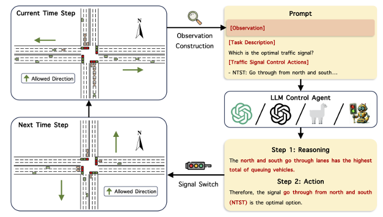
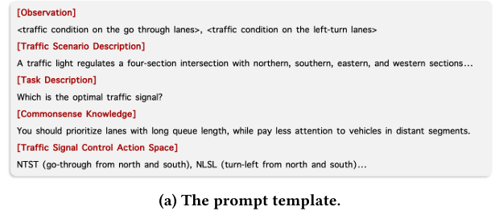
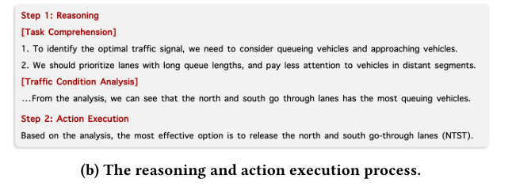
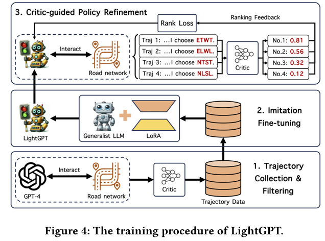
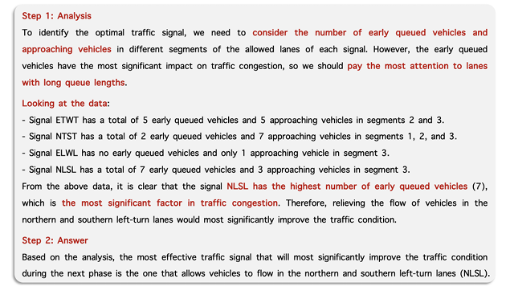

<!--
 * @Author: WANG Maonan
 * @Date: 2024-03-12 17:20:27
 * @Description: LLMLight: Large Language Models as Traffic Signal Control Agents
 * @LastEditTime: 2024-03-13 15:11:53
-->
# LLMLight: Large Language Models as Traffic Signal Control Agents

- [LLMLight: Large Language Models as Traffic Signal Control Agents](#llmlight-large-language-models-as-traffic-signal-control-agents)
  - [Introdcution](#introdcution)
    - [研究背景](#研究背景)
    - [现有的方法即存在的问题](#现有的方法即存在的问题)
    - [本文的创新点](#本文的创新点)
  - [Method: LLMLight](#method-llmlight)
    - [Workflow of LLMLight](#workflow-of-llmlight)
    - [Backbone LLM Training](#backbone-llm-training)
  - [Result](#result)

## Introdcution

### 研究背景

交通拥堵已成为影响人类社会和环境的关键问题，随着城市人口快速增长，这一挑战进一步加剧。优化交通信号控制（TSC）是智能交通领域的核心研究方向，它能带来显著的经济和环境益处，提升社会福祉。然而，在复杂动态的城市路网中有效管理交通信号仍面临巨大挑战，现有的方法难以应对多样化交通场景。

### 现有的方法即存在的问题

现有 TSC 方法主要分为交通工程方法（transportation）和强化学习（RL）方法：
- 交通工程方法（transportation），如启发式算法依赖手动设计，在复杂场景中效果有限，无法充分适应动态交通变化。
- RL方法，如基于深度神经网络的模型，虽在某些场景表现出色，但泛化能力弱，尤其在转移到更大路网或极端高流量场景时性能下降；此外，由于DNN的黑盒性质，缺乏可解释性，无法清晰解释特定交通条件下的控制决策，阻碍实际部署。

同时，现有 LLM 相关研究多依赖通用模型（如 ChatGPT）作为辅助工具，缺乏TSC专业领域知识；LLM 预训练于自然语言语料，难以处理非文本交通数据（如传感器读数），导致在专业应用中效果受限和幻觉问题（解释为什么不能直接用现有的模型）。

### 本文的创新点

本文提出 LLMLight 框架，将大型语言模型（LLMs）作为决策代理直接用于 TSC（每个 Agent 使用 LLM 管理交叉口交通灯）：
- 在每个信号切换时间步，收集目标交叉口交通条件（如排队车辆数和接近车辆数），转化为人类可读文本作为实时观察。
- 结合交通场景描述、任务描述、常识知识（优先处理长队列车辆）和控制动作空间，形成知识提示指导 LLM。
- LLM 通过Chain-of-Thought (CoT) 推理进行人类式决策，选择最佳信号相位。

下图展示了上面描述的 LLMLight 的推理过程：

    

此外，构建 LightGPT 作为 TSC 专用 LLM 骨干网络（微调了 LLM 模型）：
- 模仿微调：使用 GPT-4 生成的优质控制动作和推理轨迹进行训练，并过滤高质量数据。
- 策略精炼：引入预训练批评模型（基于RL的价值函数）评估动作，采用排名损失函数优化LLM的推理过程，提高决策对长期目标（如最小化队列长度）的对齐。

通过上面的设计，LLMLight 可以像人类一样进行信号灯控制（LLMLight engages a reasoning and decision making process akin to human intuition for effective traffic control）。 

## Method: LLMLight

方法论部分分为两个内容，（1）LLMLight 的流程，包括输入和输出；（2）骨干网络 LLM 的微调；

### Workflow of LLMLight

LLMLight 的工作流程将 TSC 任务建模为部分可观察的马尔可夫博弈（Partially Observable Markov Game），其中每个代理使用 LLM 管理一个交叉口的交通灯。流程包括三个主要步骤：
1. 观察特征收集（Observation Feature Construction）
2. 常识增强提示构建（Commonsense Augmented Prompt Construction）
3. 推理与动作执行（Reasoning and Action Execution）。

这些步骤旨在让 LLM 理解实时交通动态，并输出合理的控制动作。

**观察特征收集（Observation Feature Construction）：**

从真实交通环境中收集易获取的交通条件特征（这里作者将一条道路分为三段，统计每一段的信息），包括：
- 排队车辆数（Queuing vehicle count）：速度低于阈值 $v_{stop}$ 的车辆视为排队车辆，在车道 $l$ 上计数为 $n_l^q$。
- 接近车辆数（Approaching vehicle count）：速度高于阈值的车辆，在车道 $l$ 的段 $s$ 上计数为 $n_l^s$。

这些特征针对每个进入交叉口的车道（incoming lane）进行收集，并转化为人类可读文本，作为 LLM 的实时观察 $o$。目的是桥接 LLM 与非文本交通数据（如传感器读数）的差距，确保代理能感知环境。

**常识增强提示构建（Commonsense Augmented Prompt Construction）：**

除了观察 $o$，还为 LLM 提供全面任务信息，包括交通场景描述 $d_{scene}$、任务描述 $d_{task}$、控制动作空间 $A$（例如，四个信号相位：ETWT、ELWL、NTST、NLSL）。
- 集成常识知识 $d_{know}$，如优先处理长队列车道，而忽略远处车辆（因为它们不易很快到达交叉口）。
- 这些元素组合成知识提示 $X=Prompt(o, d_{scene}, d_{task}, d_{know}, A)$，指导 LLM 理解任务并生成合理决策。提示模板示例见下图。

    

**推理与动作执行（Reasoning and Action Execution）：**

使用构建的提示，让 LLM Zero-shot Chain-of-Thought (CoT) 推理。过程分为两步：
1. 首先，LLM 分析任务、利用常识知识评估各车道交通条件；
2. 其次，选择最拥堵车道的信号相位作为动作 $a$，以优化流量。

输出包括推理过程 $Y$ 和控制动作 $a$，公式为 $(Y, a) = \pi_\theta(X)$。这不仅生成有效动作，还提供决策的推理过程（也就是 $Y$），提升可解释性。示例见下图。

    

### Backbone LLM Training

为提升 LLMLight 的性能，论文构建了 TSC 专用 LLM，LightGPT，通过三个阶段训练：
1. 轨迹收集与过滤（Trajectory Collection and Filtering）
2. 模仿微调（Imitation Fine-tuning）
3. 批评导向策略精炼（Critic-guided Policy Refinement）。

训练流程如下图所示（最下面是步骤一，最上面是步骤三），使用参数高效微调（PEFT，如 LoRA）减少计算成本。

    

**轨迹收集与过滤（Trajectory Collection and Filtering）：**

使用 GPT-4 在模拟交通环境中生成推理轨迹：根据提示与环境交互，收集提示 $X_t$、推理 $Y_t$ 和动作 $a_t$（注意，这里使用 GPT4 与环境交互，而不是直接使用 RL 交互）。
- 过滤高质量轨迹：采用预训练的价值网络（基于 RL 的 Bellman 方程训练，这里的 Q Function 是与环境交互训练得到，不是使用 GPT-4 生成的轨迹获得）作为批评器，评估动作的长期回报（例如，未来队列长度最小化）。预测的 loss 如下所示，其中 $Q$ 是动作价值函数：

$$
L_{value} = E[(R(o_t, a_t) + \gamma Q(o_{t+1}, a_{t+1}) - Q(o_t, a_t))^2]
$$

- 只保留与长期目标（如最小化队列）最对齐的轨迹，其中 $T$ 是模拟时长。这确保数据质量，避免低效轨迹影响训练

$$
\{(X_t, Y_t, a_t) \mid a_t = \arg\max_{a \in A} Q(o_t, a)\}_{t=0}^T
$$

**模仿微调（Imitation Fine-tuning）：**

使用过滤后的 GPT-4 轨迹进行**模仿学习**：
- 将提示 $X$ 作为输入，GPT-4 的推理 $Y = [Y; a]$（包含动作 $a$）作为目标响应。
- 损失函数为负对数似然（NLL）：

$$
L_{IFT} = -\sum_{w} \log P_{\pi_\theta}
$$

- 采用 LoRA 进行参数高效训练，减少 GPU 内存消耗，同时保留原模型性能。通过此阶段，LightGPT 学习 GPT-4 的高品质控制策略和 rationale。

**批评导向策略精炼（Critic-guided Policy Refinement）：**

进一步优化 LLM 的决策，根据打分函数可以对同一个 X 的不同 Y 打分，然后就有了排序，然后使用 rank loss 进一步优化，类似 human preference：
- 对于同一个场景观测，采样 $k$ 个推理轨迹 $Y = \{Y_i\}_1^k$，用预训练批评器 $Q$ 评估每个动作 $a_i$ 的分数 $q_i$。有了打分之后进行排序；
- 计算每个轨迹的 token 平均对数似然 $p_i$，使用边界约束排名损失函数调整推理，其中 $p_j^*$ 是高于 $Y_j$ 的最低概率轨迹，$\beta$ 是超参数。

$$
L_{CGPR} = \log \left(1 + \sum_{q_i > q_j} \left( e^{(p_j - p_i)} + e^{(2p_j^* - 2\beta - p_i - p_j)} \right) \right)
$$

此过程通过批评反馈提升轨迹与长期目标的对齐，而不直接复制批评器的动作，确保 LightGPT 在多样场景中保持鲁棒性（实验显示优于纯 RL 模型）。

训练后，LightGPT 以更低成本生成高效、人类对齐的控制策略，提升 LLMLight 在不同交通场景的泛化能力。

## Result

在10个真实和合成数据集（包括Jinan、Hangzhou、New York等）上的实验，以及15位人类专家（包括交通警察、司机和AI专家）的评估，证明LLMLight与LightGPT在有效性、泛化能力和可解释性上优于9个基线方法（交通工程和RL模型）和10个高级通用LLM。

- 有效性：在Jinan和Hangzhou数据集上达到SOTA或可比性能，平均旅行时间（ATT）、队列长度（AQL）和等待时间（AWT）显著降低。
- 泛化：在转移到不同路网、扩展到大规模网络（如New York的196个交叉口）、极端高流量场景和24小时周期中，性能稳定优于RL方法（RL在OOD场景下降明显）。
- 可解释性：提供详细推理过程（如分析拥堵优先级），人类评价100%认可其决策合理性和实际适用性。

下图展示了 LLMLight 的决策过程（我有点疑问他的决策还是根据当前车道哪个方向车多）

    

