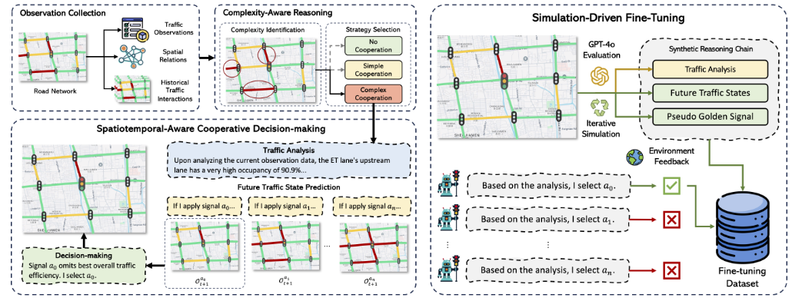

<!--
 * @Author: WANG Maonan
 * @Date: 2024-03-12 17:20:27
 * @Description: CoLLMLight: Cooperative Large Language Model Agents for Network-Wide Traffic Signal Control
 * @LastEditTime: 2024-03-13 15:11:53
-->
# CoLLMLight: Cooperative Large Language Model Agents for Network-Wide Traffic Signal Control

- [CoLLMLight: Cooperative Large Language Model Agents for Network-Wide Traffic Signal Control](#collmlight-cooperative-large-language-model-agents-for-network-wide-traffic-signal-control)
  - [Introdcution](#introdcution)
    - [研究背景](#研究背景)
    - [现有的方法即存在的问题](#现有的方法即存在的问题)
    - [本文的创新点](#本文的创新点)
  - [Method: CoLLMLight](#method-collmlight)
    - [时空感知协作决策](#时空感知协作决策)
    - [复杂度感知推理](#复杂度感知推理)
    - [模拟驱动细调](#模拟驱动细调)
  - [Result](#result)

## Introdcution

### 研究背景

交通拥堵已成为城市化进程中的重大挑战，随着人口向城市迁移，拥堵问题日益加剧。信号灯控制（TSC）是优化交通流量、缓解拥堵并提升道路安全的关键手段。通过有效管理信号灯，可以减少车辆等待时间，提高整体交通效率，并对社会和环境产生积极影响。

### 现有的方法即存在的问题

- 传统交通方法依赖启发式算法和手动设计，难以适应复杂动态的交通模式，无法泛化到不同场景。
- 数据驱动方法如强化学习（RL）虽能通过环境交互学习策略，但依赖有限训练数据，泛化能力差，尤其在未见交通条件下表现不佳。
- 现有的LLM-based方法虽展现问题解决和泛化潜力，但聚焦局部决策，忽略跨路口协作，导致无法实现网络级优化，无法处理邻近路口的时空交互和拥堵传播（fail to addres the essential need for inter-agent coordination）。

### 本文的创新点

本文提出 CoLLMLight 框架，一个合作型大语言模型（LLM）代理，用于网络级信号灯控制。具体包括：
1. **时空感知协作决策**：构建时空图捕捉实时交通动态和邻近路口空间关系，LLM 预测不同信号配置下的未来状态，并评估网络级影响以选择最优信号；
2. **复杂度感知推理**：根据拥堵风险系数分类决策复杂度（无协作、简单协作、复杂协作），动态调整推理深度，确保计算效率与决策质量平衡；
3. **模拟驱动微调**：通过迭代模拟数据收集优化推理链，使用 GPT-4o 生成伪标签，并融入环境反馈精炼策略，提升 LLM 在合作 TSC 中的性能。

下图是 CoLLMLight 的框架图：

    

## Method: CoLLMLight

### 时空感知协作决策

该模块旨在让 LLM 代理理解并利用时空信息，捕捉路口间的复杂交通交互，从而做出准确的协作决策。时空感知是通过构建一个结构化的时空图来实现的，该图捕捉实时交通动态（temporal dynamics）和空间关系（spatial relationships），允许代理预测本地决策对邻近路口的级联影响（cascading effects）。这使得多路口协作成为可能：每个代理不仅仅基于本地观察，还考虑邻近路口的时空依赖，预测不同信号配置下的未来状态，并选择优化整个网络流量的信号。

**(1) 观察收集（Observation Collection）**

在每个信号切换时间步 $t$，代理收集车道级（lane-level）的实时交通观察。这些观察包括本地路口和邻近路口的车辆状态。

$$
o_t = (n_{\text{queue}}, n_{\text{move}}, \tau, \rho)
$$

其中：
- $n_{\text{queue}}$: 队列中车辆数（queued vehicles）。
- $n_{\text{move}}$: 正在移动的车辆数（moving vehicles）。
- $\tau$: 平均等待时间（average waiting time）。
- $\rho \in [0, 1]$: 车道占用率（traffic occupancy）。

**聚合观察：** 这些车道级观察聚合为整体观察集 $O_t = \{ o_t \mid l \in L \}$，其中 $L$ 是连接代理分配路口及其邻近路口的车道集。这确保了时空感知的全面性：$O_t$ 捕捉当前时刻的实时动态（temporal），并扩展到邻近路口的空间范围（spatial）。

**多路口协作：** 通过收集邻近路口的 $O_t$，代理能感知上游拥堵（upstream congestion）或下游队列溢出（downstream queue spillbacks），从而避免本地决策导致网络级拥堵。例如，如果邻近路口的下游车道已饱和，代理会优先选择不向其释放车辆的信号。

**(2) 时空建模（Spatiotemporal Modeling）**

这部分构建一个有向子图来表示空间关系，并收集历史交通交互来捕捉时间动态。

**空间建模：** 路网拓扑表示为有向图 $G = (V, L)$，其中 $V$ 是路口集（包括分配路口和邻近路口），$L$ 是连接这些路口的相邻车道集。这捕捉了方向性连接（如车道连通性和相互依赖），例如上游路口的车辆如何流入下游。

时间建模：收集固定时间窗口 $\Delta t$ 内的历史交通交互：

$$
T_t = \{ (O_{t_i}, a_{t_i}) \mid t - \Delta t < t_i < t \}
$$

其中 $a_{t_i}$ 是分配路口和邻近路口的信号配置。这允许代理捕捉拥堵传播的时序模式（temporal patterns of congestion propagation），如队列如何随时间积累。

**多路口协作：** 时空图 $G$ 和 $T_t$ 使代理能推理多跳依赖（multi-hop effects），例如预测本地信号变化如何影响二级邻近路口。通过整合这些，代理模拟交通流的时空传播，确保决策是网络级的而非孤立的。

**(3) 协作决策（Cooperative Decision-Making）**

这部分 LLM 基于构建的时空信息进行三步链式思考（Chain-of-Thought, CoT）：
1. 分析当前交通
2. 预测未来状态
3. 选择最优信号

**时空感知实现：** 生成人类可读的提示（prompt），结合当前观察 $O_t$、空间图 $G$、历史交互 $T_t$ 和任务描述 $D$（如「避免向拥堵下游释放车辆」或「响应上游拥堵动态调整车道」）。提示形式为：

$$
X = \text{Prompt}(O_t, G, T_t, D)
$$

LLM输出：

$$
Y_{\text{ana}}, \{ \hat{O}^a_{t+1} \mid a \in A \}, \hat{a} = f_{\text{LLM}}(X)
$$

其中：
- $Y_{\text{ana}}$: 当前交通条件分析。
- $\hat{O}^a_{t+1}$: 不同信号配置 $a$ 下的预测未来交通状态（基于时空图推理）。
- $\hat{a}$: 估计的最优信号（从动作空间 $A$ 中选择）。

多路口协作：协作通过预测 $\hat{O}^a_{t+1}$ 实现——LLM评估每个信号对邻近路口的网络级影响（如减少总队列长度），选择能改善整体流量的 $\hat{a}$。这解决了孤立决策的问题，确保本地行动惠及邻近路口，例如在拥堵传播时优先缓解关键瓶颈。

### 复杂度感知推理

这一组件优化计算效率，避免在所有场景下使用相同的深度推理。通过评估决策复杂度，动态调整推理策略，确保在简单场景下节省资源，同时在复杂场景下保持准确性。这间接增强了多路口协作的可扩展性。

过程：基于拥堵风险系数 $n_c$（critical neighboring lanes 的数量，即拥堵或高风险邻近车道数）分类复杂度。这里 $n_c$ 也是通过 LLM 进行决策的：

$n_c = 0$（无协作）：本地决策简单，无需时空分析，此时周边没有拥堵的车道：

$$
\hat{a} = f^{\text{no-coop}}_{\text{LLM}}(X)
$$

$n_c = 1$（简单协作）：分析局部时空依赖，但省略未来预测，此时周边只有一个车道高拥堵：

$$
Y_{\text{ana}}, \hat{a} = f^{\text{simple}}_{\text{LLM}}(X)
$$

$n_c > 1$（复杂协作）：完整时空感知过程，包括多跳预测，此时周边有多个车道拥堵：

$$
Y_{\text{ana}}, \{ \hat{O}^a_{t+1} \mid a \in A \}, \hat{a} = f^{\text{complex}}_{\text{LLM}}(X)
$$

**时空感知实现：** LLM 首先识别 $n_c$，然后选择模式。这确保时空建模仅在必要时深度应用（如多路口高拥堵时）。

**多路口协作：** 在复杂模式下，代理考虑多个 critical lanes 的交互（如下图所示），预测级联效应，实现更精细的网络优化。同时，避免在低复杂度场景下过度计算，提高实时性。

    

### 模拟驱动细调

这一组件通过迭代模拟优化LLM的时空推理能力，构建一个轻量级、专用于合作TSC的模型。分为推理链优化和环境反馈精炼两个阶段。

**(1) 推理链优化（Reasoning Chain Optimization）**

使用 CityFlow 模拟器和合成流量数据集生成多样化场景。针对每个推理策略，合成推理链，包括 $n_c$、$Y_{\text{ana}}$、未来状态 $\{ O^a_{t+1} \}$ 和伪信号 $a^*$。具体步骤为：

1. 使用 GPT-4o 生成 $n_c$ 和 $Y_{\text{ana}}$: $n_c, Y_{\text{ana}} = f_{\text{GPT-4o}}(O_t)$。
2. 模拟未来状态： $\{ O^a_{t+1} \} = \{ f_{\text{sim}}(O_t, a) \mid a \in A \}$。
3. 选择 $a^*$: $a^* = \arg\min_a f_{\text{queue}}(O_t, a)$（最小化5步邻近队列总长）。

训练：监督细调（SFT），最小化负对数似然损失：

$$
\text{loss} = -\sum_{w=1}^{|Y|} \log P_\pi(y_w \mid X, Y_{\le w})
$$

多路口协作：合成数据覆盖多路口交互，确保 LLM 学习时空依赖的协作模式。

**(2) 环境反馈精炼（Refinement with Environment Feedback）**

这一部分模拟 LLM 决策，评估环境反馈 $Q$（队列长度的倒数，$Q = 1/\text{Queue}$），选择最高反馈的推理链作为伪链，继续细调。

$$
\{ Y \mid \hat{a} = \arg\max_a Q(O_t, a) \}_{t=0}^T
$$

- 时空感知实现：反馈基于 $5$ 步模拟，强化对时空传播的理解。
- 多路口协作：迭代优化确保决策最大化网络效率，减少时空误解（如幻觉）。

## Result

在合成（Syn-Train）和真实数据集（Jinan、Hangzhou、New York）上的实验显示，CoLLMLight 在 Zero-shot 性能上优于传统方法（如FixedTime、MaxPressure）、RL基线（如CoLight、Advanced-CoLight）和 LLM基线（如LLMLight），特别是在高协作复杂度的New York数据集上，平均旅行时间（ATT）和平均等待时间（AWT）显著降低（如New York 1的ATT为920.98s，AWT为 85.90s，较第二好性能提升25.17%）。

消融研究验证了组件有效性：去除任何模块（如推理优化或策略精炼）均导致性能下降；时空信息敏感性分析显示最佳参数（如通信阈值 $\alpha=0.5$，历史窗口 $\Delta t=5$）平衡性能与效率。整体证明框架的有效性、可扩展性和鲁棒性。