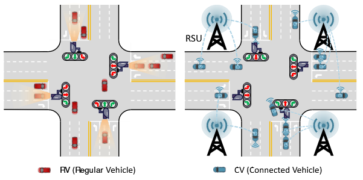
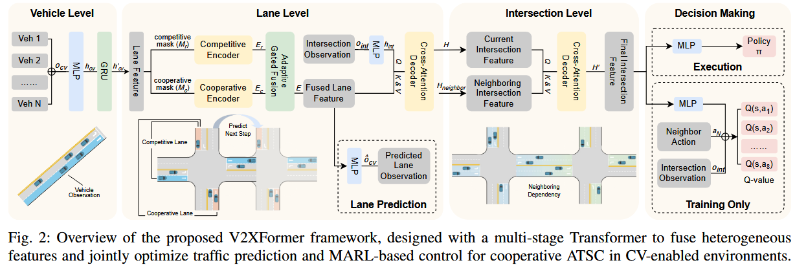
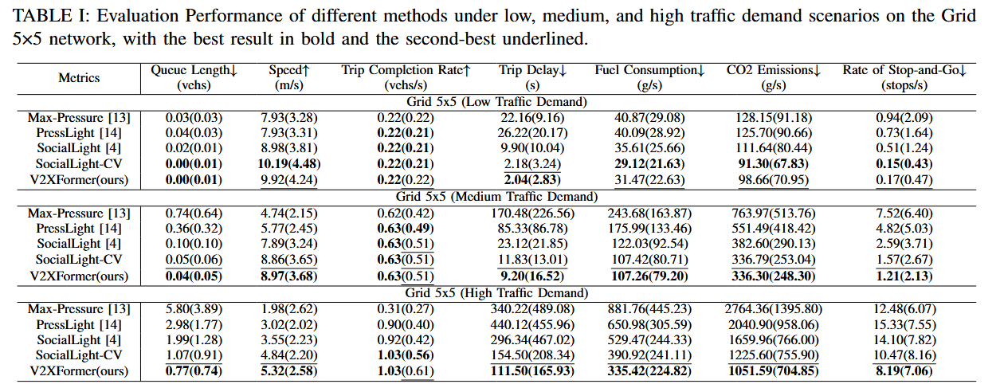
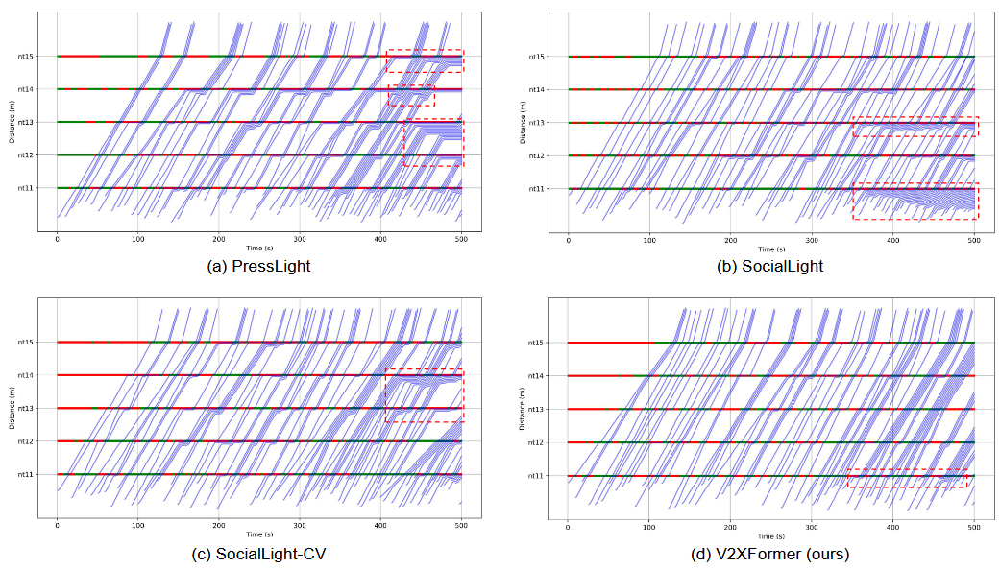

<!--
 * @Author: WANG Maonan
 * @Date: 2025-09-27 22:52:53
 * @Description: CoLLMLight: Cooperative Large Language Model Agents for Network-Wide Traffic Signal Control
 * @LastEditTime: 2025-09-27 22:52:53
-->
# V2XFormer: A Multi-Stage Transformer for Multi-Agent Reinforcement Learning in V2X-Enabled Traffic Signal Control

## Introdcution

### 研究背景

文章聚焦于城市交通拥堵问题，随着城市化和车辆数量的快速增长，交通拥堵已成为严重挑战。适应性交通信号控制（Adaptive Traffic Signal Control, ATSC）被视为有效缓解延误、缩短旅行时间并提升驾驶体验的手段。近年来，数据驱动方法尤其是强化学习（Reinforcement Learning, RL）在 ATSC 中备受关注，通过与环境的交互，RL 代理可以学习到平衡长期优化与短期适应的信号控制策略。

然而，传统 ATSC 主要针对常规车辆（Regular Vehicles, RVs）环境，**依赖路侧传感器（如摄像头和感应线圈）收集数据**，这些数据受限于视野固定、遮挡和恶劣天气，无法捕捉车辆意图级信息。随着联网车辆（Connected Vehicles, CVs）和车辆到万物（Vehicle-to-Everything, V2X）通信的兴起，CVs 可以通过路侧单元（Roadside Units, RSUs）分享实时状态和意图，提供更细粒度和高维度的交通信息，为网络级ATSC带来新机遇。目前的关键问题是，但在 CV 环境中：

> **如何有效融合异构的 CV 和基础设施数据，并实现多个路口的协作控制仍是关键挑战**。

### 现有的方法即存在的问题

按照环境是否有 Connected Vehicles，可以分为「Regular Vehicles (RV) 环境」和「Connected Vehicles (CV) 环境」。如下所示，左侧为 RV 环境，右侧为 CV 环境：

    

- **Regular Vehicles (RV) 环境下的方法**：传统方法依赖路侧传感器，包括固定时长方法（如 Webster 方法）、自适应系统（如 SCOOT 和 SCATS）和最大压力方法（Max-Pressure）。RL方法如 PressLight 引入“压力”概念，CoLight、STMARL 和GPLight使用图神经网络（GNNs）捕捉时空关系，SocialLight通过反事实推理提升代理协作，CoordLight引入QDSE状态表示和注意力机制，FRAP和GESA处理异构路口，Unicorn使用统一表示和对比学习实现泛化。
- **Connected Vehicles (CV) 环境下的方法**：非学习方法将 ATSC 建模为优化问题，使用MILP或动态规划（DP）基于CV轨迹优化信号相位。RL 方法如 CVLight 结合 CV 和非 CV 数据实现去中心化控制，UniTSA 引入统一状态设计适应不同路口。

对于上面两种方法存在的问题：
- RV 方法受传感器限制，难以捕捉整体交通状态，导致次优策略，尤其在共享车道、车流较大和恶劣条件下。
- CV 方法虽受益于 V2X，但缺乏有效融合异构数据（如车辆轨迹和路口状态）的通用解决方案，无法实现高效的多路口协作。现有方法往往将预测和控制分开处理，导致表示学习不一致，且难以处理高维CV数据。

> 现有的 RV 方法，如果出现多功能车道，例如直行和左转在一起的时候，无法区别车辆意图，此时无法做出很好的决策。

### 本文的创新点

本文提出 V2XFormer，一个多阶段 Transformer 框架，通过车辆级时序编码、车道级交互建模和路口级协作建模，融合 CV 和路口的异构数据，实现联合的交通预测和多代理强化学习（Multi-Agent Reinforcement Learning, MARL）信号控制。具体来说：
- 在车道级设计双编码器 Transformer，分别提取协作（非冲突）和竞争（冲突）车道特征，并通过自适应门控融合机制（受路口上下文指导）聚合特征。
- 在路口级引入仅解码器 Transformer，自适应聚合本地和邻近路口特征，促进跨路口协作。
- 统一优化预测和控制目标，促进任务对齐的表示学习，实现更一致、稳定的前瞻性决策，尤其适用于高需求和复杂共享车道场景。

## Method: V2XFormer

### RL 三要素设计

**观测（Observation）**：在全 CV 环境中，包括 vehicle-level observations 和 intersection-level observations：
- 车辆级信息（通过 V2X 从 RSUs 收集），CV位置、速度、加速度、下一个路口（用 one-hot 向量编码，每个路口一个编码）
- 路口级信息（包括邻近路口的观测，以扩展视野），当前信号相位、每车道移动/停止车辆数。

**动作（Action）**：选择一个信号相位，固定持续时间（如5秒），典型四路口有8个有效相位（直行、左转等），右转始终允许。相位切换前添加黄灯（2秒）确保安全。

**奖励（Reward）**：负的车道排队长度（停止车辆数），并平均本地和邻近路口的奖励，促进协作。

### 网络架构

V2XFormer 通过三个层次的处理——车辆级（Vehicle Level）、车道级（Lane Level）和路口级（Intersection Level）——来逐步提取、融合和建模交通特征，最终生成统一的表示，用于后续的交通预测和多代理强化学习（MARL）决策。V2XFormer 的架构图如下所示：

    

#### 车辆级（Vehicle Level）：时序编码和特征投影

**输入：**
- 车辆级观测 $o_{cv} \in \mathbb{R}^{|L_{in}| \times d_l}$，其中 $|L_{in}|$ 是入向车道数，其中 $d_l = 210$ 是固定维度（通过填充机制确保每个车道的 CV 观测维度一致。我理解这里将这个车道上所有车辆信息全部拼接在一起了）。
- 每个车道的观测 $o_{cv, l_{in}}$ 来自该车道上的 CVs，包括每个车辆 $v$ 的特征 $o_v = (p_v, s_v, a_v, d_v)$（位置、速度、加速度、下一个路口）。

**处理过程：**

先用两层多层感知机（MLP）投影到高维隐藏空间：

$$
h_{cv} \in \mathbb{R}^{|L_{in}| \times d_h} = \text{MLP}(o_{cv})
$$

其中 $d_h$ 是隐藏维度。然后用门控循环单元（GRU）模块捕捉时序依赖：

$$
h'_{cv} = \text{GRU}(h_{cv})
$$

GRU 是一个循环神经网络变体，能有效处理序列数据，避免梯度消失问题。它利用历史轨迹建模车辆运动动态，例如加速/减速模式。

**输出：** 时序增强特征 $h'_{cv} \in \mathbb{R}^{|L_{in}| \times d_h}$ ，每个车道一行，表示该车道的 CV 动态。这一模块类似于时间序列预处理。如果没有 GRU，模型只能看到静态快照，无法捕捉如“车辆即将减速转弯”的动态意图。这为下游层提供更丰富的输入，提升预测准确性。

#### 车道级（Lane Level）：交互建模与特征融合

**目的：** 这一层聚焦车道间的关系，区分协作（cooperative，非冲突车道，可同时通行）和竞争（competitive，冲突车道，不能同时通行）。通过双编码器和融合机制，提取并整合这些特征，同时融入路口级上下文，实现细粒度交互建模。

**输入：** 输入包含两个部分：
- 来自车辆级的 $h'_{cv}$；
- 路口级观测 $o_{int} = (s_{int}, n_{int}^{move}, n_{int}^{wait})$（当前信号相位 one-hot 向量、每车道移动/停止车辆数）。

**处理过程：**

双编码器 Transformer：输入 $h'_{cv}$ 到两个并行的自注意力（self-attention）编码器，每个编码器使用不同的掩码机制建模车道关系。

- 协作编码器（Cooperative Encoder）：使用协作掩码 $M_c$，冲突车道的注意力值设为 $-\infty$（防止信息聚合），非冲突车道保留原注意力。输出协作特征 $E_c \in \mathbb{R}^{|L_{in}| \times d_h} = \text{Encoder}_{l1}(h'_{cv}, M_c)$ 。
- 竞争编码器（Competitive Encoder）：使用竞争掩码 $M_r$，非冲突车道设为 $-\infty$，只关注冲突车道。输出竞争特征 $E_r \in \mathbb{R}^{|L_{in}| \times d_h} = \text{Encoder}_{l2}(h'_{cv}, M_r)$ 。

自注意力公式：

$$
\text{Attention}(Q, K, V, M) = \text{softmax}\left( \frac{Q K^T}{\sqrt{d}} + M \right) V
$$

其中 $Q = W_Q h'_{cv}$， $K = W_K h'_{cv}$， $V = W_V h'_{cv}$（ $W_*$ 是可学习权重）。

接着融合上面两部分的信息，使用自适应门控融合（Adaptive Gated Fusion）：整合 $E_c$ 和 $E_r$。

计算门控值使用 sigmoid 激活，确保 $g \in [0,1]$ ：

$$
g = \sigma(W_g E_c + b_g)
$$

最后获得融合特征（此时完成车辆信息的融合）：

$$
E \in \mathbb{R}^{|L_{in}| \times d_h} = g \cdot E_c + (1 - g) \cdot E_r
$$

最后使用交叉注意力解码器（Cross-Attention Decoder）：将融合车道特征与路口上下文对齐。先用两层 MLP 处理路口观测：

$$
h_{int} \in \mathbb{R}^{1 \times d_h} = \text{MLP}(o_{int})
$$

交叉注意力：查询（Query）来自 $h_{int}$，键（Key）和值（Value）来自 $E$。输出统一表示

$$
H \in \mathbb{R}^{1 \times d_h} = \text{Decoder}_l(h_{int}, E)
$$

经过上面的处理，获得融合路口表示 $H$，捕捉车道级动态与路口状态的交互。

#### 路口级（Intersection Level）：协作建模

最后将信息扩展到网络级，聚合本地和邻近路口的特征，实现跨路口协作（e.g., 避免上游路口放行导致下游拥堵）。

**输入：** 本地 $H$，以及邻近路口的特征 $H_{neighbor}$（通过相同编码过程获得）。
处理过程：

使用仅解码器 Transformer（decoder-only），即交叉注意力解码器：查询来自本地 $H$，键/值来自 $H_{neighbor}$。输出更新表示：

$$
H' = \text{Decoder}_{int}(H, H_{neighbor})
$$

**输出：** 最终路口特征 $H' \in \mathbb{R}^{1 \times d_h}$，融入邻域依赖。这一层像「全局视野」，Transformer 的注意力机制自适应选择关键邻居（e.g., 高流量上游路口）。它捕捉高阶依赖，确保决策不孤立。

### MARL 算法

关于 Agent 训练部分，在 MAPPO 的基础上，加入了车道状态预测的部分。使用车道级融合特征 $E$（来自双编码器 Transformer）通过两层 MLP 预测下一决策步的车辆级观测 $\hat{o}^t_{cv}$。损失函数为均方误差（MSE）：

$$
L_{pred} = \text{MSE}(\hat{o}^t_{cv}, o^{t+1}_{cv})
$$

这个辅助损失在训练时通过共享梯度指导 RL 过程，帮助模型更好地捕捉未来交通趋势，而非直接用于决策。最终的损失函数为，其中 $L_{RL}$ 是强化学习的损失：

$$
L = L_{RL} + c L_{pred}
$$

## 实验结果

### 性能指标

关于不同方法的通行效率，V2XFormer 在所有场景中表现最佳，尤其车流较多下，队列长度 0.77 veh（优于基线>1.0），延误 111.50 s（减54% vs. SocialLight-CV），速度 5.32 m/s，燃料/CO2/停-走率均最低。低/中需求下，也在延误和队列上领先，展示在简单场景的鲁棒性。以下是实验表格，测试了不同指标，不同的 traffic demand 下的性能：

    

### 可视化分析

论文还比较了车辆轨迹的区别。PressLight 轨迹锯齿状（频繁停-走），SocialLight 局部拥堵，SocialLight-CV 改善但仍有队列，V2XFormer 轨迹近直线，几乎无等待，展示通过意图共享形成交替车队，减少阻塞。

    

