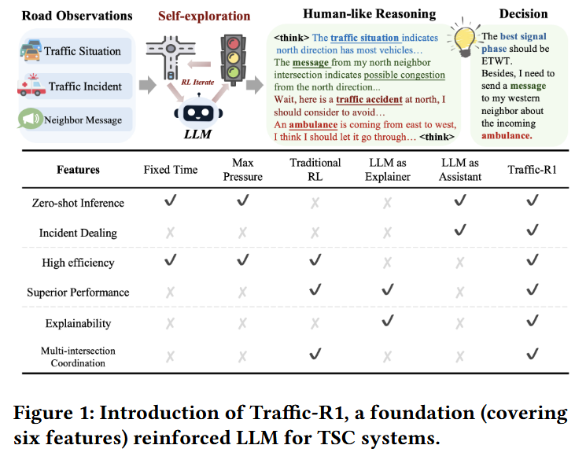

<!--
 * @Author: WANG Maonan
 * @Date: 2024-03-12 17:20:27
 * @Description: Traffic-R1: Reinforced LLMs Bring Human-Like Reasoning to Traffic Signal Control Systems
 * @LastEditTime: 2024-03-13 15:11:53
-->
# Traffic-R1: Reinforced LLMs Bring Human-Like Reasoning to Traffic Signal Control Systems

- [Traffic-R1: Reinforced LLMs Bring Human-Like Reasoning to Traffic Signal Control Systems](#traffic-r1-reinforced-llms-bring-human-like-reasoning-to-traffic-signal-control-systems)
  - [Introduction](#introduction)
    - [研究背景](#研究背景)
    - [现有的方法即存在的问题](#现有的方法即存在的问题)
    - [本文的创新点](#本文的创新点)
  - [Method: Traffic-R1](#method-traffic-r1)
    - [Offline Human-Informed Reinforcement Learning](#offline-human-informed-reinforcement-learning)
    - [Online Open-World Reinforcement Learning](#online-open-world-reinforcement-learning)
    - [Asynchronous Communication Network](#asynchronous-communication-network)
  - [Results](#results)

## Introduction

### 研究背景

交通信号灯控制（TSC）是缓解城市交通拥堵和提升网络吞吐量的关键手段。快速城市化和车辆保有量的激增导致严重拥堵，每年浪费数亿生产小时、消耗大量燃料，并贡献城市温室气体排放的近四分之一。此外，拥堵还会增加事故率、延缓紧急响应、加剧污染，并对交通不便社区造成不公平负担。有效的 TSC 可以通过协调相位序列和持续时间来优化交通流，减少延误和提升整体流动性，从而应对这些社会和环境挑战。

### 现有的方法即存在的问题

- 传统方法（如FixedTime和MaxPressure）：依赖固定启发式规则，适应性差，无法应对动态需求变化，需要大量人工干预。
- 强化学习（RL）方法（如CoLight、MPLight）：虽然在模拟环境中表现优异，但存在**跨区域泛化差**（一个城市训练的政策难以转移到另一个）、**可解释性低**（决策不透明，难以获得从业者信任）、**对分布外（out-of-distribution, OOD）事件鲁棒性弱**（如事故或紧急车辆优先）等问题，导致实际部署罕见。
- 现有LLM增强方法：主要有两种范式 — **LLM解释器**（训练LLM解释RL决策，但继承RL性能上限且解释可能偏离真实逻辑）和 **LLM助手**（仅在OOD事件时咨询LLM，但增加提示工程、延迟和计算开销，对日常控制益处有限）。这些方法仍面临性能天花板、泛化不足和部署障碍，无法实现大规模应用。

### 本文的创新点

本文提出 Traffic-R1，一个基于 Qwen2.5-3B 参数的轻量级强化大语言模型（LLM），作为 TSC 的基础模型，融入人性化推理能力。Traffic-R1 有以下的三个亮点：
- (1) zero-shot generalization to unseen traffic networks and OOD incidents, 
- (2) resource-efficient inference on edge hardware such as mobile platforms,
- (3) human-like & transparent reasoning that supports explainable decision-making and multi-intersection coordination

Traffic-R1 核心方法包括：

- 两阶段代理 RL 微调：
  - 离线人类指导（offline RL stage）：使用专家协作 TSC 数据集（3000个高质量样本，由 11 名人类专家提供行动决策），通过离线政策优化（GRPO算法）训练模型自迭代生成思维链和行动。奖励包括准确性（匹配专家行动）和格式奖励，促进自思考而非模仿。
  - 在线开放世界 RL（online RL stage）：模型在模拟交通环境中自探索多步多路口动态，基于轨迹奖励（队列长度和等待时间）更新政策。引入逐步轨迹政策优化（STPO）分解长轨迹，减少计算开销并提供稠密奖励信号。
- 异步通信网络：将路口分为两组，按奇偶顺序激活，实现异步消息传递，支持LLM间类似人类协调（如绿波同步或紧急响应），提升多路口效率。

下图展示了 Traffic-R1 的优势：

    

## Method: Traffic-R1

Traffic-R1 核心是：
- 两阶段代理 RL 微调过程，结合了离线（offline）人类指导RL和在线（online）开放世界RL，以实现模型的自探索和迭代。
- 引入了一个异步通信网络来支持多路口协调。

### Offline Human-Informed Reinforcement Learning

这一阶段旨在通过人类专家的知识指导LLM学习TSC的基本决策逻辑。它使用离线环境进行训练，焦点是让模型通过自迭代生成思维链（Chain-of-Thought），从而发展出人性化推理能力，而不是直接复制外部样本。

- 数据集构建（Expert-Collaborative TSC Dataset Construction）：
  - 创建了一个包含3000个高质量问答（QA）样本的专家协作TSC数据集。
  - 生成过程：首先产生多样化的交通观测数据及其文本描述。然后，使用DeepSeek-R1模型基于这些观测建议行动。
  - 验证：使用SUMO模拟器评估建议行动的有效性（基于平均车辆速度变化）。同时，由两名人类交通专家审查样本。
  - 如果DeepSeek-R1的行动无效，专家手动提供正确行动。数据集仅保留最终行动，不包括推理内容，以鼓励模型在RL迭代中生成自己的推理。
  - 优势：只需数千样本（而非指令微调的数十万），减少训练数据需求，并融入真实人类专家知识。

下图展示了收集的数据部分，路口对应的文字描述，Deepseek 产生推荐动作，人类专家校验：

    

- Offline Policy Optimization
  - 使用Group Relative Policy Optimization (GRPO)算法在离线环境中微调LLM。
  - 给定一个描述交通场景的文本提示 $x$，模型参数为 $\theta$ 的LLM根据政策 $\pi_{\theta}(y|x)$ 自回归生成输出序列 $y$（包含推理和行动）。
  - 这里 reward 由两个部分组成，分别是回复正确（和专家意见一直），以及符合格式（think 标签）

### Online Open-World Reinforcement Learning

这一阶段扩展离线学习，允许模型在动态模拟环境中自探索多步和多路口TSC场景，超越专家数据集的局限。通过在线奖励更新政策，实现更好的性能和泛化。

同样使用 GRPO 来微调，**但是对于 reward 部分，将长的轨迹拆分为每一个 observation 和 action，他们的 reward 就是这个轨迹的 reward**（Stepwise Trajectory Policy Optimization）。

### Asynchronous Communication Network

现有 TSC 研究常假设同步并行工作流（所有路口同时更新），但实际协调是异步的（如消息传递）。这里我有一个简单的理解：

> 人类交通代理（如交警或控制中心操作员）通过异步通信协调路口，例如一个交警观察到拥堵后，通过无线电或电话通知下游交警，接收方再根据本地情况响应。这种“发送-接收-响应”的过程是异步的、非并行的。

下面是关于异步通信网络的解释：
- 分组机制：将路网中的路口分为两组，基于位置的奇偶性（parity）。例如，在一个网格状路网中，按行/列坐标的奇偶（奇数或偶数）分组。
- 激活顺序：每个常规TSC步骤（时间步）分为两个内步骤（可以理解为他们做动作是分开的，每次有一组 TSC 会延续上一次的动作）：
  - 第一内步骤：激活组一（例如奇数位置）的LLM代理。这些代理基于当前观测生成行动和消息，并将消息发送给邻近路口（这些邻近路口属于组二）。
  - 第二内步骤：激活组二（例如偶数位置）的LLM代理。这些代理接收来自组一的消息，结合自身观测生成行动和响应消息（如果需要，继续传递）。
- 消息传递：采用异步消息传递机制，代理之间交换文本消息（如交通观测、事件通知或协调建议）。

下图展示了传统同步控制，和这里的异步通信网络的区别。可以看到下面 $A_1$ 和 $A_3$ 在第一内步骤保持不变，第二步骤的时候根据 $O_2$ 的观测做出动作：

    

> 我有一个想法，这里可以使用知识数据库的形式，让 TSC 之间可以共享知识。

## Results

这里重点讲一下在真实道路上的测试。作者提到使用 Traffic-R1 在真实道路上部署，但这里出于安全和法律要求，模型不能完全在线运行，需结合人类监督。

为满足政府监管和实际操作需求，Traffic-R 1采用了一种混合工作模式（如下图所示），分为在线和离线两条流水线：

    

- Offline Dispatch Pipeline：
  - 功能：主要用于日常TSC操作（如常规信号相位规划）。
  - **流程**：
    - 交通流预测：使用30天的历史数据，通过带时空嵌入的LGBM（Light Gradient Boosting Machine）算法预测下一天的交通模式。
    - 初步行动计划：Traffic-R1基于预测的时空交通流表示生成初步信号控制计划。
    - 人工审查：计划提交给相关当局（如交通管理部门）进行评估和修订，确保安全合规。
    - 实施：修订后的计划应用于路口信号控制。
    - 优势：通过预测和预规划，减少实时计算负担，满足监管要求。
- Online Dispatch Pipeline：
  - 功能：处理实时突发事件（如交通事故、紧急车辆优先）。
  - 流程：感知系统提供实时交通观测，Traffic-R1直接生成行动决策（如优先放行紧急车辆的相位）。这些决策可能仍需快速人工确认，但大大减少了响应时间。
  - 优势：快速响应动态事件，利用LLM的零-shot泛化和推理能力。

